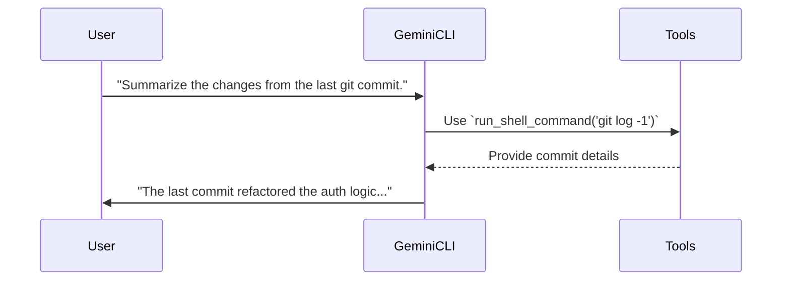
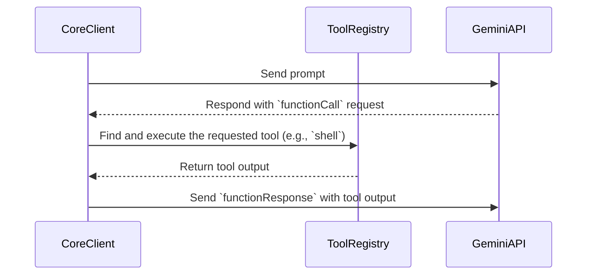
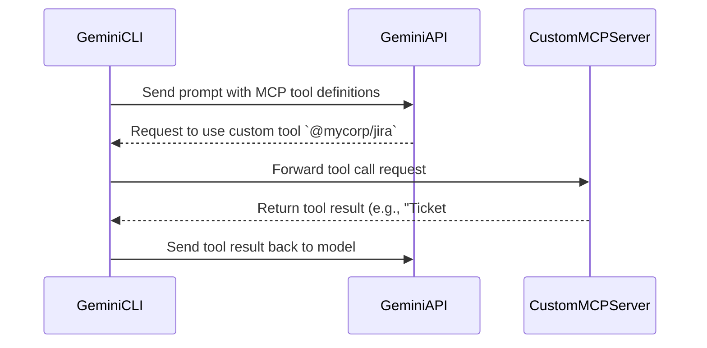
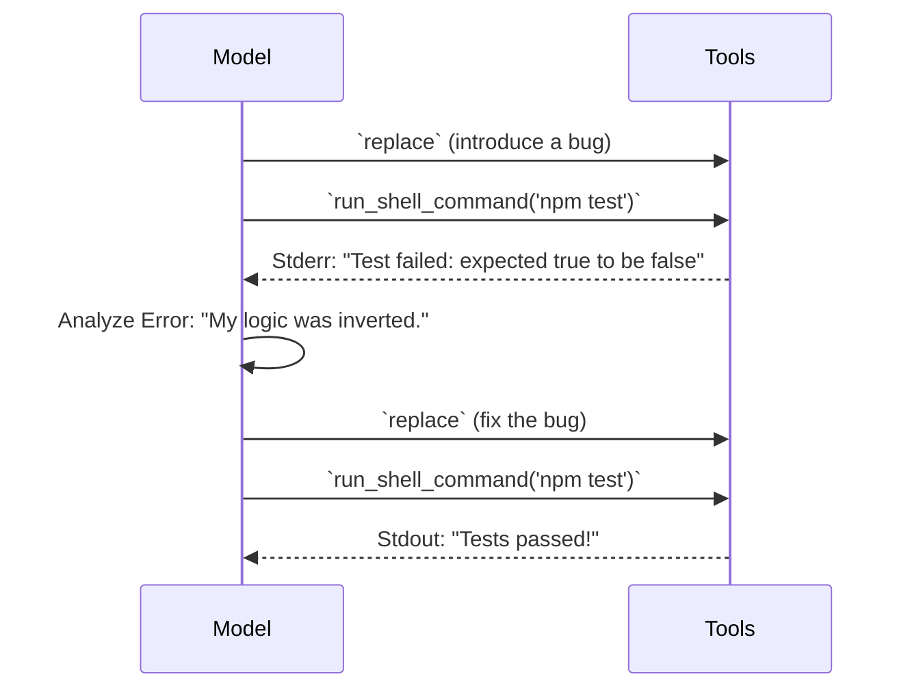

# Slide 1: Title

# Deconstructing Gemini CLI: An Architectural Deep Dive

An analysis of the prompts, architecture, and agentic loops that power Google's command-line AI assistant.

---

# Slide 2: What is Gemini CLI?

Gemini CLI is an **open-source, terminal-first AI agent** that brings the power of the Gemini model family directly to your command line.

- It's built on a modern TypeScript stack, featuring a **monorepo architecture**.
- It operates in two distinct modes: **Interactive (UI)** and **Non-Interactive (Scripting)**.
- It leverages a powerful **tool-using agentic loop** to read files, execute commands, and interact with its environment.

---

# Slide 3: The Core Agentic Loop

Fundamentally, Gemini CLI is a tool-using agent. It deconstructs a user's request and executes a series of tool-driven steps to achieve the goal.



---

# Slide 4: Dual-Mode Architecture

Gemini CLI is designed for two different use cases, with two corresponding entry points.

1.  **Interactive Mode (`gemini.tsx`):**
    - A rich, full-screen UI built with **React and the Ink library**.
    - Manages application state, renders the conversation, and handles complex user interactions like keypresses and dialogs.

2.  **Non-Interactive Mode (`nonInteractiveCli.ts`):**
    - A streamlined flow for scripting and one-off commands.
    - Takes a prompt, executes the agentic loop, and prints the final result to `stdout`.
    - Ideal for CI/CD pipelines and shell scripting.

---

# Slide 5: Diagram: High-Level Architecture

Gemini CLI uses a monorepo structure to separate its concerns.

```mermaid
graph TD
    subgraph User Interface
        A[Interactive UI (gemini.tsx, Ink/React)]
        B[Non-Interactive CLI (nonInteractiveCli.ts)]
    end

    subgraph Core Logic (`packages/core`)
        C[Core Client (client.ts)]
        D[Tool Registry (tools.ts)]
        E[Gemini API Client]
    end

    A --> C
    B --> C
    C --> D
    C --> E
```

---

# Slide 6: The Prompt: A Multi-Part Assembly

Just like other advanced agents, the prompt sent to the Gemini model is more than just the user's input. It's a carefully constructed collection of contextual information.

- **User Input:** The question or command you provide.
- **System Prompt:** Foundational instructions about its role, available tools, and how to behave.
- **Conversation History:** The transcript of the current session.
- **Environment Context:** Information about the OS, file system, and `GEMINI.md` project-specific instructions.

---

# Slide 7: The "Thinking" & Planning Process

When the core logic in `client.ts` receives a request, it doesn't just respond. It plans.

1.  **Goal Deconstruction:** It analyzes the assembled prompt to understand the user's intent.
2.  **Plan Formulation:** It creates a step-by-step plan. For "Debug this file," the plan might be: _Read the file -> Run the file and capture errors -> Analyze errors -> Propose a fix._
3.  **Tool Selection:** It identifies the first tool needed to execute the plan, for example, `read_file`.

---

# Slide 8: The Tool Use Micro-Loop

Every action Gemini CLI takes is a structured tool call. This micro-loop is the engine of the agent.



---

# Slide 9: Authentication: The Gateway

Gemini CLI provides multiple, flexible authentication methods, managed in `packages/cli/src/config/auth.ts`.

- **Login with Google (OAuth):** The default, user-friendly method for individuals. No API key management needed.
- **Gemini API Key:** For developers who want direct control or need paid-tier access.
- **Vertex AI:** For enterprise teams needing advanced security, scalability, and integration with Google Cloud.

This flexibility allows it to be used by individual hobbyists and large enterprises alike.

---

# Slide 10: Diagram: Interactive Mode Event Loop

The interactive UI is a continuous event loop managed by React/Ink.

```mermaid
graph TD
    A[User Presses Key] --> B{KeypressContext};
    B --> C[Composer Component];
    C -- On Submit --> D{useGeminiStream Hook};
    D --> E[Core Client (client.ts)];
    E -- Streams Events (Content, Tool Call) --> D;
    D --> F[App State (Zustand)];
    F -- Rerender --> G[UI Components (Messages, Spinners)];
```

---

# Slide 11: Diagram: Non-Interactive Mode Flow

The non-interactive mode is a much more linear, procedural flow, defined in `nonInteractiveCli.ts`.

```mermaid
graph LR
    A[Start] --> B(Parse Arguments);
    B --> C{Process @-file commands};
    C --> D(Enter `while(true)` loop);
    D --> E{Send Message to API};
    E --> F{Has Tool Calls?};
    F -- Yes --> G[Execute Tools];
    G --> D;
    F -- No --> H(Print Final Response);
    H --> I[End];
```

---

# Slide 12: The Full Agentic Loop (Combined)

This diagram shows how the UI/CLI, Core Client, and API work together.

```mermaid
graph TD
    subgraph "CLI / UI (`packages/cli`)"
        A[User Input]
        B{UI / CLI Entry Point}
        F[Render Output]
    end

    subgraph "Core Logic (`packages/core`)"
        C[Core Client (client.ts)]
        D[Tool Executor]
    end

    subgraph "Google AI"
        E[Gemini Model API]
    end

    A --> B;
    B --> C;
    C -- Generate Content Request --> E;
    E -- Returns `functionCall` --> C;
    C -- Invokes Tool --> D;
    D -- Returns Tool Output --> C;
    C -- Sends `functionResponse` --> E;
    E -- Returns Final Text --> C;
    C --> F;
```

---

# Slide 13: Context Management & Compression

To handle long conversations without exceeding the model's context window, Gemini CLI implements a smart compression strategy in `client.ts`.

1.  **Token Counting:** Before sending a request, it counts the tokens in the conversation history.
2.  **Threshold Check:** If the count exceeds a threshold (e.g., 70% of the model's limit), compression is triggered.
3.  **Summarization:** It sends the older part of the conversation to the Gemini model with a special prompt asking it to summarize the key facts.
4.  **History Replacement:** The old messages are replaced with a single summary message, freeing up tokens for the current turn.

---

# Slide 14: The Built-in Toolset

Gemini CLI comes with a powerful set of built-in tools, defined in `packages/core/src/tools/`, allowing it to interact with the developer's environment.

- **File System:** `read_file`, `write_file`, `list_directory`, `glob`
- **Execution:** `run_shell_command`
- **Web:** `google_web_search`, `web_fetch`
- **Code:** `replace` (for smart, targeted code edits)
- **Memory:** `save_memory`

---

# Slide 15: Extensibility: A Core Principle

Gemini CLI was designed to be extended.

- **MCP (Model Context Protocol):** A standardized way to create and connect custom tool servers. You can run a separate server that exposes new tools (e.g., `@jira create_ticket`), and Gemini CLI can discover and use them.
- **Extensions:** A packaging system for distributing custom commands, prompts, and MCP server configurations, allowing teams to create and share tailored functionality.

---

# Slide 16: Diagram: MCP Extension Flow

This shows how an MCP server adds new capabilities to the agent.



---

# Slide 17: The Self-Correction Loop

Like any robust agent, Gemini CLI can check its own work and fix its mistakes.

1.  Gemini CLI uses the `replace` tool to modify a source file.
2.  It then uses `run_shell_command` to execute the project's test suite (e.g., `npm test`).
3.  The command fails, and the error output is captured.
4.  This error is fed back into the agentic loop as a tool result.
5.  The model analyzes the test failure and generates a new `replace` call to fix the bug it just introduced.

---

# Slide 18: Diagram: Self-Correction in Action



---

# Slide 19: Safety and Sandboxing

Gemini CLI includes security features to protect the user's system.

- **Tool Confirmation:** By default, it prompts the user for permission before executing potentially destructive tools like `run_shell_command` or `write_file`.
- **Sandboxing:** It has the capability to run shell commands inside a containerized environment (Docker or Podman), isolating them from the host system for enhanced security.

---

# Slide 20: Summary & Key Takeaways

- **Dual-Mode Architecture:** Flexibly serves both **interactive UI** users and **automation scripts**.
- **Componentized Core:** Logic is cleanly separated in `packages/core`, making the system maintainable and testable.
- **True Agentic Loop:** It uses a continuous **Think -> Act -> Observe** cycle with a rich set of tools.
- **Extensibility First:** Designed from the ground up with **MCP and Extensions** to be adapted to any workflow.
- **React-Powered UI:** Leverages the power of React via the `ink` library to create a modern, responsive terminal interface.
