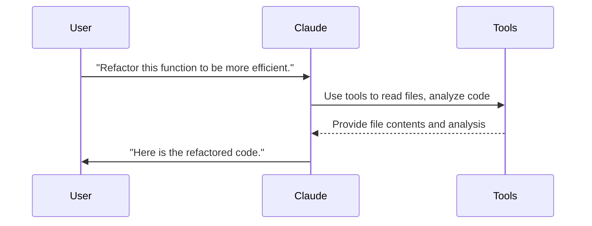
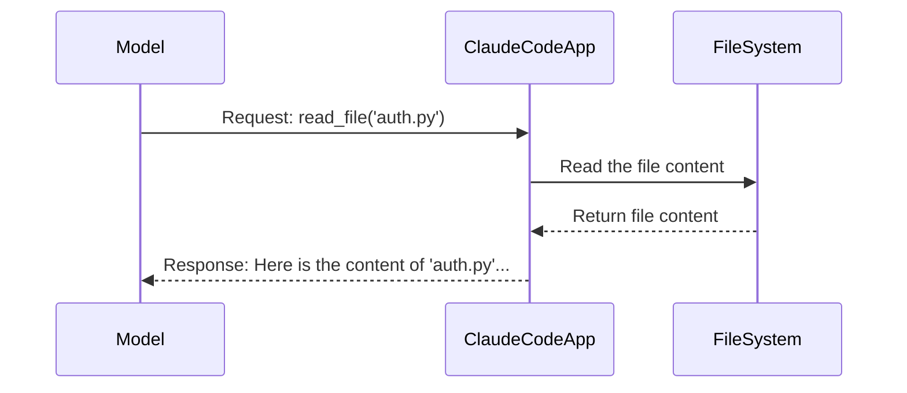
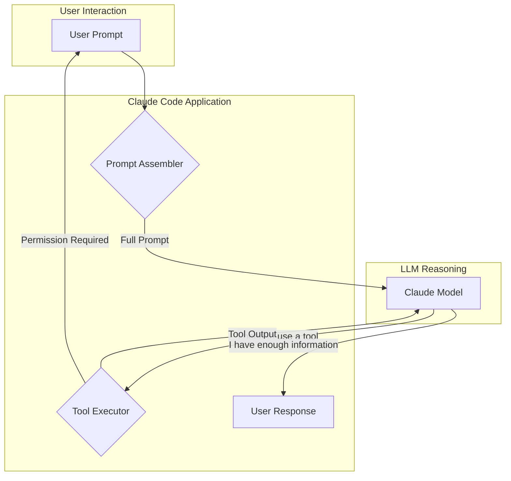
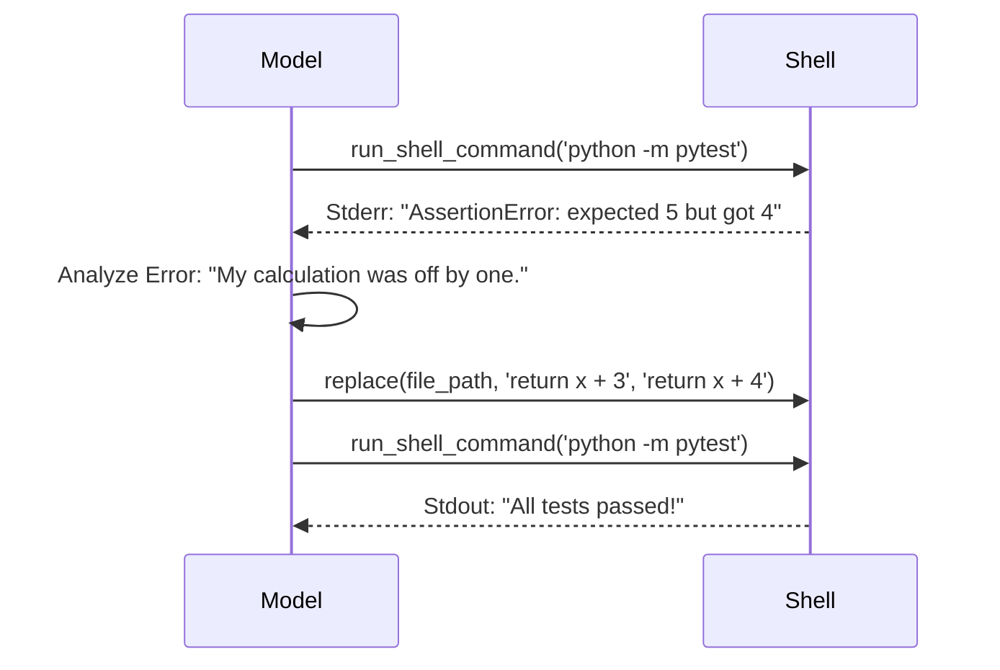

# Slide 1: Title

# Understanding Claude Code: The Agentic Loop

A deep dive into the prompts, tools, and cycles that power your AI coding assistant.

---

# Slide 2: What is Claude Code?

Claude Code is an **agentic AI coding assistant** that lives in your terminal.

- It's not just a chatbot; it's a **doer**.
- It understands your codebase by reading files and context.
- It helps you code faster by executing tasks, explaining code, and managing workflows.
- It operates in a loop: **Prompt -> Think -> Act -> Observe -> Repeat**.

---

# Slide 3: The Core Interaction Loop

At its heart, Claude Code follows a simple, powerful loop. The goal is to take a user's request and turn it into a completed task.



---

# Slide 4: The User's Role

The user is the director of the process.

1.  **The Prompt:** You initiate the loop with a clear goal (e.g., "add a feature," "fix a bug," "write a test").
2.  **The Guardian:** You grant or deny permissions for actions like writing to files or running commands.
3.  **The Guide:** You provide feedback and clarification, steering Claude toward the correct solution.

---

# Slide 5: The Anatomy of a Prompt (Part 1)

Everything starts with the user's request. But the prompt Claude _actually_ sees is much richer.

It's a combination of multiple sources of information.

- **User Prompt:** What you type.
- **System Prompt:** The foundational instructions.
- **Context:** Files, conversation history, and tool definitions.

---

# Slide 6: The System Prompt: Claude's "OS"

The System Prompt is a hidden set of instructions that guides Claude's behavior. It's the most critical part of the process.

It tells Claude:

- Its persona ("You are an expert AI programmer...").
- The tools it has available (e.g., `read_file`, `run_shell_command`).
- The format for how to use those tools.
- The overall goal (to assist the user with their coding task).
- Constraints and rules to follow for safety and efficiency.

---

# Slide 7: Diagram: Prompt Assembly

Before the model even thinks, Claude Code assembles a complete prompt from various sources.

```mermaid
graph TD
    A[User Input <br><i>"Fix the bug in auth.py"</i>] --> C{Prompt Assembler};
    B[System Prompt <br><i>"You are an AI assistant..."</i>] --> C;
    D[Context <br><i>- File Tree <br>- Tool Definitions <br>- CLAUDE.md</i>] --> C;
    C --> E[Full Prompt for LLM];
```

---

# Slide 8: The "Thinking" Process

Once the LLM receives the full prompt, it begins its reasoning process. This is often displayed as "Thinking..." in the UI.

1.  **Deconstruct the Request:** It breaks down the user's goal. _"Fix the bug in auth.py"_ means I need to first understand the bug.
2.  **Formulate a Plan:** It creates a high-level plan.
    - _1. Read `auth.py` to understand the code._
    - _2. Search for related tests to understand expected behavior._
    - _3. Identify the likely source of the bug._
    - _4. Propose a change._
3.  **Select a Tool:** It chooses the first tool to execute from its plan. -> `read_file('auth.py')`

---

# Slide 9: Tool Use: The Action Step

This is where Claude moves from _thinking_ to _doing_.

- The model generates a special, structured request to use a tool.
- For example: `I need to read the file auth.py to understand the current implementation.`
- This is translated into a function call: `read_file(absolute_path='/path/to/project/auth.py')`.
- The Claude Code application executes this function.

---

# Slide 10: Diagram: The Tool Use Micro-Loop

Each time Claude uses a tool, it enters a micro-loop of requesting, executing, and observing.



---

# Slide 11: Example: Reading a File

**User:** "Add a docstring to the `calculate_total` function in `utils.py`."

1.  **Claude's Thought:** "I need to see the function first to know where to add the docstring."
2.  **Tool Call:** `read_file(absolute_path='/Users/mdangelo/projects/claude-code/utils.py')`
3.  **Tool Output:** The full content of `utils.py` is returned to Claude.
4.  **Claude's Next Thought:** "Okay, now I see the function. I can construct the `replace` call to add the docstring."

---

# Slide 12: Example: Searching the Codebase

**User:** "Where is the `User` model defined?"

1.  **Claude's Thought:** "I don't know the file structure. I should search for `class User` to find the definition."
2.  **Tool Call:** `search_file_content(pattern='class User')`
3.  **Tool Output:** A list of files and line numbers containing `class User` is returned.
    - `models/user.py:10: class User:`
    - `tests/test_user.py:5: class FakeUser:`
4.  **Claude's Next Thought:** "`models/user.py` looks like the right place. I will read that file."

---

# Slide 13: Example: Modifying Code

This is the most powerful tool. It requires precision.

1.  **Claude's Thought:** "I have read the file and know what to change. I will replace the old function with the new one, including the docstring."
2.  **Tool Call:** `replace(file_path, old_string, new_string)`
    - `old_string`: Contains the _exact_ original function text, with several lines of context before and after to ensure a unique match.
    - `new_string`: Contains the new version of the function, with the added docstring.
3.  **User Confirmation:** Claude Code prompts the user to approve the change.
4.  **Execution:** If approved, the file is modified on disk.

---

# Slide 14: Diagram: The Full Agentic Loop

This diagram combines prompt assembly and the tool loop into a complete picture of how a single user request is handled.



---

# Slide 15: Permissions & Safety

Claude Code does not act on your files without permission.

- **Read-only actions** (like `read_file`, `glob`) are often performed automatically.
- **Write actions** (`replace`, `write_file`) or **execution actions** (`run_shell_command`) require explicit user approval.
- This makes the **user the ultimate guardian** of the codebase, preventing unintended changes. You have the final say.

---

# Slide 16: Context is Everything

How does Claude remember what's going on?

- **Conversation History:** The entire transcript of the conversation (user prompts, tool calls, tool outputs, model responses) is included in the prompt.
- **Context Window:** Models have a limited context window (e.g., 200K tokens).
- **Compaction:** When the conversation gets too long, Claude uses an LLM call to summarize the earlier parts of the conversation, keeping the key details while freeing up space.

---

# Slide 17: Customization and Configuration

You can guide Claude's behavior on a per-project basis.

- **`.claude/` directory:** A special directory in your project root.
- **`CLAUDE.md`:** A file where you can provide project-specific instructions, which are added to the system prompt. (e.g., "This project uses the `requests` library, not `urllib`." or "Always add unit tests for new functions.")
- **Custom Commands:** Define your own slash commands for repetitive tasks.

---

# Slide 18: The Self-Correction Loop

Claude can use tools to check its own work and correct mistakes. This is a key part of its "agentic" nature.

1.  Claude writes some code.
2.  It runs a linter or a test suite using `run_shell_command`.
3.  The command fails with an error message.
4.  The error message (from stdout/stderr) is fed back into the tool loop.
5.  Claude analyzes the error and attempts to fix its own code in the next turn.

---

# Slide 19: Diagram: Self-Correction in Action



---

# Slide 20: Summary & Key Takeaways

- **Agentic Loop:** Claude operates in a **Prompt -> Think -> Act -> Observe** cycle.
- **Prompt Engineering:** The prompt given to the model is carefully assembled from user input, system instructions, and contextual data.
- **Tools are Key:** Tools are what allow Claude to interact with the world (your codebase) and get things done.
- **User as Director:** You initiate the process, grant permissions, and provide crucial feedback to guide the AI.
- **Self-Correction:** By observing the output of its actions, Claude can identify and fix its own mistakes, leading to more robust solutions.
