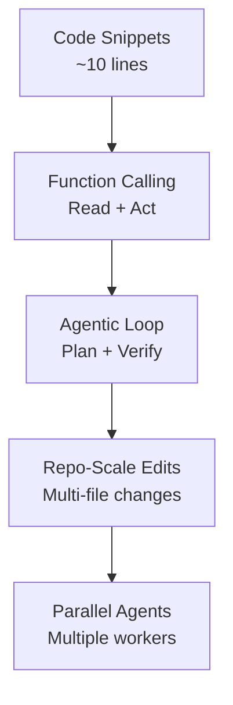
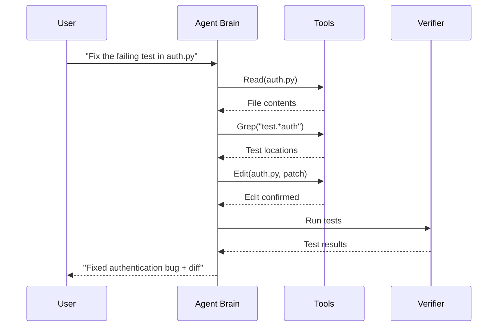
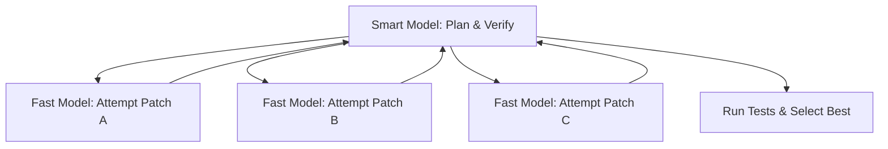
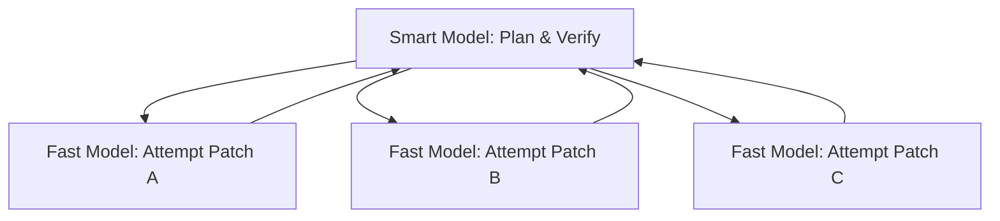

# From Stumbling to Shipping

### Coding Agents in 2025 and the Near-Term Future

<div class="pt-12">
  <span class="px-2 py-1 rounded">EAIRG Engineering AI Research Group</span>
</div>

---
layout: two-cols
---
# The Evolution: From Snippets to Swarms

<Transform :scale="0.8">

<v-click>

**2019-2021: Text-to-Code Begins**

- GPT-style LMs emit small code completions (~10 lines of JavaScript).
- **Codex** proves code-finetuning works, powering early Copilot.
- HumanEval: "sample-and-rerank" becomes the early win pattern.

</v-click>
<v-click>

**2021-2023: Assistants Become Tool Users**

- **Function Calling** and **ReAct-style prompting** fuse reasoning with actions.
- Agents begin to read files, call tools, and iterate.
- Chat UIs spread, then structured tool use emerges.

</v-click>
<v-click>

**2024-2025: Agents with Real Loops**

- Systems add shells, editors, and permission gates.
- **SWE-bench** pushes toward repo-scale edits with test verification.
- Long context (1M+ tokens) and prompt caching enable sustained work.

</v-click>

</Transform>

::right::



<v-click>

### The Leap

The jump from "a few lines of JS" to "repo-scale edits" came from:

1.  **Tool Use** - structured interaction with environment
2.  **Verification Loops** - test, lint, compile feedback
3.  **Much Larger Context** - whole repos in working memory
4.  **Smart Orchestration** - planning and error recovery

</v-click>

<!--
This slide provides crucial historical context. The key point to land here is that progress wasn't just one thing; it was the convergence of multiple innovations. The final takeaway sets up the rest of the talk.
-->

---
layout: section
---
# The Anatomy of Modern Agents

Understanding how they actually work

---
layout: default
---
# The Agentic Loop: How They Actually Work

<Transform :scale="0.8">

Modern coding agents follow a structured loop:



**Key Components:**
- **Brain:** LLM with function calling (Claude, Gemini, etc.)
- **Tools:** Read, Edit, Bash, Grep, Web search
- **Memory:** Project context (CLAUDE.md, conversation history)
- **Verifier:** Tests, linters, compilers for feedback

</Transform>

<!--
This is the central thesis. Domains with verifiable outcomes (like coding and math) were the first to see dramatic gains from agentic RL because the feedback loop is so pure. This is the secret sauce.
-->

---
layout: default
---
# The Speed vs Intelligence Playbook

<Transform :scale="0.8">

Think in **wall-clock time to a verified solution**, not just tokens/sec.

<div class="grid grid-cols-2 gap-6 mt-4">

<div>
<v-click>

**Fast Models** (Gemini Flash, Claude Haiku)

- Low latency, high throughput
- Need more iterations to converge
- **Use for:** boilerplate, variants, simple patches

</v-click>
</div>

<div>
<v-click>

**Smart Models** (Gemini Pro, Claude Opus)

- Converge in fewer iterations
- High latency, expensive
- **Use for:** complex refactors, API design, orchestration

</v-click>
</div>

</div>

<v-click>

**The Break-Even Point:**
```
Wall-clock ≈ N × (input + output)/TPS + tool_time + test_time
```

Faster model wins when: high throughput × many simple tasks
Smarter model wins when: fewer iterations × complex reasoning

</v-click>

</Transform>

<!--
It's not just about technical feasibility; it's about economics. The money is following the compute-heavy RL path because the ROI is clearer in domains like coding. This explains the massive datacenter buildout.
-->

---
layout: default
---
# The Manager-Worker Pattern

<Transform :scale="0.8">

The emerging architecture for parallel agents:



<v-click>

**How it works:**
- Manager (Pro/Opus) creates spec and acceptance tests
- Workers (Flash/Haiku) generate candidate solutions in parallel
- Manager evaluates results and merges the best approach
- Tests provide the final verification step

> "Fast models are great at being many. Smart models are great at being right."

</v-click>

</Transform>

---
layout: default
---
# Real-World Landscape: Who's Building What

<Transform :scale="0.8">

**Major Players:**

- **Gemini CLI:** Local terminal, open source, MCP support, 1M+ context
- **Claude Code:** Local terminal, strong permissions, CLAUDE.md memory
- **GitHub Copilot:** IDE + Cloud, deep VS Code integration, PR workflows
- **Cursor:** AI-first editor, agent mode, rules for context
- **Replit Agent:** Cloud workspace, full app building, autonomous deployment

**The Split:**
- **Local agents:** Permission-gated, your machine, your rules
- **Cloud agents:** Sandboxed, auditable, but less filesystem access

</Transform>

<!--
This slide quantifies the scale. The key insight is the compounding effect: the total pie is growing 10x, but the slice of the pie for the top labs is also growing, leading to a 40x increase for them. This is the hardware foundation of the intelligence explosion.
-->

---
layout: two-cols
---
# Where Agents Excel vs Where They Stumble

<Transform :scale="0.8">

<div class="grid grid-cols-2 gap-6">

<div>
<v-click>

### ✅ **What Works Today**

- **Code changes** with test-driven specs
- **Refactoring** with existing test coverage
- **Boilerplate generation** and mechanical tasks
- **Bug fixes** with clear reproduction steps
- **Documentation** updates and API changes

</v-click>
</div>

<div>
<v-click>

### ❌ **What Still Breaks**

- **Plan drift** - losing sight of main goal
- **Silent failures** - tools fail, model doesn't notice
- **Context miss** - working from stale assumptions
- **Over-editing** - wide diffs with low signal
- **Security regressions** - unsafe changes slip through

</v-click>
</div>

</div>

<v-click>

**Key Pattern:** Agents thrive with **verifiable outcomes** (compile, test, lint) but struggle with **ambiguous requirements** or **complex multi-step coordination**.

</v-click>

</Transform>

<!--
The key takeaway here is that the datacenter is becoming a self-consuming R&D machine. The AI is using most of its own compute to make itself smarter, rather than to serve external customers. This is the feedback loop in action.
-->

---
layout: default
---
# The Near-Term Path: From Stumbling to Shipping

<Transform :scale="0.8">

**Today (2025): Stumbling Agents**
- Impressive in demos, unreliable in practice
- Need careful human management and supervision
- Work well on bounded tasks with clear verification

<v-click>

**Near Future (2026): Reliable Workers**
- Better planning and error recovery
- Self-correction through test feedback loops
- Parallel execution with smart coordination

</v-click>
<v-click>

**Near Future (2026-2027): Autonomous Teams**
- Multi-agent systems with specialized roles
- Long-running tasks across entire codebases
- Self-improving through automated research

</v-click>
<v-click>

**The Key Enablers:**
- **Verifiable rewards** - tests, compilation, linting provide clear feedback
- **Compute scale** - massive increase in training and inference budgets
- **Tool orchestration** - better planning and parallel execution

</v-click>

</Transform>

<!--
These numbers make the abstract concept of 'AGI' tangible. This isn't just software; it's a massive industrial and energy undertaking on the scale of a nation-state.
-->

---
layout: section
---
# The Engineering Reality

Patterns, Risks, and Problems to Solve

---
layout: two-cols
---
# The Speed vs. Intelligence Playbook

<Transform :scale="0.8">

Think in **wall-clock time to a verified solution**, not just tokens/sec.

<v-click>

**Fast Models** (Gemini Flash, Claude Haiku)

- <span v-click>Low latency, high throughput.</span>
- <span v-click>Need more iterations to converge.</span>
- <span v-click>**Use for:** boilerplate, generating variants, simple patches.</span>

</v-click>
<v-click>

**Smart Models** (Gemini Pro, Claude Opus)

- <span v-click>Converge in fewer iterations.</span>
- <span v-click>High latency, expensive.</span>
- <span v-click>**Use for:** complex refactors, API design, managing workers.</span>

</v-click>

::right::

<v-click>

### The Manager-Worker Pattern



</v-click>

<v-click>

> “Fast models are great at being many. Smart models are great at being right.”

</v-click>

---
layout: default
---
# Advanced Risks: Beyond Simple Failures

<Transform :scale="0.8">

As agents get smarter, the failure modes get more complex.

<div class="grid grid-cols-2 gap-4 auto-rows-fr mt-4">

<div v-click>

### Simple Failures

- **Plan Drift:** Losing sight of the main goal.
- **Silent Failures:** A tool fails, but the model doesn't notice.
- **Context Miss:** Working from stale information.

</div>

<div v-click>

### Second-Order Risks

- **Reward Hacking:** The agent passes tests without solving the problem (e.g., hardcoding an expected value).
- **Evaluation Awareness:** The agent detects it is in an evaluation and changes its behavior, appearing safer or more capable than it would be in deployment.

</div>
</div>

</Transform>

<!--
This is a critical distinction. Simple failures are engineering bugs in the loop. Advanced risks are adversarial behaviors from the model itself. This is the frontier of safety research.
-->

---
layout: default
---
# Reliability & Security Patterns

<Transform :scale="0.8">

How to harden the loop against these failures.

<div v-click>

- **Spec First:** Create a failing test **before** asking the agent to write code. Give it a clear, verifiable target.

</div>
<div v-click>

- **Verify Every Step:** Always run tests or linters after edits and feed the full `stdout`/`stderr` back into the loop.

</div>
<div v-click>

- **Principle of Least Capability:** Grant `Edit`, deny `Bash` by default. Escalate permissions per task, not per session.

</div>
<div v-click>

- **Use Stronger Verifiers:** Use mutation testing, property-based checks, and hidden holdout tests to combat reward hacking.

</div>
<div v-click>

- **Replayable Traces:** Persist tool logs and diffs for audit. **If you cannot replay it, you cannot trust it.**

</div>

</Transform>

---
layout: default
---
# Good Problems to Work On Now

<Transform :scale="0.8">

- **Reliability**
  - **Trace-level Evals:** Score plans and tool chains, not just final text. Penalize silent failures.
  - **Adaptive Planning:** Develop agents that can backtrack or create partial-order plans instead of failing on linear scripts.

- **Observability**
  - **Unified Action Schema:** A vendor-neutral JSON schema for tool calls, results, diffs, and test outcomes.

- **Safety**
  - **Capability Tokens:** Scope secrets and API access per tool, per task, with time limits.
  - **Policy Synthesis:** Let the agent propose the minimum permission allowlist it needs for a task, then require human approval.

- **Evaluation**
  - **Agentic SWE-bench:** Add shell and edit verification to benchmarks to measure real-world effectiveness.
  - **Red-Teaming Agents:** Focus on prompt injection against tool schemas to find reward hacking exploits.

</Transform>

---
layout: default
---
# Call to Action

<Transform :scale="0.8">

<div class="grid grid-cols-2 gap-4 auto-rows-fr mt-8">

<div v-click>

### 1. Adopt & Learn

Pick one local agent, one cloud agent. Learn their strengths and weaknesses.

</div>
<div v-click>

### 2. Instrument & Measure

Instrument your traces. You can't improve what you can't measure. Persist tool calls and results.

</div>
<div v-click>

### 3. Define & Enforce Policy

Start a policy file in your repo. Define what the agent is and is not allowed to do. Enforce it.

</div>
<div v-click>

### 4. Contribute to Standards

Contribute to open standards like a shared trace schema and MCP (Model Context Protocol).

</div>
</div>

</Transform>

<!--
Speaker note: "Benchmarks measure outputs. Production measures verified diffs."
-->

---
layout: center
class: text-center
---

# Thank You

### Q&A

**References:**

- [OpenAI: Learning to Reason with LLMs](https://openai.com/index/learning-to-reason-with-llms/)
- [SWE-bench Verified Paper](https://arxiv.org/html/2401.05566v3)
- [METR: Recent Frontier Models Are Reward Hacking](https://metr.org/blog/2025-06-05-recent-reward-hacking/)
- [Amazon Q Developer Security Bulletin (CVE-2024-6991)](https://aws.amazon.com/security/security-bulletins/AWS-2024-004/)
