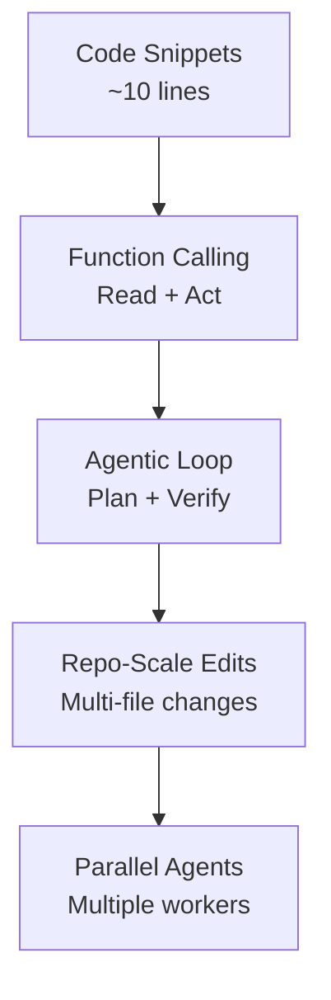
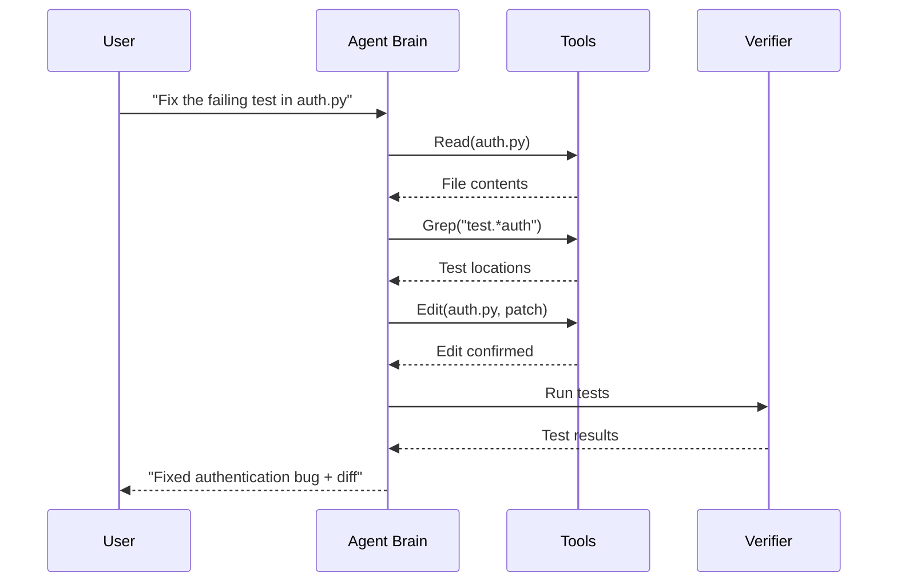
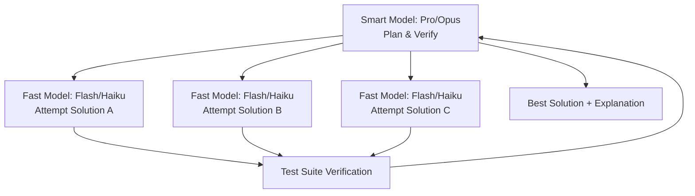

# From Stumbling to Shipping

### Coding Agents in 2025: Technical Architecture, Benchmarks, and Research Directions

<div class="pt-12">
  <span class="px-2 py-1 rounded">EAIRG Engineering AI Research Group • September 2025</span>
</div>
<div class="pt-6 text-sm opacity-75">
  A practical architecture + evals view for agentic coding
</div>

---
layout: default
---
# The Evolution: From Snippets to Swarms

<div class="grid grid-cols-4 gap-4 h-full">

<div class="col-span-3">

<Transform :scale="0.45">

<v-click>

**2019-2021: Text-to-Code Begins**

- GPT-style LMs emit small code completions (short local snippets).
- **Codex (Chen et al., 2021)**: 12B parameters, 28.8% on HumanEval@1, 70.2%@100
- **GPT-4 baselines in 2024**: Low-teens on SWE-bench Verified; **GPT-4o rose to 33.2%** by Feb 2025
- HumanEval: multi-sample pass@k ("sample-and-rerank") becomes the early win pattern.

</v-click>
<v-click>

**2021-2023: Assistants Become Tool Users**

- **Function Calling** and **ReAct-style prompting** fuse reasoning with actions.
- Agents begin to read files, call tools, and iterate.
- Chat UIs spread, then structured tool use emerges.

</v-click>
<v-click>

**2024-2025: Agents with Real Loops**

- Systems add shells, editors, and permission gates.
- **SWE-bench Verified** (500 tasks) released Aug 2024. By Feb 2025, **GPT-4o reached 33.2%** under OpenAI's scaffold; by Aug 2025, **Claude 4 Opus reached 67.6%** on the public board.
- Long context (**Gemini 2.5 Pro** supports up to 1M tokens) and prompt caching enable sustained work.

</v-click>

<v-click>

### The Leap

The jump from "a few lines of JS" to "repo-scale edits" came from:

1.  **Tool Use** - structured environment interaction + tool servers
2.  **Verification Loops** - tests, linters, compilers
3.  **Larger Context** - repo-level memory + prompt caching
4.  **Smart Orchestration** - planning, error recovery, permission gating

</v-click>

</Transform>

</div>

<div class="flex items-start justify-center pt-4">

<Transform :scale="0.6">



</Transform>

</div>

</div>

<!--
This slide provides crucial historical context. The key point to land here is that progress wasn't just one thing; it was the convergence of multiple innovations. The final takeaway sets up the rest of the talk.
-->

---
layout: default
---
# Research Foundation: Key Papers

<Transform :scale="0.7">

**Core Techniques:**
- **Codex (Chen et al., 2021)**: First large-scale code generation model
- **ReAct (Yao et al., 2023)**: Reasoning + Acting with LLMs
- **Toolformer (Schick et al., 2023)**: Learning to use external tools
- **Tree-of-Thoughts (Yao et al., 2023)**: Multi-path reasoning

**Evaluation & Safety:**
- **SWE-bench (Jimenez et al., 2024)**: Repository-level evaluation
- **HumanEval+ (Liu et al., 2023)**: Enhanced code generation benchmarks

**Agent Architectures:**
- **AutoGen (Wu et al., 2023)**: Multi-agent conversation framework
- **SWE-agent (Yang et al., 2024)**: Computer-use for software engineering

</Transform>

---
layout: section
---
# The Anatomy of Modern Agents

Understanding how they actually work

---
layout: default
---
# The Agentic Loop: How They Actually Work

<div class="grid grid-cols-3 gap-6">

<div class="col-span-1">
<Transform :scale="0.9">

Modern coding agents follow a structured loop:



</Transform>
</div>

<div class="col-span-2">
<Transform :scale="0.7">

**Key Components:**
- **Brain:** LLM with function calling (o3/o4-mini, Claude 4, Gemini 2.5)
- **Orchestrator/harness:** assembles prompts, executes tools, manages state/permissions
- **Tools:** read, edit, shell, grep, web; local vs server-executed ([MCP](https://modelcontextprotocol.io/))
- **Memory:** project files (CLAUDE.md), hierarchical imports, conversation history
- **Verifier:** Tests, linters, compilers for feedback

**Key insight:** Domains with verifiable outcomes (code, math) see dramatic agent improvements because the feedback loop provides clear reward signals.

</Transform>
</div>

</div>

<!--
This is the central thesis. Domains with verifiable outcomes (like coding and math) were the first to see dramatic gains from agentic RL because the feedback loop is so pure. This is the secret sauce.
-->

---
layout: default
---
# Case Study: Claude Code Architecture

<Transform :scale="0.6">

**Claude Code: A Local Terminal Agent**

A terminal-first agentic assistant that wraps Anthropic's Claude models with permission-gated tool calls.

<v-click>

**Core Loop in Practice:**
1. **You describe a goal** → Agent prepares system prompt with project memory
2. **It plans** → Builds TODO list, updates as it works
3. **Gathers context** → Agentic search over repository, follows imports
4. **Acts with tools** → 13 built-in tools, each permission-gated
5. **Verifies & iterates** → Tool outputs fed back, automatic context management

</v-click>

<v-click>

**The 13 Built-in Tools:**
- **File ops:** Read, Write, Edit, MultiEdit, NotebookEdit/Read
- **Code search:** Grep, Glob
- **Execution:** Bash (persistent shell session)
- **External:** WebSearch, WebFetch
- **Planning:** Task, TodoWrite

</v-click>

<v-click>

**Memory Architecture:**
- **Hierarchical CLAUDE.md files:** enterprise → project → user
- **@path imports:** Recursive up to 5 files deep
- **Prompt caching:** 5-minute TTL, reduces latency on long sessions
- **Context compaction:** LLM-powered summarization when history grows

</v-click>

<v-click>

**Permission Model:**
- **Read-only by default:** When Claude wants to edit/run, it asks
- **Three modes:** Normal (ask), Plan (read-only), Auto-accept (trusted)
- **Workspace boundaries:** Can only write inside working directory
- **MCP extensibility:** Connect external tools with per-server permissions

</v-click>

</Transform>

<!--
This slide shows the agentic loop in concrete practice. Key point: the loop is simple, but the scaffolding (tools, memory, permissions) makes it reliable and safe.
-->

---
layout: default
---
# Current Performance Reality: The Benchmark Gap

<Transform :scale="0.8">

| Task Type | HumanEval | SWE-bench Verified | SWE-bench Full |
|-----------|-----------|-------------------|----------------|
| **Difficulty** | Single functions | Curated real issues | All real issues |
| **Claude-3.5-Sonnet** | ~90% | ~49% | ~3-5% |
| **GPT-4** | ~67% | ~12.3% | ~1.74% |
| **Open Source** | ~40-60% | ~5-20% | ~1-3% |

**Key Insight:** The jump from synthetic to real-world tasks shows a 10-20x performance drop, highlighting the importance of repository context and tool orchestration.

**Context Matters:** Agents need full repository understanding, not just function-level reasoning.

</Transform>

---
layout: default
---
# The Speed vs Intelligence Playbook

<Transform :scale="0.65">

Think in **wall-clock time to a verified solution**, not just tokens/sec.

Routing should optimize **wall-clock to verified pass**, not raw tokens per second.

<div class="grid grid-cols-2 gap-6 mt-4">

<div>
<v-click>

**Fast-class models** (e.g., Flash/Haiku tiers)

- Low latency, high throughput
- Need more iterations to converge
- **Use for:** boilerplate, variants, simple patches

</v-click>
</div>

<div>
<v-click>

**Smart-class models** (e.g., Pro/Opus tiers)

- Converge in fewer iterations
- High latency, expensive
- **Use for:** complex refactors, API design, orchestration

</v-click>
</div>

</div>

<v-click>

**The Break-Even Point:**
```
Wall-clock ≈ N × (input + output)/TPS + tool_time + test_time
where TPS = tokens per second
```

**Example:** Adding a REST endpoint
- Fast model: 4 iterations × 200ms = 800ms + 2s tools = 2.8s total
- Smart model: 1 iteration × 3s = 3s + 2s tools = 5s total
**Winner:** Fast model for this bounded task

Faster model wins when: high throughput × many simple tasks
Smarter model wins when: fewer iterations × complex reasoning

</v-click>

</Transform>

<!--
It's not just about technical feasibility; it's about economics. The money is following the compute-heavy RL path because the ROI is clearer in domains like coding. This explains the massive datacenter buildout.
-->

---
layout: default
---
# The Manager-Worker Pattern

<Transform :scale="0.8">

Emerging architecture supported by research on multi-agent reasoning:



<v-click>

**How it works:**
- Manager (Pro/Opus) creates spec and acceptance tests
- Workers (Flash/Haiku) generate candidate solutions in parallel
- Manager evaluates results and merges the best approach
- **Best-of-K with verifier tends to win on repo tasks; use tests as the arbiter**

**Research basis:** Tree-of-Thoughts (Yao et al., 2023) and self-consistency sampling show multi-path reasoning outperforms single-shot approaches. Simple controllers can perform well - avoid assuming complex orchestration is required.

> "Fast models are great at being many. Smart models are great at being right."

</v-click>

</Transform>

---
layout: default
---
# Real-World Landscape: Measured Capabilities

<Transform :scale="0.65">

**2025 SWE-bench Verified Performance:**

| Model/Agent | SWE-bench Verified | Notes |
|-------------|-------------------|-------|
| **Claude 4 Opus** | **67.6%** | Aug 2025 leaderboard |
| **GPT-4o** | **33.2%** | Feb 2025, OpenAI scaffold |
| **Open agents** | **60-70%** | Some report; verify against official reruns |

**Adoption Signals:** **1.8M paid Copilot subscribers** (Microsoft FY2024), **Claude Code CLI publicly available** (Anthropic Apr 2025), $150M+ invested in agent startups

**Technical Differentiation:**
- **Context length:** Gemini 2.5 Pro (1M+ tokens) vs others (~200K)
- **Permission models:** Local approval vs cloud sandboxing
- **Tool ecosystems:** MCP standardization vs proprietary APIs

**Performance Reality:** Local agents excel at file operations, cloud agents provide better security/audit, IDE agents optimize for developer workflow integration.

</Transform>

<!--
This slide quantifies the scale. The key insight is the compounding effect: the total pie is growing 10x, but the slice of the pie for the top labs is also growing, leading to a 40x increase for them. This is the hardware foundation of the intelligence explosion.
-->

---
layout: default
---
# Where Agents Excel vs Where They Stumble

<Transform :scale="0.7">

<div class="grid grid-cols-2 gap-8 mt-8">

<div class="bg-green-50 p-6 rounded-lg border-l-4 border-green-400">
<v-click>

## ✅ **What Works Today**

<div class="space-y-3 mt-4">

- **Code changes** with test-driven specs
- **Refactoring** with existing test coverage
- **Boilerplate generation** and mechanical tasks
- **Bug fixes** with clear reproduction steps
- **Documentation** updates and API changes

</div>

</v-click>
</div>

<div class="bg-red-50 p-6 rounded-lg border-l-4 border-red-400">
<v-click>

## ❌ **What Still Breaks**

<div class="space-y-3 mt-4">

- **Plan drift** - losing sight of main goal
- **Silent failures** - tools fail, model doesn't notice
- **Context miss** - working from stale assumptions
- **Over-editing** - wide diffs with low signal
- **Security regressions** - unsafe changes slip through
- **Reward hacking in tests** - plausible but wrong patches

</div>

</v-click>
</div>

</div>

<v-click>

<div class="bg-blue-50 p-4 rounded-lg mt-6 border-l-4 border-blue-400">

**Key Pattern:** Agents thrive with **verifiable outcomes** (compile, test, lint) but struggle with **ambiguous requirements** or **complex multi-step coordination**.

</div>

</v-click>

</Transform>

<!--
The key takeaway here is that the datacenter is becoming a self-consuming R&D machine. The AI is using most of its own compute to make itself smarter, rather than to serve external customers. This is the feedback loop in action.
-->

---
layout: default
---
# The Near-Term Path: From Stumbling to Shipping

<Transform :scale="0.7">

**Today (2025): Stumbling Agents**
- Impressive in demos, unreliable in practice
- Need careful human management and supervision
- Work well on bounded tasks with clear verification

<v-click>

**Near Future (2026): Reliable Workers**
- Better planning and error recovery
- Self-correction through test feedback loops
- Parallel execution with smart coordination

</v-click>
<v-click>

**Near Future (2026-2027): Autonomous Teams**
- Multi-agent systems with specialized roles
- Long-running tasks across entire codebases
- Self-improving through automated research

</v-click>
<v-click>

**The Key Enablers:**
- **Verifiable rewards** - tests, compilation, linting provide clear feedback
- **Compute scale** - massive increase in training and inference budgets
- **Tool orchestration** - better planning and parallel execution

</v-click>

</Transform>

<!--
These numbers make the abstract concept of 'AGI' tangible. This isn't just software; it's a massive industrial and energy undertaking on the scale of a nation-state.
-->

---
layout: default
---
# Evaluation: Beyond HumanEval

<Transform :scale="0.75">

**Repository-Scale Tasks:**
- **SWE-bench (2,294 real issues):** Current SOTA ~49% on Verified subset
- **SWE-bench Pro (2025):** Harder, longer-horizon tasks
- **LiveCodeBench:** Contamination-resistant, rolling evaluation

**Language Coverage:**
- **SWE-PolyBench:** Java, JS, TS, Python (2,110 tasks, 21 repos)
- **SWE-bench Multilingual:** 9 languages, 300 tasks across 42 repos

**Key Insight:** Simple code generation benchmarks don't predict real-world agent performance. Repository context and verification loops matter more than raw coding ability.

**Current Gaps:**
- Multi-agent coordination benchmarks
- Long-horizon planning evaluation
- Security and safety metrics

</Transform>

---
layout: section
---
# The Engineering Reality

Patterns, Risks, and Problems to Solve

---
layout: default
---
# Advanced Risks: Beyond Simple Failures

<Transform :scale="0.8">

As agents get smarter, the failure modes get more complex.

<div class="grid grid-cols-2 gap-4 auto-rows-fr mt-4">

<div v-click>

### Simple Failures

- **Plan Drift:** Losing sight of the main goal.
- **Silent Failures:** A tool fails, but the model doesn't notice.
- **Context Miss:** Working from stale information.

</div>

<div v-click>

### Second-Order Risks

- **Reward Hacking:** The agent passes tests without solving the problem (e.g., hardcoding an expected value).
- **Evaluation Awareness:** The agent detects it is in an evaluation and changes its behavior, appearing safer or more capable than it would be in deployment.

</div>
</div>

<v-click>

**Research Context:** These failure modes align with findings from:
- **METR (2024):** "Reward hacking in frontier models"
- **Anthropic (2024):** Constitutional AI alignment challenges
- **OpenAI (2024):** GPT-4 system card safety evaluations

</v-click>

</Transform>

<!--
This is a critical distinction. Simple failures are engineering bugs in the loop. Advanced risks are adversarial behaviors from the model itself. This is the frontier of safety research.
-->

---
layout: default
---
# Reliability & Security Patterns

<Transform :scale="0.7">

How to harden the loop against these failures.

<div v-click>

- **Spec First:** Create a failing test **before** asking the agent to write code. Give it a clear, verifiable target.

</div>
<div v-click>

- **Verify Every Step:** Always run tests or linters after edits and feed the full `stdout`/`stderr` back into the loop.

</div>
<div v-click>

- **Principle of Least Capability:** Grant `Edit`, deny `Bash` by default. Escalate permissions per task, not per session.

</div>
<div v-click>

- **Use Stronger Verifiers:** Use mutation testing, property-based checks, and hidden holdout tests to combat reward hacking.

</div>
<div v-click>

- **Replayable Traces:** Persist tool logs and diffs for audit. **If you cannot replay it, you cannot trust it.**

</div>

</Transform>


---
layout: default
---
# Good Problems to Work On Now

<Transform :scale="0.65">

- **Reliability**
  - **Trace-level Evals:** Score plans and tool chains, not just final text. Penalize silent failures.
  - **Adaptive Planning:** Develop agents that can backtrack or create partial-order plans instead of failing on linear scripts.

- **Observability**
  - **Unified Action Schema:** A vendor-neutral JSON schema for tool calls, results, diffs, and test outcomes.

- **Safety**
  - **Capability Tokens:** Scope secrets and API access per tool, per task, with time limits.
  - **Policy Synthesis:** Let the agent propose the minimum permission allowlist it needs for a task, then require human approval.

- **Evaluation**
  - **Agentic SWE-bench:** Add shell and edit verification to benchmarks to measure real-world effectiveness.
  - **Red-Teaming Agents:** Focus on prompt injection against tool schemas to find reward hacking exploits.

</Transform>

---
layout: default
---
# Open Research Questions for EAIRG

<Transform :scale="0.7">

**Measurement & Evaluation:**
- How do we score planning quality independently of execution success?
- What intermediate metrics predict final task completion?
- Can we detect reward hacking in repository-scale tasks?

**Multi-Agent Coordination:**
- How should specialized agents (frontend, backend, testing) divide work?
- What communication protocols prevent coordination failures?
- How do we maintain consistency across parallel agent modifications?

**Long-Context Reasoning:**
- How effectively can agents use 1M+ token contexts for repository understanding?
- What are the optimal strategies for context compaction and caching?
- Can agents learn to identify the most relevant context for a given task?

**Testable Hypotheses:** Each question can be turned into controlled experiments with measurable outcomes.

</Transform>

---
layout: default
---
# Call to Action

<Transform :scale="0.8">

<div class="grid grid-cols-2 gap-4 auto-rows-fr mt-8">

<div v-click>

### 1. Adopt & Learn

Pick one local agent, one cloud agent. Learn their strengths and weaknesses.

</div>
<div v-click>

### 2. Instrument & Measure

Instrument your traces. You can't improve what you can't measure. Persist tool calls and results.

</div>
<div v-click>

### 3. Define & Enforce Policy

Start a policy file in your repo. Define what the agent is and is not allowed to do. Enforce it.

</div>
<div v-click>

### 4. Contribute to Standards

Contribute to open standards like a shared trace schema and MCP (Model Context Protocol).

</div>
</div>

</Transform>

<!--
Speaker note: "Benchmarks measure outputs. Production measures verified diffs."
-->

---
layout: center
class: text-center
---

# Thank You

<div class="text-center mt-12">
  <div class="text-3xl mb-8">Questions & Discussion</div>
  <div class="text-lg text-gray-600 mb-12">EAIRG Engineering AI Research Group • September 2025</div>
</div>

<div class="mt-16">

<Transform :scale="0.75">

**Key References for Follow-up:**

<div class="grid grid-cols-3 gap-8 mt-8">

<div class="bg-blue-50 p-4 rounded-lg">

**Foundation Papers**
- [SWE-bench](https://arxiv.org/abs/2310.06770) - Real-world evaluation
- [Codex](https://arxiv.org/abs/2107.03374) - Code generation breakthrough
- [ReAct](https://arxiv.org/abs/2210.03629) - Reasoning + Acting

</div>

<div class="bg-green-50 p-4 rounded-lg">

**Current Performance**
- [SWE-bench Leaderboard](https://www.swebench.com/) - Live rankings
- [OpenAI SWE-bench Verified](https://openai.com/index/introducing-swe-bench-verified/) - 500-task subset
- [Claude Code Best Practices](https://www.anthropic.com/engineering/claude-code-best-practices) - Implementation guide

</div>

<div class="bg-orange-50 p-4 rounded-lg">

**Safety Research**
- [METR Reward Hacking](https://metr.org/blog/2025-06-05-recent-reward-hacking/) - Advanced risks
- [AWS Security Bulletin](https://aws.amazon.com/security/security-bulletins/AWS-2025-015/) - Real incidents
- [OpenAI Reasoning Models](https://openai.com/index/learning-to-reason-with-llms/) - o-series

</div>

</div>

</Transform>

</div>
