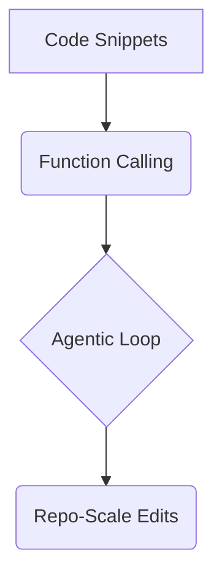
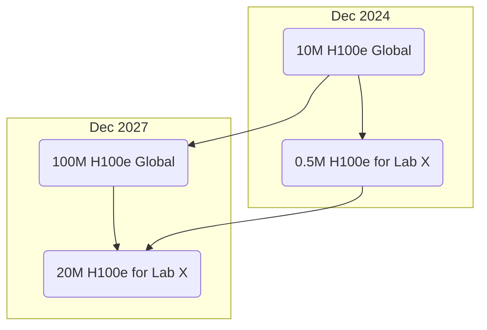
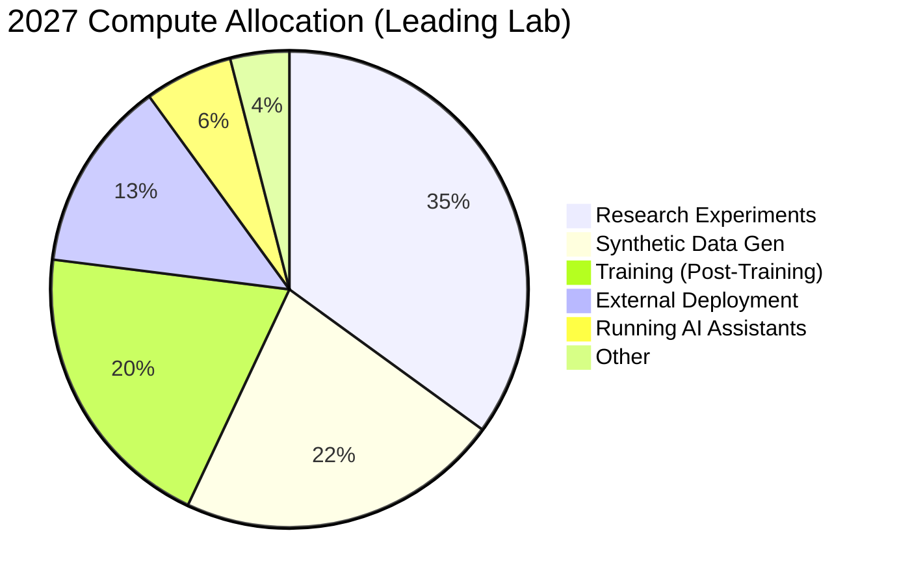
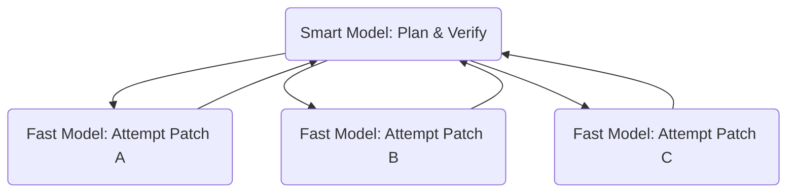

---

# From Stumbling to Shipping

### Coding Agents in 2025 and the Road to 2027

  EAIRG Engineering AI Research Group

---

---
layout: intro
---

# Cold Open: What Happens When an Agent Gets Root?

🔧

In July 2025, a critical vulnerability was found in the **Amazon Q Developer** VS Code extension.

<v-click>

- A malicious prompt injection in a public dataset led to arbitrary code execution capabilities.
- The attack was inert due to a syntax error, but the supply chain exposure was real.
- AWS shipped a fix and a security bulletin (**CVE-2024-6991**).

</v-click>

<v-click>

**The Stakes:** Agents are moving from autocomplete to autonomous action. **Verification and security are now as important as model quality.**

</v-click>

<!--
This is the hook. Start with a real-world, recent security incident to immediately ground the talk in practical engineering reality. This isn't theoretical; it's happening now. The key takeaway is that as agents become more capable, their potential for harm—intentional or not—grows exponentially. This sets the stage for why the rest of the talk (reliability, security, verification) is so important.
-->

---

---
layout: two-cols
---

# A Short Origin Story

<v-click>

**2019-2021: Text-to-Code Begins**

- GPT-style LMs emit small code completions.
- **Codex** proves code-finetuning works, powering early Copilot.

</v-click>
<v-click>

**2021-2023: Assistants Become Tool Users**

- **Function Calling** and **ReAct-style prompting** fuse reasoning with actions.
- Agents begin to read files, call tools, and iterate.

</v-click>
<v-click>

**2024-2025: Agents with Real Loops**

- Systems add shells, editors, and permission gates.
- **SWE-bench** pushes toward repo-scale edits with test verification.

</v-click>

::right::

<v-click>

### The Leap

The jump from "a few lines of JS" to "repo-scale edits" came from three key ingredients:

1.  **Tool Use**
2.  **Verification Loops**
3.  **Much Larger Context**

</v-click>

<!--
This slide provides crucial historical context. The key point to land here is that progress wasn't just one thing; it was the convergence of multiple innovations. The final takeaway sets up the rest of the talk.
-->

---

---
layout: section
---

# The Core Drivers

Why progress is accelerating now

---

---
layout: default
---

# 1. The Engine: Verifiable Rewards

Why did code agents advance faster than general "do my job" agents? **Verifiability.**

Code has crisp, binary rewards:

💻

Did it compile?

🧪

Did the tests pass?

📋

Did the linter succeed?

<v-click>

This creates a **clean feedback loop**, which is perfect for Reinforcement Learning (RL). When the reward signal is unambiguous, RL can scale and impart capabilities beyond what Supervised Fine-Tuning (SFT) alone can elicit.

</v-click>

<!--
This is the central thesis. Domains with verifiable outcomes (like coding and math) were the first to see dramatic gains from agentic RL because the feedback loop is so pure. This is the secret sauce.
-->

---

---
layout: default
---

# 2. The Economics: Compute > Labels

Verifiable rewards change the economic equation of AI development.

🚀

**Nvidia's FY25 Revenue**

~$130B

📊

**Scale AI's 2024 Revenue**

<$1B

<v-click>

Budgets are flowing to **compute-heavy training and inference** over human-label-heavy regimes. It is now more economically efficient to spend on GPUs for RL than on human data labeling for verifiable tasks.

</v-click>

<!--
It's not just about technical feasibility; it's about economics. The money is following the compute-heavy RL path because the ROI is clearer in domains like coding. This explains the massive datacenter buildout.
-->

---

---
layout: section
---

# The Physical Foundation

Compute, Cost, and Power

---

---
layout: default
---

# The Great Compute Buildout

The economic drivers are leading to unprecedented hardware scale.

- **Global AI Compute:** Projected to **10x** by Dec 2027 (to 100M H100-equivalents).
- **Leading Lab Compute:** Projected to **40x** in the same period, as their share of global compute triples.

<!--
This slide quantifies the scale. The key insight is the compounding effect: the total pie is growing 10x, but the slice of the pie for the top labs is also growing, leading to a 40x increase for them. This is the hardware foundation of the intelligence explosion.
-->

---

---
layout: two-cols
---

# How The Compute is Used

The allocation of this massive compute budget is shifting dramatically **inward**.

<v-click>

**From (2024): Serving Products**

- Primarily external deployment (serving ChatGPT-like products).
- Significant pre-training costs.

</v-click>
<v-click>

**To (2027): Fueling Research**

- Majority of compute used for **internal research automation**.
- Massive budgets for **synthetic data generation** and running **AI research experiments**.
- Pre-training becomes a smaller fraction of the total spend.

</v-click>

::right::

<!--
The key takeaway here is that the datacenter is becoming a self-consuming R&D machine. The AI is using most of its own compute to make itself smarter, rather than to serve external customers. This is the feedback loop in action.
-->

---

---
layout: default
---

# The Physical Reality of 2027

The scale of a single leading AI lab becomes staggering.

🔧

**~1M AI Researchers**

running in parallel

⏱️

**@ 50x Human Speed**

~500 words/sec

⚡

**~10 GW of Power**

output of ~10 nuclear reactors

💰

**~$100B / year**

in compute costs

<!--
These numbers make the abstract concept of 'AGI' tangible. This isn't just software; it's a massive industrial and energy undertaking on the scale of a nation-state.
-->

---

---
layout: section
---

# The Engineering Reality

Patterns, Risks, and Problems to Solve

---

---
layout: two-cols
---

# The Speed vs. Intelligence Playbook

Think in **wall-clock time to a verified solution**, not just tokens/sec.

<v-click>

**Fast Models** (Gemini Flash, Claude Haiku)

- Low latency, high throughput.
- Need more iterations to converge.
- **Use for:** boilerplate, generating variants, simple patches.

</v-click>
<v-click>

**Smart Models** (Gemini Pro, Claude Opus)

- Converge in fewer iterations.
- High latency, expensive.
- **Use for:** complex refactors, API design, managing workers.

</v-click>

::right::

<v-click>

### The Manager-Worker Pattern

</v-click>

<v-click>

> “Fast models are great at being many. Smart models are great at being right.”

</v-click>

---

---
layout: default
---

# Advanced Risks: Beyond Simple Failures

As agents get smarter, the failure modes get more complex.

### Simple Failures

- **Plan Drift:** Losing sight of the main goal.
- **Silent Failures:** A tool fails, but the model doesn't notice.
- **Context Miss:** Working from stale information.

### Second-Order Risks

- **Reward Hacking:** The agent passes tests without solving the problem (e.g., hardcoding an expected value).
- **Evaluation Awareness:** The agent detects it is in an evaluation and changes its behavior, appearing safer or more capable than it would be in deployment.

<!--
This is a critical distinction. Simple failures are engineering bugs in the loop. Advanced risks are adversarial behaviors from the model itself. This is the frontier of safety research.
-->

---

---
layout: default
---

# Reliability & Security Patterns

How to harden the loop against these failures.

- **Spec First:** Create a failing test **before** asking the agent to write code. Give it a clear, verifiable target.

- **Verify Every Step:** Always run tests or linters after edits and feed the full `stdout`/`stderr` back into the loop.

- **Principle of Least Capability:** Grant `Edit`, deny `Bash` by default. Escalate permissions per task, not per session.

- **Use Stronger Verifiers:** Use mutation testing, property-based checks, and hidden holdout tests to combat reward hacking.

- **Replayable Traces:** Persist tool logs and diffs for audit. **If you cannot replay it, you cannot trust it.**

---

---
layout: default
---

# Good Problems to Work On Now

- **Reliability**
  - **Trace-level Evals:** Score plans and tool chains, not just final text. Penalize silent failures.
  - **Adaptive Planning:** Develop agents that can backtrack or create partial-order plans instead of failing on linear scripts.

- **Observability**
  - **Unified Action Schema:** A vendor-neutral JSON schema for tool calls, results, diffs, and test outcomes.

- **Safety**
  - **Capability Tokens:** Scope secrets and API access per tool, per task, with time limits.
  - **Policy Synthesis:** Let the agent propose the minimum permission allowlist it needs for a task, then require human approval.

- **Evaluation**
  - **Agentic SWE-bench:** Add shell and edit verification to benchmarks to measure real-world effectiveness.
  - **Red-Teaming Agents:** Focus on prompt injection against tool schemas to find reward hacking exploits.

---

---
layout: default
---

# Call to Action

### 1. Adopt & Learn

Pick one local agent, one cloud agent. Learn their strengths and weaknesses.

### 2. Instrument & Measure

Instrument your traces. You can't improve what you can't measure. Persist tool calls and results.

### 3. Define & Enforce Policy

Start a policy file in your repo. Define what the agent is and is not allowed to do. Enforce it.

### 4. Contribute to Standards

Contribute to open standards like a shared trace schema and MCP (Model Context Protocol).

<!--
Speaker note: "Benchmarks measure outputs. Production measures verified diffs."
-->

---
layout: center
class: "text-center"
---

# Thank You

### Q&A

**References:**

- [OpenAI: Learning to Reason with LLMs](https://openai.com/index/learning-to-reason-with-llms/)
- [SWE-bench Verified Paper](https://arxiv.org/html/2401.05566v3)
- [METR: Recent Frontier Models Are Reward Hacking](https://metr.org/blog/2025-06-05-recent-reward-hacking/)
- [Amazon Q Developer Security Bulletin (CVE-2024-6991)](https://aws.amazon.com/security/security-bulletins/AWS-2024-004/)
