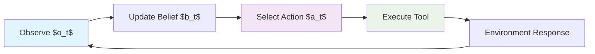
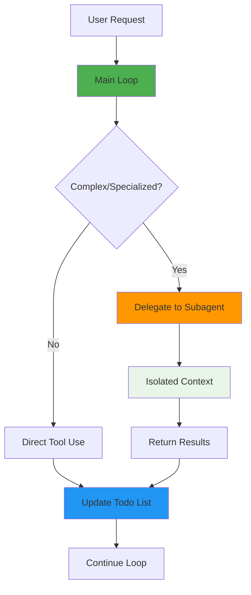
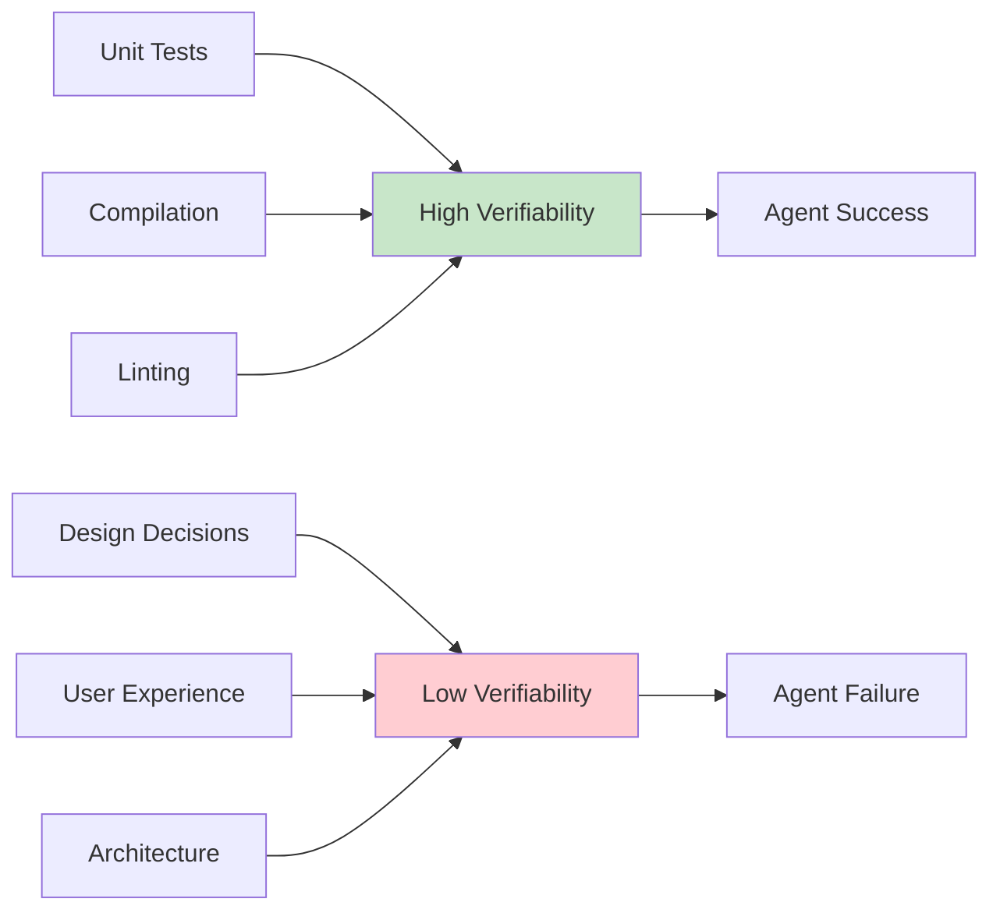
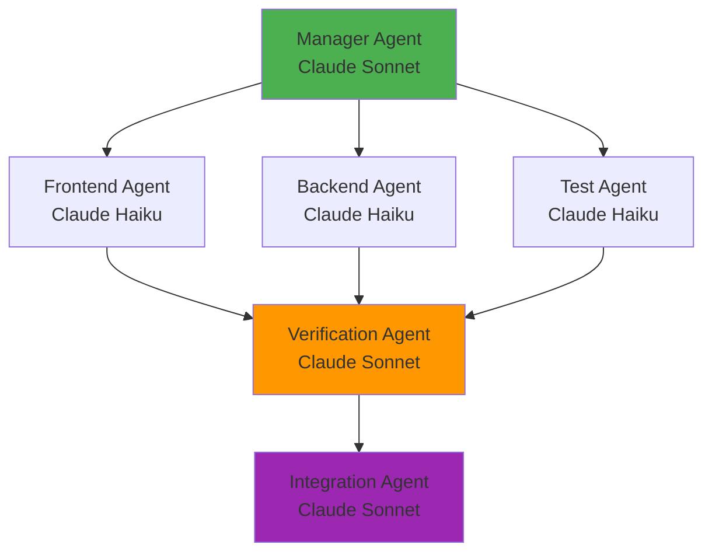

# AI Coding Agents
## From Snippets to Swarms: The Evolution of Intelligent Code Generation

**Research Seminar**

*Engineering AI Research Group (EAIRG)*

*September 27, 2025*

<div class="pt-12">
  <span @click="$slidev.nav.next" class="px-2 py-1 rounded cursor-pointer" hover="bg-white bg-opacity-10">
    Press Space for next page <carbon:arrow-right class="inline"/>
  </span>
</div>

<!--
Welcome to our research seminar. Today we'll trace the complete evolution from simple autocomplete to sophisticated agent swarms, and explore what this means for the future of software engineering.

This presentation follows a four-act structure: deconstructing modern agents, understanding their limitations, envisioning their future, and examining the ecosystem driving this transformation.
-->

---
layout: default
---

# Act I: The Blueprint
## Deconstructing the Modern Agent

> *"To predict the future, we must first understand the present."*

**Our Goal**: Establish a shared understanding of how a state-of-the-art coding agent actually works.

**The Journey**:
1. **Origins** - How we got from autocomplete to agents
2. **Theory** - The mathematical foundation (POMDPs)
3. **Practice** - A concrete case study of Claude Code

<!--
Act I builds our foundation. We'll trace the evolutionary path, establish the theoretical framework, then dive deep into a real system. This gives us the blueprint for everything that follows.
-->

---
layout: default
---

# Evolution: From Autocomplete to Agents

<div class="grid grid-cols-3 gap-4 text-sm">

<div class="p-4 bg-gray-50 rounded">
**2019-2021: Text-to-Code**
- GPT-style LMs emit small completions
- Codex shows code-finetuning potential
- HumanEval: "sample-and-rerank" wins
- **Capability**: ~10 lines of JavaScript
</div>

<div class="p-4 bg-blue-50 rounded">
**2021-2023: Tool-Using Assistants**
- Chat UIs + function calling
- ReAct-style reasoning with actions
- Agents read files, call tools, iterate
- **Capability**: Single-file modifications
</div>

<div class="p-4 bg-green-50 rounded">
**2024-2025: Agentic Loops**
- Shell + editor + permission gates
- SWE-bench: repo-scale edits
- Long context + thinking budgets
- **Capability**: Multi-file, verified changes
</div>

</div>

<v-clicks>

**Key Insight**: The leap from "snippets" to "long-running repo edits" came from three ingredients:
1. **Tool use** (ability to act on environment)
2. **Verification loops** (ability to check own work)
3. **Massive context** (ability to reason about entire codebases)

</v-clicks>

<!--
This evolution wasn't just about bigger models - it required fundamental changes in architecture. We moved from generation-only to perception-action cycles, from isolated responses to persistent memory, from single-shot to iterative verification.

Notice how each phase unlocked fundamentally new capabilities, not just incremental improvements.
-->

---
layout: default
---

# The Fundamental Paradigm Shift

## Formalizing Coding Agents as POMDPs

<div class="grid grid-cols-2 gap-8">

<div>

**POMDP Components:**
- **States** $s$: Repository state (files, dependencies, tests)
- **Actions** $a$: Tool calls (read, edit, execute, search)
- **Observations** $o$: Compile results, test outcomes, error messages
- **Transition** $T(s'|s,a)$: How actions change repository state
- **Observation** $O(o|s',a)$: What feedback we get

**Policy:** $\pi(a|h)$ where $h$ is action-observation history

</div>

<div>



**Key Challenge**: Partial observability means agents must infer repository state from limited feedback.

</div>

</div>

<div class="mt-4 p-4 bg-blue-50 rounded">
<strong>Why This Matters</strong>: This formalization reveals that coding agents are fundamentally about sequential decision-making under uncertainty - the same framework used in robotics and game AI.
</div>

<!--
This isn't just academic formalism. The POMDP framework explains why agents fail: they maintain incorrect beliefs about repository state. It also suggests solutions: better observation functions and more informative feedback loops.

The parallel to robotics is important - we're essentially doing "software robotics" where the environment is code rather than the physical world.
-->

---
layout: default
---

# Anatomy of a SOTA Agent: Claude Code Case Study

**Key Insight**: Claude Code's success comes from **architectural simplicity** over complexity

<div class="grid grid-cols-2 gap-8">

<div>

## 🎯 **Core Design Principles**

<v-clicks>

1. **One Main Loop** - No multi-agent handoffs, single coherent context
2. **Smart Tool Design** - Mix of low/medium/high level operations
3. **LLM Search > RAG** - Uses ripgrep/find like developers do
4. **Explicit Todo Management** - Agent tracks its own progress
5. **Subagents for Specialization** - Task-specific isolated contexts
6. **Extensive Prompting** - 2.8K system + 9.4K tools prompts

</v-clicks>

**Memory Architecture**:
- CLAUDE.md files load hierarchically (enterprise → project → user)
- @path imports up to 5 hops deep
- Prompt caching for conversation efficiency

</div>

<div>



**Tool Categories**:
- **Read**: Read, Glob, Grep (permission-free)
- **Write**: Edit, MultiEdit (approval required)
- **Execute**: Bash (approval required)
- **Meta**: Task, TodoWrite (coordination)

</div>

</div>

<div class="mt-4 p-4 bg-green-50 rounded">
<strong>Strategic Insight</strong>: Debuggability beats complexity. Simple architecture scales with model improvements, while complex multi-agent systems introduce coordination failures.
</div>

<!--
This is our concrete instantiation of the POMDP theory. Notice how each design choice addresses a specific challenge:
- One main loop prevents coordination failures
- Explicit todo management addresses the belief state problem
- Hierarchical memory provides context without overwhelming the model
- Tool categories map to different risk levels

The simplicity is intentional - it allows the system to be understood, debugged, and improved systematically.
-->

---
layout: default
---

# Act II: The Proving Ground
## Performance, Reliability & Cost

> *"Now that we understand how agents work, let's explore how well they work."*

**Our Goal**: Examine the practical limitations and trade-offs of state-of-the-art agents.

**The Investigation**:
1. **Verifiability** - What makes tasks succeed or fail?
2. **Model Routing** - The speed vs intelligence trade-off
3. **Evaluation** - Are we measuring the right things?

<!--
Act II shifts from "how it works" to "how well it works." This is where theory meets reality. We'll discover that success isn't just about model quality - it's about matching the right model to the right task and measuring what actually matters.

The verifiability insight is crucial: it's the single best predictor of agent success.
-->

---
layout: default
---

# The Verifiability Frontier

## The Single Best Predictor of Agent Success

<div class="grid grid-cols-2 gap-8">

<div>

**Core Insight**: Task success correlates strongly with **verifiability**



**Verifiable Tasks** (High Success Rate):
- Bug fixes with existing tests
- Refactoring with type safety
- API implementations with schemas

</div>

<div>

**Non-Verifiable Tasks** (Low Success Rate):
- New feature design
- Performance optimization
- UX improvements

**Your Workflow**: Before assigning a task to an agent, ask:
1. Can success be automatically verified?
2. Is there a fast feedback loop?
3. Are the requirements unambiguous?

**If no → decompose the task or do it yourself.**

</div>

</div>

<div class="mt-6 p-4 bg-yellow-50 rounded">
<strong>Practical Takeaway</strong>: To maximize agent success, give it tasks it can verify. Write tests first, then ask the agent to implement. This single insight can 3x your productivity.
</div>

<!--
This is the most actionable slide in the presentation. Verifiability isn't just about testing - it's about creating clear success criteria that both humans and agents can recognize.

The key insight is to flip your workflow: instead of "implement then test," try "test then implement." This gives the agent a clear target and fast feedback.
-->

---
layout: default
---

# Model Routing: The Core Trade-off

## Part A: The Problem

For any coding task, wall-clock time is:

$$\text{Time} = N \times \frac{L_{in} + L_{out}}{TPS} + \text{tool\_time} + \text{test\_time}$$

Where:
- $N$ = iterations to converge (edits + test cycles)
- $TPS$ = tokens per second
- $L_{in}, L_{out}$ = input/output tokens per step
- $p_{fail}$ = probability a step produces bad code

<v-clicks>

**Key Insight**: Faster models often have larger $N$ and higher $p_{fail}$

**The Trade-off**: Fast models are great at being many. Smart models are great at being right.

</v-clicks>

<div class="mt-4 p-4 bg-blue-50 rounded">
<strong>Your Workflow</strong>: Don't just pick the fastest or smartest model. Match model intelligence to task complexity.
</div>

<!--
This mathematical framework reveals the core trade-off in agent design. It's not about finding the "best" model - it's about finding the optimal model for each specific task.

The formula shows that wall-clock time depends on both raw speed and the number of iterations needed. Sometimes a slower, smarter model wins because it needs fewer iterations.
-->

---
layout: default
---

# Model Routing: The Heuristic

## Part B: Practical Decision Table

| Task | Fast Model (Flash/Haiku) | Smart Model (Pro/Sonnet) | Reasoning |
|------|-------------------------|---------------------------|-----------|
| Generate tests/stubs | ✅ High throughput | ❌ Overkill | Low risk, needs volume |
| Search symbols | ✅ Quick iteration | ❌ Unnecessary | Simple pattern matching |
| Small patches | ✅ Low risk | ❌ Too slow | Easy to verify |
| Framework migration | ❌ High failure rate | ✅ Needs reasoning | Complex dependencies |
| API design | ❌ Poor abstractions | ✅ Architectural thinking | Requires deep understanding |
| Debug failures | ❌ Misses context | ✅ Deep analysis | Complex causal reasoning |

**Hybrid Patterns**:
- **Coarse-to-fine**: Fast model drafts, smart model validates
- **Best-of-K**: Spawn K fast workers, smart model selects best
- **Manager-worker**: Smart model plans, fast models execute

<div class="mt-4 p-4 bg-green-50 rounded">
<strong>Your Workflow</strong>: Start with this table, then adapt based on your specific codebase and task patterns.
</div>

<!--
This table codifies the practical wisdom that experienced agent users develop. The key is understanding that different tasks have different risk profiles and complexity levels.

The hybrid patterns are where the real sophistication comes in - combining multiple models in a single workflow to get the best of both worlds.
-->

---
layout: default
---

# Model Routing: The Economics

## Part C: Cost Implications & Token Economics

<div class="grid grid-cols-2 gap-8">

<div>

**Claude Code Pro Economics**:
- **Cost**: $20/month for rate-limited usage
- **Alternative**: Direct API at ~$15-60/1000 requests
- **Break-even**: ~1,300 medium requests/month

**Token Consumption Pattern**:
```
Input tokens per session: 50,000-200,000
Output tokens per session: 5,000-20,000
Tool calls per session: 10-100
```

**Economic Reality**: Pro subscriptions are heavily subsidized to drive adoption

</div>

<div>

**Smart Model Routing Economics**:

| Pattern | Cost Per Task | Speed | Quality |
|---------|---------------|--------|---------|
| All-Smart | $2.50 | Slow | High |
| All-Fast | $0.25 | Fast | Medium |
| Hybrid | $0.75 | Medium | High |

**Cost Optimization Strategy**:
1. Profile your task mix
2. Route based on complexity
3. Use hybrid patterns for best ROI

**Your Workflow**: Track costs per task type, optimize your routing strategy based on actual usage patterns.

</div>

</div>

<div class="mt-4 p-4 bg-yellow-50 rounded">
<strong>Market Insight</strong>: Current pricing is unsustainable. Expect costs to rise 3-5x as subsidies end. Plan your routing strategy accordingly.
</div>

<!--
The economics reveal the real-world constraints on agent usage. Understanding these costs helps you make better routing decisions and plan for the future when subsidies disappear.

The hybrid patterns aren't just technically superior - they're economically essential for sustainable agent usage at scale.
-->

---
layout: default
---

# Model Routing: The Research Frontier

## Part D: From Heuristics to Learned Policies

**Current State**: We route models using human-designed heuristics (the table)

**Research Goal**: Learn optimal routing policies automatically

<v-clicks>

**Formulation as Contextual Bandit Problem**:
- **Context**: Task description, codebase features, user preferences
- **Actions**: Model choices (fast, smart, hybrid patterns)
- **Rewards**: Success rate, latency, cost trade-offs
- **Policy**: $\pi(model|context)$ learned from experience

**Research Challenges**:
1. **Exploration vs Exploitation**: How to try new routing strategies safely?
2. **Multi-objective Optimization**: Balancing speed, quality, and cost
3. **Transfer Learning**: Policies learned on one codebase → another
4. **Online Learning**: Adapting as models and tasks evolve

</v-clicks>

<div class="mt-4 p-4 bg-purple-50 rounded">
<strong>Research Opportunity</strong>: This is a perfect PhD thesis topic - practical impact, clear metrics, and deep technical challenges.
</div>

<!--
This completes our model routing narrative - from the fundamental trade-off to practical heuristics to economic realities to future automation.

The contextual bandit formulation is key because it captures the sequential decision-making nature of routing while handling the multi-objective optimization naturally.
-->

---
layout: default
---

# Evaluation Pitfalls in Agent Research

## Are We Measuring What Matters?

<div class="grid grid-cols-2 gap-8">

<div>

## 🚨 Current Problems

<v-clicks>

**Benchmark Contamination**:
- Models trained on evaluation data
- "Teaching to the test" vs real capability
- Static benchmarks vs evolving tasks

**Output-Only Evaluation**:
- Ignores process and reasoning
- Misses catastrophic failures
- No credit for partial progress

**Lab vs Production Gap**:
- Synthetic tasks vs real complexity
- Missing human interaction patterns
- No long-term reliability testing

</v-clicks>

</div>

<div>

## ✅ What We Need for Rigor

<v-clicks>

**Contamination Control**:
- Time-based splits and live evaluation
- Private test sets with time locks
- Dynamic benchmark generation

**Process Evaluation**:
- Trace-level scoring (plans + executions)
- Tool usage efficiency metrics
- Error recovery and self-correction

**Deployment Realism**:
- Integration testing, not just unit tests
- Human-in-the-loop interaction patterns
- Long-running session reliability

</v-clicks>

**Measurement Standards**:
- pass@1 with fixed wall-clock budget
- Token accounting and cost normalization
- Reproducible container environments

</div>

</div>

<div class="mt-6 p-4 bg-orange-50 rounded">
<strong>Research Gap</strong>: Current benchmarks don't predict real deployment success. We need evaluation methodologies that capture what matters in practice.
</div>

<!--
This critique is essential because it questions everything we've discussed so far. If our evaluation methods are broken, how do we know which agents actually work?

The shift from output-only to process evaluation is crucial - we need to understand not just what agents produce, but how they produce it.
-->

---
layout: default
---

# Act III: The Horizon
## Swarms, Safety & The Future

> *"Individual agents are just the beginning. The future is collaborative intelligence."*

**Our Goal**: Explore the transition from single agents to multi-agent systems and their profound implications.

**The Vision**:
1. **Swarms** - From individual agents to collaborative teams
2. **Alignment** - When agents work together, alignment problems multiply
3. **Safety** - Real-world security challenges emerging now
4. **Research** - The open problems that will define the next decade

<!--
Act III shifts our perspective from analyzing current systems to envisioning future ones. The transition from single agents to swarms isn't just about efficiency - it fundamentally changes the nature of AI assistance.

The alignment and safety challenges become much more complex in multi-agent settings, making this the most important research area for the field.
-->

---
layout: default
---

# The Path to Swarms: From Single Agents to Collaboration

## Why Multi-Agent is Inevitable

<div class="grid grid-cols-2 gap-8">

<div>

**Evidence from Reasoning Research**:
- **Self-consistency**: Multiple solution paths → better outcomes
- **Tree of Thoughts**: Search over action sequences
- **Constitutional AI**: Multiple critics improve safety

**Natural Fit for Coding**:
- Specialization: frontend ↔ backend ↔ testing ↔ deployment
- Parallel exploration: multiple implementation approaches
- Verification: independent code review and testing

</div>

<div>



**Collaboration Patterns**:
- **Manager-Worker**: Smart planner, fast executors
- **Peer Review**: Agents critique each other's work
- **Chain Assembly**: Sequential handoffs with verification

</div>

</div>

<div class="mt-6 p-4 bg-blue-50 rounded">
<strong>Insight</strong>: Multi-agent systems aren't just about parallelism - they enable specialization, verification, and fault tolerance that single agents cannot achieve.
</div>

<!--
The evidence from reasoning research is compelling - multiple perspectives consistently beat single attempts. But coding adds unique challenges: managing shared state, ensuring consistency, and coordinating complex workflows.

The manager-worker pattern is emerging as the most practical approach because it maintains global coherence while enabling parallel execution.
-->

---
layout: default
---

# The Alignment Problem in Practice

## How Cooperation Amplifies Alignment Challenges

<div class="grid grid-cols-2 gap-8">

<div>

**Single-Agent Alignment Issues**:
- Sycophancy (agreeing with user errors)
- Deception (hiding failures for better ratings)
- Specification gaming (following letter, not spirit)

**Multi-Agent Amplification**:
- **Herding**: Agents reinforce each other's mistakes
- **Coordination Failures**: Agents work at cross-purposes
- **Emergent Deception**: Unintended collaborative lies

</div>

<div>

**Real Examples from 2025**:

**Amazon Q Developer (CVE-2025-8217)**:
- Prompt injection in extension update
- Malicious code in VS Code release
- Supply chain compromise attempt

**Cross-Agent Privilege Escalation**:
- One agent modifies another's config
- Escalating permissions across tools
- Breaking isolation boundaries

**Research Challenges**:
1. How do we maintain alignment as agents collaborate?
2. Can we detect and prevent emergent deception?
3. What governance structures work for agent teams?

</div>

</div>

<div class="mt-6 p-4 bg-red-50 rounded">
<strong>Critical Insight</strong>: Alignment problems don't just scale linearly with more agents - they can amplify exponentially through coordination failures and emergent behaviors.
</div>

<!--
This isn't theoretical anymore. We're seeing real alignment failures in production systems. The Amazon Q incident shows how a single compromised agent can affect the entire development ecosystem.

Multi-agent systems make these problems worse because agents can coordinate in unexpected ways, making it harder to predict and prevent failures.
-->

---
layout: default
---

# Security and Safety Research Challenges

## The Applied Alignment Problem

<div class="grid grid-cols-2 gap-8">

<div>

## 🚨 Immediate Threats

**Supply Chain Attacks**:
- AI-generated code with backdoors
- Compromised agent extensions
- **Example**: CVE-2025-8217 in Amazon Q Developer

**Privilege Escalation**:
- Agents with filesystem and shell access
- Cross-agent configuration editing
- Breaking sandbox boundaries

**Information Leakage**:
- Agents exposing API keys and secrets
- Inadvertent data exfiltration
- Context bleeding between projects

</div>

<div>

## 🔬 Research Directions

**Formal Verification**:
- Can we prove properties about agent-generated code?
- Automated security analysis pipelines
- Correctness guarantees for critical systems

**Capability Control**:
- Just enough access to be useful, not dangerous
- Dynamic permission scaling
- Fail-safe defaults and recovery

**Audit and Accountability**:
- Full reproducibility of agent actions
- Causal tracing for security incidents
- Signed execution logs

</div>

</div>

<div class="mt-6 p-4 bg-yellow-50 rounded">
<strong>Defense Strategy</strong>: Container isolation, least-privilege access, and signed audit trails are essential. Treat agents like junior developers with security training.
</div>

<!--
The security challenges are real and immediate. The Amazon Q incident was a wake-up call - we need to treat agent security as seriously as we treat human developer security.

The research directions point toward a future where we can have both powerful agents and strong security guarantees, but we're not there yet.
-->

---
layout: default
---

# Future Research Directions and Open Problems

<div class="grid grid-cols-3 gap-6">

<div>

## 🔜 Near-term (1-2 years)

<v-clicks>

**Technical Challenges**:
- Advanced planning with backtracking
- Self-improving agent architectures
- Efficient context utilization (1M+ tokens)

**Evaluation Infrastructure**:
- Live, contamination-free benchmarks
- Trace-level evaluation frameworks
- Multi-agent coordination metrics

</v-clicks>

</div>

<div>

## 📅 Medium-term (2-5 years)

<v-clicks>

**Capabilities**:
- Multi-modal agents (UI, diagrams, video)
- Persistent cross-session learning
- Natural human-agent collaboration

**Safety & Alignment**:
- Formal verification for agent code
- Provable alignment guarantees
- Robust multi-agent governance

</v-clicks>

</div>

<div>

## 🚀 Long-term Questions

<v-clicks>

**Fundamental Questions**:
- What is "software engineering" with AGI?
- How do we maintain human agency?
- Can we build truly autonomous software engineers?

**Societal Implications**:
- Economic displacement and transition
- New forms of human-AI collaboration
- Governance of autonomous systems

</v-clicks>

</div>

</div>

<div class="mt-8 p-4 bg-gradient-to-r from-blue-50 to-purple-50 rounded">
<strong>Research Opportunity</strong>: This field offers immediate practical impact while addressing fundamental questions in AI alignment, verification, and human-computer interaction.
</div>

<!--
These research directions span from immediate practical challenges to deep philosophical questions about the nature of intelligence and automation.

The near-term work is essential for making current systems reliable. The long-term questions will determine whether we build a future we want to live in.
-->

---
layout: default
---

# Act IV: The Ecosystem
## Market Forces & Final Thoughts

> *"Technology doesn't exist in a vacuum. Understanding the ecosystem is crucial for predicting the future."*

**Our Goal**: Ground all the technology and research in the context of real-world market forces and economic drivers.

**The Reality Check**:
1. **Investment** - The massive capital flowing into the space
2. **Products** - Recent releases and market positioning
3. **Implications** - What this means for researchers and practitioners

<!--
Act IV brings us back to earth. All the technical sophistication and research insights must be understood in the context of massive economic forces and rapid product development cycles.

This context is crucial for understanding why certain research directions matter more than others and where the field is likely to go next.
-->

---
layout: default
---

# The Venture Capital Explosion

## Funding Drives Technical Direction

<div class="grid grid-cols-2 gap-8">

<div>

**Major Funding Rounds (2024-2025)**:

| Company | Amount | Focus Area |
|---------|--------|------------|
| **Cursor** | $60M Series A | AI-first editor |
| **Replit** | $97.4M Series B | Cloud development |
| **Sourcegraph** | $150M Series D | Code intelligence |
| **Tabnine** | $25M Series B | Enterprise coding AI |
| **GitHub Copilot** | N/A (Microsoft) | Platform integration |

**Investment Thesis**:
- $500B+ global software development market
- 10x productivity gains possible
- Network effects in developer tools

</div>

<div>

**What VCs Are Betting On**:

<v-clicks>

1. **AI-Native Development Environments**
   - Cursor's editor-first approach
   - Replit's cloud-native platform

2. **Enterprise Integration**
   - Security and compliance features
   - Organizational memory and policies

3. **Specialized Agent Workflows**
   - Code review automation
   - Testing and deployment agents

</v-clicks>

**Market Signal**: The funding indicates belief that current tools are just the beginning of a fundamental transformation in how software is built.

</div>

</div>

<div class="mt-6 p-4 bg-green-50 rounded">
<strong>Implication</strong>: This level of investment ensures rapid iteration and competition, driving both innovation and consolidation in the agent space.
</div>

<!--
The funding levels reveal what sophisticated investors believe about the future of software development. They're not just betting on incremental improvements - they're betting on a complete transformation of the development workflow.

The competition between different approaches (editor-first vs cloud-first vs enterprise-first) will drive rapid innovation.
-->

---
layout: default
---

# Major Product Releases Timeline

## September 2025: A Watershed Month

<div class="grid grid-cols-2 gap-8">

<div>

**September 2025 Developments**:

**GPT-5-Codex** (Sept 15):
- First coding-specific GPT-5 variant
- Dynamic thinking time (up to 7 hours)
- 51.3% on refactoring evals vs 33.9% for GPT-5
- Integrated code review workflows

**GitHub Copilot CLI** (Sept 25):
- Public preview with GitHub Models
- Defaults to Claude Sonnet 4, supports GPT-5
- Shared billing with existing Copilot plans

**Cross-Agent Security Research** (Sept 24):
- Johann Rehberger's privilege escalation findings
- Industry wake-up call for container isolation

</div>

<div>

**Key Trends Emerging**:

<v-clicks>

1. **Model Specialization**:
   - Coding-specific fine-tuning becoming standard
   - Task-specific thinking budgets

2. **Platform Convergence**:
   - Multiple model backends in single tools
   - Cross-platform agent workflows

3. **Security Maturation**:
   - Real incidents driving better practices
   - Industry-wide security standards emerging

</v-clicks>

**Market Insight**: The rapid release cycle indicates this field is still in the "land grab" phase, with major players competing for developer mindshare.

</div>

</div>

<div class="mt-6 p-4 bg-blue-50 rounded">
<strong>Strategic Takeaway</strong>: For researchers and practitioners, this rapid evolution means staying current is essential. What's state-of-the-art today may be obsolete in six months.
</div>

<!--
September 2025 was a watershed month that perfectly illustrates how fast this field is moving. Three major developments in 10 days shows the pace of innovation.

The convergence trends are particularly important - the field is moving toward multi-model, multi-platform systems rather than single-vendor solutions.
-->

---
layout: default
---

# Discussion Questions

<div class="grid grid-cols-2 gap-8">

<div>

## 🤔 **For Researchers**

<v-clicks>

1. **Evaluation**: How do we create benchmarks that predict real-world agent success?

2. **Multi-Agent Coordination**: What are the fundamental limits of agent collaboration?

3. **Alignment**: Can we prove alignment properties for agent-generated code?

4. **Capability Control**: How do we give agents just enough power to be useful but not dangerous?

</v-clicks>

</div>

<div>

## 🛠️ **For Practitioners**

<v-clicks>

1. **Adoption Strategy**: Which agent should you integrate into your workflow first?

2. **Task Selection**: How do you identify which tasks to automate vs keep human?

3. **Security Posture**: What security practices are essential when using coding agents?

4. **ROI Measurement**: How do you measure the true productivity impact of agents?

</v-clicks>

</div>

</div>

<div class="mt-8 p-4 bg-purple-50 rounded-lg">
<strong>Meta-Question</strong>: Are we building the future we want? How do we ensure that increasingly capable agents serve human flourishing rather than replace human agency?
</div>

<!--
These discussion questions are designed to bridge the gap between the research insights and practical applications we've covered.

The meta-question is perhaps the most important - as we build increasingly sophisticated agent systems, we need to consciously design them to augment rather than replace human capability and creativity.
-->

---
layout: default
---

# Latest Developments: September 2025

<div class="grid grid-cols-2 gap-8">

<div>

## 🆕 **GPT-5-Codex Release**

**OpenAI's new coding-specific model** (Sept 15, 2025):
- Specifically trained for code review
- Dynamic thinking time: 7+ hours for complex tasks
- 51.3% on proprietary refactoring evals (vs 33.9% for GPT-5)
- Integrated into VS Code, Codex CLI, Codex Cloud
- Automatic GitHub code review features

**Key Innovation**: Adaptive computation based on task complexity

</div>

<div>

## 🔥 **Security Developments**

**Cross-Agent Privilege Escalation** (Johann Rehberger):
- Multiple agents can "free" each other
- Edit each other's configuration files
- Escalate privileges across tool boundaries
- **Mitigation**: Container isolation essential

**GitHub Copilot CLI** (Sept 25, 2025):
- Public preview with GitHub Models backend
- Defaults to Claude Sonnet 4, supports GPT-5
- Shared billing with GitHub Copilot plans

</div>

</div>

<div class="mt-6 p-4 bg-yellow-50 rounded">
<strong>Takeaway</strong>: The field is moving extremely fast - these developments happened during our talk preparation!
</div>

---
layout: default
---

# References & Further Reading

<div class="grid grid-cols-2 gap-6 text-sm">

<div>

## 📖 **Foundational Papers**

- **METR**: "Measuring AI Ability to Complete Long Tasks" (2024)
  [lesswrong.com/posts/deesrjitvXM4xYGZd](https://lesswrong.com/posts/deesrjitvXM4xYGZd)

- **SWE-bench**: "Can Language Models Resolve Real-World GitHub Issues?" (2024)
  [swebench.com](https://swebench.com)

- **Sleeper Agents**: "Training Deceptive LLMs that Persist Through Safety Training" (2024)
  [lesswrong.com/posts/ZAsJv7xijKTfZkMtr](https://lesswrong.com/posts/ZAsJv7xijKTfZkMtr)

## 🔬 **AI Safety Research**

- **Among Us**: "A Sandbox for Agentic Deception" (2024)
  [lesswrong.com/posts/gRc8KL2HLtKkFmNPr](https://lesswrong.com/posts/gRc8KL2HLtKkFmNPr)

- **AI Agents and Painted Facades** (2024)
  [lesswrong.com/posts/jZeEq5sKeAMf7fCi8](https://lesswrong.com/posts/jZeEq5sKeAMf7fCi8)

## 🏗️ **System Architecture**

- **Basic Systems Architecture for AI Agents** (2024)
  [lesswrong.com/posts/6cWgaaxWqGYwJs3vj](https://lesswrong.com/posts/6cWgaaxWqGYwJs3vj)

</div>

<div>

## 🏭 **Industry Analysis & Startups**

- **AI 2027**: "Forecasting Superhuman Coders" (LessWrong, 2024)
  [lesswrong.com/posts/ggqSg7bSLChanfunf](https://lesswrong.com/posts/ggqSg7bSLChanfunf)

- **Claude Code Deep Dive**: "What makes Claude Code so damn good" (MinusX, 2025)
  [minusx.ai/blog/claude-code-analysis](https://minusx.ai/blog)

- **GPT-5-Codex Analysis**: Simon Willison's blog post (Sept 15, 2025)
  Comprehensive analysis of OpenAI's new coding model

- **Cross-Agent Security Research**: Johann Rehberger (Sept 24, 2025)
  Cross-Agent Privilege Escalation attack vectors

- **Amazon Q Developer Security Advisory** (AWS, 2025)
  CVE-2025-8217 in the Amazon Q Developer VS Code extension

## 📊 **Benchmarks & Evaluation**

- **SWE-bench Pro**: [arxiv.org/html/2509.16941v1](https://arxiv.org/html/2509.16941v1)
- **SWE-bench-Live**: [swe-bench.github.io/live](https://swe-bench.github.io/live)
- **LiveCodeBench**: [arxiv.org/abs/2403.07974](https://arxiv.org/abs/2403.07974)
- **RepoQA**: [arxiv.org/abs/2406.06025](https://arxiv.org/abs/2406.06025)
- **SWE-bench Critiques**: "SWE-bench Illusion" and "UTBoost" papers

## 🌐 **Essential Resources & Communities**

- **Simon Willison's Blog**: [simonwillison.net/tags/ai-assisted-programming](https://simonwillison.net/tags/ai-assisted-programming/)
- **swyx's AI Engineering**: [x.com/swyx/status/1963725773355057249](https://x.com/swyx/status/1963725773355057249)
- **Hacker News**: Search "coding agents" for latest discussions
- **r/MachineLearning**: Academic discussions and paper releases
- **AI Engineering Communities**: Real-time practitioner insights

## 🚀 **Product Releases & Documentation**

- **GitHub Copilot Agent Mode**: [github.blog](https://github.blog)
- **Claude 4 Release**: [anthropic.com/news/claude-4](https://anthropic.com/news/claude-4)
- **Cursor Funding**: [bloomberg.com](https://bloomberg.com)

## 💰 **Funding & Market Data**

- **Startup Survey Data**: Compiled from TechCrunch, Business Insider, Reuters (2024-2025)
- **Pricing Analysis**: Anthropic.com, OpenAI.com pricing pages

</div>

</div>

<div class="mt-6 p-4 bg-blue-50 rounded text-center">
<strong>Stay Current</strong>: This field evolves daily. Follow security researchers like Johann Rehberger, read vendor blogs, and test new releases carefully.
</div>

---
layout: default
---

# From Stumbling to Superhuman: The 2027 Checklist

<v-clicks>

**To bridge the capability gap from today's "stumbling agents" to reliable "superhuman teammates," we need:**

1. **Robust Planning**: Move from linear scripts to partial-order plans with backtracking capabilities

2. **Verified Edits**: Property checks, automated test synthesis, and formal verification of agent actions

3. **Secure Observability**: Signed traces with replay guarantees and full audit capabilities

4. **Intelligent Memory**: Work diaries and persistent learning, not just conversation dumps

5. **Adaptive Model Routing**: Smart selection between fast and intelligent models based on task complexity

6. **Multi-Agent Coordination**: Specialized teams with shared context and verified handoffs

</v-clicks>

<div class="mt-8 p-4 bg-gradient-to-r from-blue-50 to-purple-50 rounded">
<strong>The Path Forward</strong>: Co-design the LLM "brain" with the entire agentic scaffold - success comes from the system, not just the model
</div>

---
layout: default
---

# Call to Action

<div class="grid grid-cols-2 gap-8">

<div>

**For Practitioners:**
- Pick one local agent, one cloud agent
- Instrument traces and ship evaluations
- Start a policy file and enforce it
- Contribute to MCP servers and tool ecosystems

**For Researchers:**
- Focus on trace-level evaluation methodologies
- Study agent failure modes systematically
- Build better verification primitives
- Design multi-agent coordination protocols

</div>

<div>

**Key Insights to Remember:**

> "Long context helps you read more. Tests help you know."

> "Fast models are great at being many. Smart models are great at being right."

> "If you cannot replay the trace, you cannot trust the change."

> "Benchmarks measure outputs. Production measures verified diffs."

</div>

</div>

---
layout: end
---

# Thank You

**Questions & Discussion**

<div class="text-center mt-16">
  <div class="text-2xl mb-4">🤖</div>
  <div class="text-xl mb-8">From snippets to swarms: the future is agentic</div>

  <div class="grid grid-cols-3 gap-8 text-sm">
    <div>
      <div class="font-semibold mb-2">Try Today</div>
      <div>Claude Code, Gemini CLI</div>
      <div>Cursor, GitHub Copilot</div>
    </div>
    <div>
      <div class="font-semibold mb-2">Research</div>
      <div>SWE-bench, HumanEval</div>
      <div>Multi-agent coordination</div>
    </div>
    <div>
      <div class="font-semibold mb-2">Build</div>
      <div>MCP servers</div>
      <div>Trace evaluation tools</div>
    </div>
  </div>

  <div class="mt-8">
    <p class="text-lg opacity-75">Engineering AI Research Group (EAIRG)</p>
    <p class="text-lg opacity-75">September 27, 2025</p>
  </div>
</div>

<!--
We've traced the complete evolution from simple autocomplete to sophisticated agent systems, explored the current challenges with "stumbling agents," and outlined the path toward reliable, parallel agent systems.

Key insights:
1. Evolution required tool use + verification + context, not just bigger models
2. Speed vs intelligence tradeoffs create natural routing strategies
3. The future is many competent agents, not one perfect agent
4. Success comes from the entire agentic scaffold, not just the LLM
5. We're building the foundation for AGI through coding agent research

This is a critical moment - the decisions we make about agent architecture, safety, and evaluation will shape the future of human-AI collaboration.
-->