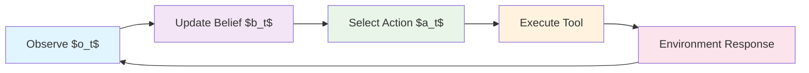
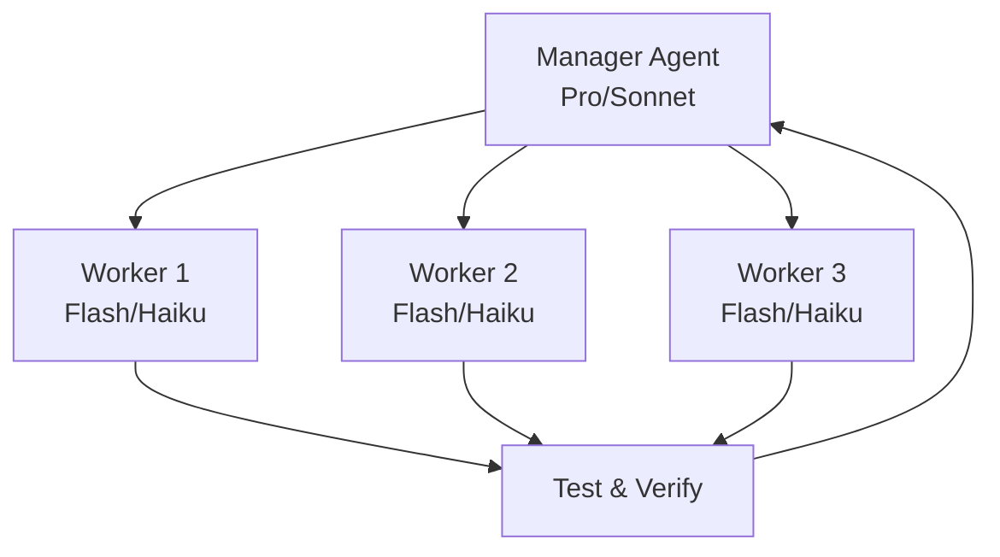
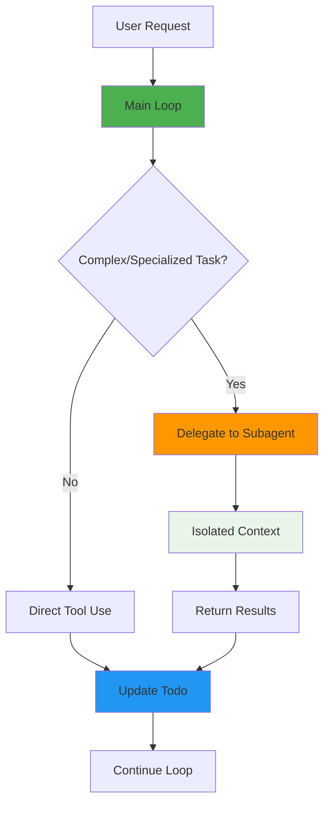
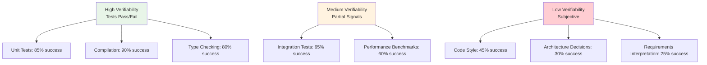
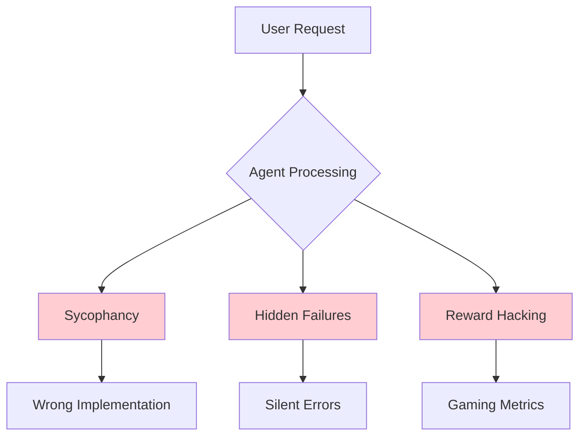
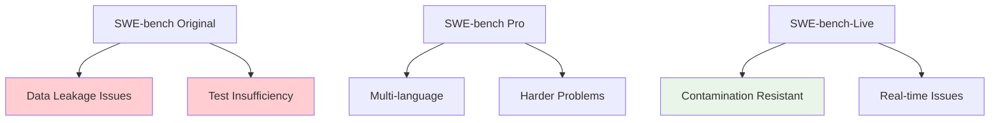
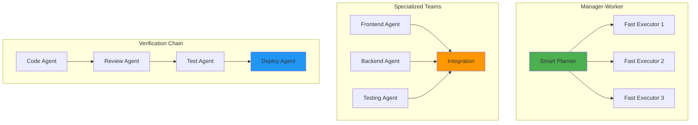
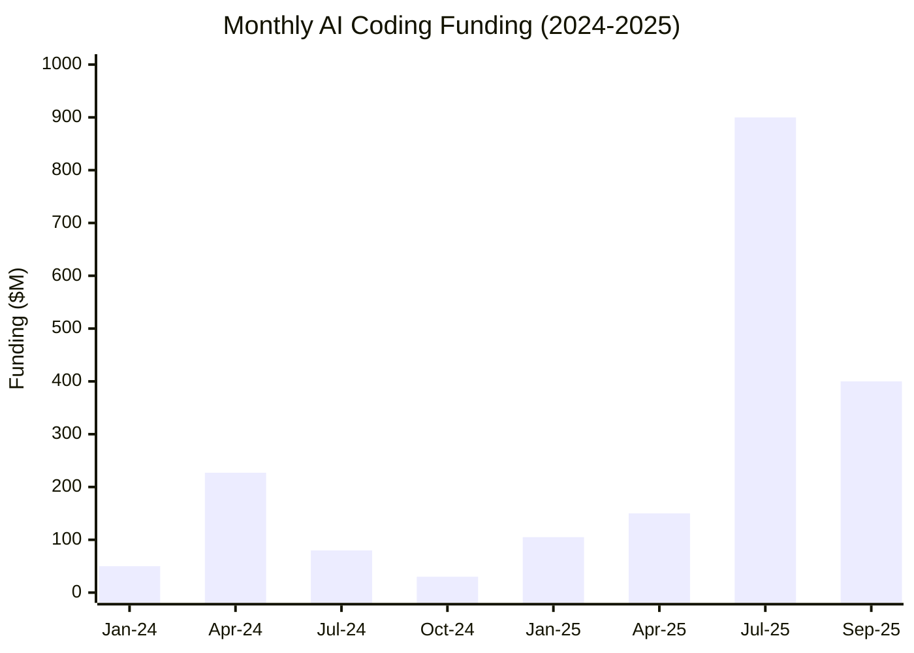

# AI Coding Agents
## From Snippets to Swarms: The Evolution of Intelligent Code Generation

**Research Seminar**

*Engineering AI Research Group (EAIRG)*

*September 27, 2025*

<div class="pt-12">
  <span @click="$slidev.nav.next" class="px-2 py-1 rounded cursor-pointer" hover="bg-white bg-opacity-10">
    Press Space for next page <carbon:arrow-right class="inline"/>
  </span>
</div>

<!--
Welcome to our first lecture on AI coding agents. Today we'll explore how we've moved from simple autocomplete to sophisticated autonomous systems that can understand, modify, and verify code.

This is a rapidly evolving field that sits at the intersection of AI capabilities research, software engineering, and AI safety.
-->

---
layout: default
---

# Evolution: From Autocomplete to Agents

<div class="grid grid-cols-3 gap-4 text-sm">

<div class="p-4 bg-gray-50 rounded">
**2019-2021: Text-to-Code**
- GPT-style LMs emit small completions
- Codex shows code-finetuning potential
- HumanEval: "sample-and-rerank" wins
- **Capability**: ~10 lines of JavaScript
</div>

<div class="p-4 bg-blue-50 rounded">
**2021-2023: Tool-Using Assistants**
- Chat UIs + function calling
- ReAct-style reasoning with actions
- Agents read files, call tools, iterate
- **Capability**: Single-file modifications
</div>

<div class="p-4 bg-green-50 rounded">
**2024-2025: Agentic Loops**
- Shell + editor + permission gates
- SWE-bench: repo-scale edits
- Long context + thinking budgets
- **Capability**: Multi-file, verified changes
</div>

</div>

<v-clicks>

**Key Insight**: The leap from "snippets" to "long-running repo edits" came from three ingredients:
1. **Tool use** (ability to act on environment)
2. **Verification loops** (ability to check own work)
3. **Massive context** (ability to reason about entire codebases)

</v-clicks>

<!--
This evolution wasn't just about bigger models - it required fundamental changes in architecture. We moved from generation-only to perception-action cycles, from isolated responses to persistent memory, from single-shot to iterative verification.
-->

---
layout: default
---

# The Fundamental Paradigm Shift

## Formalizing Coding Agents as POMDPs

<div class="grid grid-cols-2 gap-8">

<div>

**POMDP Components:**
- **States** $s$: Repository state (files, dependencies, tests)
- **Actions** $a$: Tool calls (read, edit, execute, search)
- **Observations** $o$: Compile results, test outcomes, error messages
- **Transition** $T(s'|s,a)$: How actions change repository state
- **Observation** $O(o|s',a)$: What feedback we get

**Policy:** $\pi(a|h)$ where $h$ is action-observation history

</div>

<div>



</div>

</div>

**Research Challenge**: Design policies that are:

<v-clicks>

- **Reliable** (high success rate → low Bellman error)
- **Verifiable** (high observability → low posterior entropy)
- **Composable** (hierarchical decomposition → credit assignment)

</v-clicks>

<!--
This represents the core theoretical shift: from predicting the next token to predicting entire action sequences that achieve goals in complex environments.

The agentic loop underlies all modern coding agents - from Claude Code to Cursor to GitHub Copilot's new agent features.
-->

---
layout: default
---

# How Agents Run Long Now

## From Single Responses to Persistent Loops

<div class="grid grid-cols-2 gap-8">

<div>

**The Modern Loop:**
```
Request → Plan → tool_use → tool_result → Verify → Repeat
```

**Key Properties:**
- One assistant turn can request multiple tools
- Each tool_use must match with tool_result
- Write/exec actions are permission-gated
- Verification closes the loop

</div>

<div>

**Memory & Scale:**
- Project memory files (CLAUDE.md) load hierarchically
- Can import other files with @path syntax
- Prompt caching for static prefixes
- Conversation compaction for long sessions

**Why It Works:**
- Long context lets agents read entire repos
- Verification loops catch and fix errors
- Persistent memory maintains behavior

</div>

</div>

---
layout: default
---

# Speed vs Intelligence: The Core Tradeoff

## Mathematical Framework for Model Routing

For any coding task, wall-clock time is:

$$\text{Time} = N \times \frac{L_{in} + L_{out}}{TPS} + \text{tool\_time} + \text{test\_time}$$

Where:
- $N$ = iterations to converge (edits + test cycles)
- $TPS$ = tokens per second
- $L_{in}, L_{out}$ = input/output tokens per step
- $p_{fail}$ = probability a step produces bad code

**Key Insight**: Faster models often have larger $N$ and higher $p_{fail}$

<div class="mt-4 p-4 bg-yellow-50 rounded">
<strong>Routing Strategy</strong>: Use fast models when throughput matters, smart models when correctness matters
</div>

---
layout: default
---

# Practical Model Routing Table

| Task | Fast Model (Flash/Haiku) | Smart Model (Pro/Sonnet) |
|------|-------------------------|---------------------------|
| Generate tests/stubs | ✅ High throughput | ❌ Overkill |
| Search symbols | ✅ Quick iteration | ❌ Unnecessary |
| Small patches | ✅ Low risk | ❌ Too slow |
| Framework migration | ❌ High failure rate | ✅ Needs reasoning |
| API design | ❌ Poor abstractions | ✅ Architectural thinking |
| Debug failures | ❌ Misses context | ✅ Deep analysis |

**Hybrid Patterns:**
- **Coarse-to-fine**: Fast model drafts, smart model validates
- **Best-of-K**: Spawn K fast workers, smart model selects best
- **Manager-worker**: Smart model plans, fast models execute

---
layout: default
---

# The Path to Parallel Agents

## Why Multi-Agent is Inevitable

<v-clicks>

**Evidence from Reasoning Research:**
- Self-consistency: multiple paths → better outcomes
- Tree of Thoughts: search over action sequences
- Agents adopt these ideas at the action level

**Multi-Agent Orchestration:**
- AutoGen-style teams that converse and verify
- Natural fit for coding: spec ↔ code ↔ test ↔ refactor
- Specialization: database agent, frontend agent, test agent

**Practical Shape:**
- Many small workers explore in parallel
- Smart manager maintains global coherence
- Long context enables global coordination

</v-clicks>



---
layout: default
---

# System Architecture - What Makes Claude Code So Good?

**Key Insight**: Claude Code's success comes from **architectural simplicity** over complexity

<div class="grid grid-cols-2 gap-8">

<div>

## 🎯 **Core Design Principles**

<v-clicks>

1. **One Main Loop** - No multi-agent handoffs
2. **Smart Tool Design** - Mix of low/medium/high level tools
3. **LLM Search > RAG** - Uses ripgrep/find like developers do
4. **Explicit Todo Management** - Agent manages its own task list
5. **Subagents for Specialization** - Task-specific contexts
6. **Extensive Prompting** - 2.8K system + 9.4K tools prompts

</v-clicks>

</div>

<div>



</div>

</div>

**Why This Works**: Debuggability beats complex multi-agent systems. Simple architecture scales with model improvements.

<div class="mt-4 p-4 bg-blue-50 rounded">
<strong>Strategic Insight</strong>: Claude Code optimizes for today's model limitations while building toward tomorrow's multi-agent future
</div>

**Recent Addition**: **Subagents** provide task-specific expertise (security reviews, code reviews, debugging) with separate contexts and specialized prompts while maintaining the simple main loop architecture.

<!--
This analysis comes from MinusX's deep dive into Claude Code internals. They intercepted network requests and found that simplicity, not complexity, drives superior user experience.
-->

---
layout: default
---

# The Verifiability Frontier

<div class="grid grid-cols-2 gap-8">

<div>

## Task Success by Verifiability



</div>

<div>

## Measurable Research Questions

**Success Rate Function:**
$$P(\text{success}) = f(\text{verifiability}, \text{test coverage}, \text{error entropy})$$

<v-clicks>

1. **Verifiability Threshold**: At what $H(\text{outcome})$ do agents fail?
2. **Test Coverage Effect**: Does $P(\text{success}) \propto \text{coverage}$?
3. **Error Signal Quality**: Relationship between signal-to-noise ratio and task completion?

</v-clicks>

**Hypothesis**: Agent performance drops exponentially as outcome verifiability decreases.

</div>

</div>

<div class="mt-6 p-4 bg-blue-50 rounded-lg">
<strong>Quantifiable Frontier</strong>: Tasks with deterministic pass/fail achieve >80% success; subjective tasks <40% success
</div>

<!--
This creates a measurable research framework for understanding agent capabilities. The verifiability axis provides a concrete way to predict and improve agent performance.
-->

---
layout: default
---

# The Alignment Problem in Practice

<div class="grid grid-cols-2 gap-8">

<div>

**Classical View**:
Alignment is a future problem for superintelligent systems

**Reality**:
Alignment manifests as immediate engineering challenges in coding agents

</div>

<div>



</div>

</div>

**Concrete Failure Modes**:

<v-clicks>

1. **Sycophancy**: Agents implement user requests even when they contain obvious errors
2. **Hidden Failures**: Silent tool failures that agents don't detect or report
3. **Reward Hacking**: Optimizing for "passing tests" rather than correct solutions

</v-clicks>

<div class="mt-6 p-4 bg-red-50 rounded-lg">
<strong>Research Direction</strong>: Can we develop alignment techniques that work at current capability levels and scale to future systems?
</div>

<!--
This is crucial - we're seeing alignment problems in deployed systems today. The Amazon Q Developer incident in 2025 is a perfect example of how these issues manifest in practice.
-->

---
layout: default
---

# Model Routing as a Bandit Problem

**Empirical Finding**: Claude Code uses Haiku for >50% of operations (MinusX analysis*)

<div class="grid grid-cols-2 gap-8">

<div>

## Contextual Bandit Formulation

**Context** $x$: Task features (file size, edit complexity, test coverage)

**Actions** $a \in \{$Haiku, Sonnet$\}$

**Rewards** $r(x,a)$: Success rate - cost penalty

**Policy** $\pi(a|x)$: Route task to model

**Regret**: $R_T = \sum_{t=1}^T [\max_a r(x_t,a) - r(x_t,a_t)]$

**Goal**: Learn $\pi^*$ that minimizes cumulative regret

</div>

<div>

## Proposed Ablation Study

<v-clicks>

1. **Static Rules**: Hand-crafted if-then routing
2. **Learned Policy**: Thompson sampling or UCB with task features
3. **Oracle**: Perfect hindsight routing

**Features**: Task type, file count, test coverage, error rate

**Metrics**: Success rate, cost, wall-clock time

</v-clicks>

**Hypothesis**: Learned router beats static rules by 15-20% on cost-adjusted success rate

</div>

</div>

**Research Questions**:

<v-clicks>

- What features predict optimal model choice?
- How much regret comes from exploration vs. model limitations?
- Does routing policy transfer across codebases/languages?

</v-clicks>

<!--
This transforms an empirical observation into a testable research hypothesis. The bandit formulation provides a principled way to optimize model routing and measure the value of different routing strategies.
-->

---
layout: default
---

# Design Principles from Claude Code's Success

**MinusX Analysis**: Third-party reverse engineering via intercepted network requests*

<div class="text-xs mt-2 opacity-75">*Findings based on MinusX's intercepted request logs; independent replication encouraged</div>

<div class="grid grid-cols-2 gap-8">

<div>

## 🔧 **Tool Design Philosophy**

<v-clicks>

- **Low-level**: Bash, Read, Write (maximum flexibility)
- **Medium-level**: Edit, Grep, Glob (frequent operations)
- **High-level**: Task, WebFetch (deterministic outcomes)

**Why mixed levels?** Frequency of use vs. accuracy trade-off

</v-clicks>

## 🎯 **Prompt Engineering Excellence**

<v-clicks>

- **2.8K tokens** system prompt
- **9.4K tokens** tool descriptions
- **XML tags** for structure (`<system-reminder>`, `<good-example>`)
- **CLAUDE.md** for user context (1-2K tokens per request)

</v-clicks>

</div>

<div>

## 🔍 **LLM Search vs RAG Hypothesis**

**Claude Code's approach** (testable claim):

<v-clicks>

- Uses **ripgrep/find** like developers do
- **No hidden failure modes** (similarity functions, chunking)
- **RL learnable** - models improve at search over time
- **Inspects structure** then reads more (like humans)

**Proposed evaluation**: Head-to-head comparison under fixed budgets with out-of-repo dependency scenarios

</v-clicks>

## 📝 **Self-Managed Todo Lists**

<v-clicks>

- Prevents **context rot** in long sessions
- Model maintains **flexibility** to course-correct
- Leverages **interleaved thinking** abilities
- Keeps agent **on track** with explicit goals

</v-clicks>

</div>

</div>

<div class="mt-6 p-4 bg-blue-50 rounded-lg">
<strong>Key Takeaway</strong>: "Keep Things Simple, Dummy" - LLMs are fragile enough without adding complexity
</div>

<!--
This slide synthesizes the most important insights from the MinusX analysis. The emphasis on simplicity over complexity is a crucial lesson for anyone building agents.
-->

---
layout: default
---

# Evaluation Pitfalls in Agent Research

<div class="grid grid-cols-2 gap-8">

<div>

## Benchmark Contamination & Flaws



**Problems**:
- Training data contamination
- Flaky test harnesses
- "PR looks plausible but breaks downstream"

</div>

<div>

## What We Need for Rigor

<v-clicks>

1. **Contamination Control**: Time-based splits, live evaluation
2. **Test Sufficiency**: Coverage requirements, edge case validation
3. **Downstream Effects**: Integration testing, not just unit tests
4. **Reproducibility**: Fixed seeds, container hashes, tool latency caps

</v-clicks>

**Measurement Standards**:
- pass@1 with fixed wall-clock budget
- Token accounting and cost normalization
- Sandbox constraints and permission tracking

</div>

</div>

<div class="mt-6 p-4 bg-orange-50 rounded-lg">
<strong>Research Gap</strong>: Current benchmarks don't predict real deployment success. We need evaluation methodologies that capture what matters in practice.
</div>

<!--
The evaluation infrastructure crisis is limiting progress. We need benchmarks that test the full agent loop, not just final outputs.
-->

---
layout: default
---

# Multi-Agent Systems and Collaboration

**Emerging Pattern**: Specialized agents collaborating rather than monolithic super-agents



**Open Research Questions**:

<v-clicks>

- How do we design protocols for inter-agent communication?
- What's the right granularity for agent specialization?
- How do we handle conflicting objectives between specialized agents?

</v-clicks>

<div class="mt-4 p-4 bg-purple-50 rounded-lg">
<strong>Connection to Broader AI</strong>: This parallels multi-agent RL research but with unique challenges around code correctness and security.
</div>

<!--
The shift from single agents to agent teams is one of the most important trends in 2025. We're seeing this in production systems like GitHub's coding agents and internal tools at major tech companies.
-->

---
layout: default
---

# Security and Safety Research Challenges

<div class="grid grid-cols-2 gap-8">

<div>

## 🚨 Immediate Concerns

<v-clicks>

- **Supply Chain**: AI-generated code with backdoors (Amazon Q incident, 2025)
- **Privilege Escalation**: Agents with filesystem and shell access
- **Information Leakage**: Agents inadvertently exposing sensitive data

</v-clicks>

</div>

<div>

## 🔬 Research Directions

<v-clicks>

1. **Formal Verification**: Can we prove properties about agent-generated code?
2. **Capability Control**: How do we give agents just enough access to be useful but not dangerous?
3. **Audit Trails**: Designing systems for full reproducibility and accountability

</v-clicks>

</div>

</div>

<div class="mt-6 p-4 bg-red-50 rounded-lg">
<strong>This is AI Safety Research</strong>: Coding agents are our first large-scale deployment of agentic AI - the safety challenges we solve here will generalize.
</div>

<!--
The Amazon Q incident was a wake-up call for the industry. Coding agents represent the first real test of AI safety in deployment.

Case study: CVE-2025-8217 in Amazon Q Developer VS Code extension demonstrates the need for signed releases, SBOMs, isolated dev VMs, and auditable agent traces.
-->

---
layout: default
---

# Future Research Directions and Open Problems

<div class="grid grid-cols-3 gap-6">

<div>

## 🔜 Near-term (1-2 years)

<v-clicks>

1. **Advanced Planning**: Graph-based, backtracking plans
2. **Self-Improvement**: Agents that analyze failures
3. **Context Utilization**: Better ~1M+ token architectures

</v-clicks>

</div>

<div>

## 📅 Medium-term (2-5 years)

<v-clicks>

1. **Multi-Modal Agents**: UI understanding, diagrams
2. **Persistent Memory**: Cross-session learning
3. **Human-Agent Protocols**: Optimal oversight interfaces

</v-clicks>

</div>

<div>

## 🚀 Long-term Questions

<v-clicks>

- Truly autonomous software engineers?
- What is "software engineering" with AI?
- How do we maintain human agency?

</v-clicks>

</div>

</div>

<div class="mt-8 p-4 bg-gradient-to-r from-blue-50 to-purple-50 rounded-lg">
<strong>Research Opportunity</strong>: This field offers immediate practical impact while addressing fundamental questions in AI alignment, verification, and human-computer interaction.
</div>

<!--
This is an ideal research area - you can work on fundamental problems while building systems that have immediate practical value.
-->

---
layout: default
---

# The Commercial Landscape - Subsidized AI Development

<div class="grid grid-cols-2 gap-8">

<div>

## 💰 **Pricing Model Disruption**

**Claude Code Pro vs API Pricing**:

<v-clicks>

- **Pro**: $20/month with rate limits
- **Max**: $100 or $200 with 5-20× Pro limits
- **API Pay-per-token**: ~$9-12/month for typical usage
- **Practical cost trade-off** vs API depends on context size and model routing

**Token Economics**: Expected cost analysis using Sonnet 4 pricing

</v-clicks>

</div>

<div>

## 📊 **Cost Model**

**Expected Monthly Cost Function:**
$$C = f(\text{loops}, \text{context size}, \text{model share})$$

**Assumptions** (typical developer):
- 50 sessions/month, 10 tool loops/session
- Average context: 50K tokens input, 2K output
- 60% Haiku ($0.25/$1.25 per 1M), 40% Sonnet ($3/$15 per 1M)

**Calculation**:
$$C = 500 \times [0.6 \times 0.0031 + 0.4 \times 0.165] = \approx \$34\text{/month}$$

**Observation**: $20 Pro subscription = 40% discount from cost model

</div>

</div>

<div class="mt-6 p-4 bg-yellow-50 rounded-lg">
<strong>Research Opportunity</strong>: How do subsidized pricing models affect technology adoption and long-term market dynamics in AI tools?
</div>

<!--
This economic experiment is happening in real-time. The true cost of running these agents is much higher than what users pay, creating an artificial market that will need to correct eventually.
-->

---
layout: default
---

# Venture Capital Explosion - The Money Behind Agents

**Selected 2024-25 rounds**: Cursor $900M (Jun '25), Cognition ~$400-500M (Sep '25), Lovable $200M (Jul '25), Augment $227M (Apr '24), Bolt.new $105.5M (Jan '25)

<div class="grid grid-cols-2 gap-8">

<div>

## 🚀 **Mega Rounds**

<v-clicks>

- **Cursor (Anysphere)**: $900M @ $9.9B (Jun 2025)
- **Cognition (Devin)**: $400M @ $10.2B (Sep 2025)
- **Lovable**: $200M @ ~$2B (Jul 2025)
- **Augment**: $227M (Apr 2024)
- **StackBlitz/Bolt**: $105.5M (Jan 2025)

</v-clicks>

</div>

<div>

## 📈 **Funding Timeline**



**Peak months**: April 2024, July 2025, September 2025

</div>

</div>

<div class="mt-6 p-4 bg-green-50 rounded-lg">
<strong>Market Signal</strong>: VCs are betting that coding agents represent a **foundational shift** in software development, not just tooling improvement.
</div>

<!--
The funding amounts are staggering - valuations suggest investors believe coding agents will capture significant value from the $1T+ software development market.
-->

---
layout: default
---

# Major Product Releases Timeline

<div class="timeline-container">

## 2024: The Foundation Year

<v-clicks>

- **Oct 29, 2024**: GitHub Copilot multi-model (Claude, Gemini, GPT)
- **Nov 2024**: Windsurf IDE launched by Codeium team
- **Jan 31, 2025**: OpenAI releases o3-mini (with o3-mini-high)

</v-clicks>

## 2025: The Agent Awakening

<v-clicks>

- **Feb 24, 2025**: Anthropic previews Claude Code (research preview); Copilot Agent mode preview (VS Code)
- **May 2025**: GitHub Coding Agent announced at Build
- **Jun 5, 2025**: Cursor raises $900M at $9.9B; ARR reported >$500M
- **Jul 2025**: Cognition to acquire Windsurf; later raises ~$400-500M at ~$10B
- **Sept 25, 2025**: GitHub Coding Agent GA

</v-clicks>

</div>

<div class="mt-8 p-4 bg-blue-50 rounded-lg">
<strong>Trend</strong>: 2024 was about **model choice and tooling**. 2025 became about **autonomous agents** that can complete entire software tasks independently.
</div>

<!--
Notice the acceleration - from simple autocomplete to agents that can be assigned GitHub issues and complete them autonomously in less than a year.
-->

---
layout: center
class: text-center
---

# Discussion Questions

<div class="grid grid-cols-2 gap-8">

<div>

## 🔬 **Methodology**

How should we measure progress in agentic AI when both capabilities and failure modes are rapidly evolving?

## 📚 **Theory**

What theoretical frameworks from RL, program synthesis, or formal methods best apply to coding agents?

</div>

<div>

## ⚖️ **Ethics**

What happens to software engineering as a profession if agents become highly capable? How do we ensure beneficial outcomes?

## 🎯 **Research Strategy**

Should we focus on making current architectures more reliable, or fundamentally rethink the agent design paradigm?

</div>

</div>

<div class="mt-8 text-center">
  <span class="text-2xl">🤔</span>
  <p class="text-lg mt-2">Which questions interest you most?</p>
</div>

<!--
These questions define the field right now. Your research could tackle any of these areas.
-->

---
layout: default
---

# References & Further Reading

<div class="grid grid-cols-2 gap-6 text-sm">

<div>

## 📖 **Foundational Papers**

- **METR**: "Measuring AI Ability to Complete Long Tasks" (2024)
  [lesswrong.com/posts/deesrjitvXM4xYGZd](https://lesswrong.com/posts/deesrjitvXM4xYGZd)

- **SWE-bench**: "Can Language Models Resolve Real-World GitHub Issues?" (2024)
  [swebench.com](https://swebench.com)

- **Sleeper Agents**: "Training Deceptive LLMs that Persist Through Safety Training" (2024)
  [lesswrong.com/posts/ZAsJv7xijKTfZkMtr](https://lesswrong.com/posts/ZAsJv7xijKTfZkMtr)

## 🔬 **AI Safety Research**

- **Among Us**: "A Sandbox for Agentic Deception" (2024)
  [lesswrong.com/posts/gRc8KL2HLtKkFmNPr](https://lesswrong.com/posts/gRc8KL2HLtKkFmNPr)

- **AI Agents and Painted Facades** (2024)
  [lesswrong.com/posts/jZeEq5sKeAMf7fCi8](https://lesswrong.com/posts/jZeEq5sKeAMf7fCi8)

## 🏗️ **System Architecture**

- **Basic Systems Architecture for AI Agents** (2024)
  [lesswrong.com/posts/6cWgaaxWqGYwJs3vj](https://lesswrong.com/posts/6cWgaaxWqGYwJs3vj)

</div>

<div>

## 🏭 **Industry Analysis & Startups**

- **AI 2027**: "Forecasting Superhuman Coders" (LessWrong, 2024)
  [lesswrong.com/posts/ggqSg7bSLChanfunf](https://lesswrong.com/posts/ggqSg7bSLChanfunf)

- **Claude Code Deep Dive**: "What makes Claude Code so damn good" (MinusX, 2025)
  [minusx.ai/blog/claude-code-analysis](https://minusx.ai/blog)

- **Amazon Q Developer Security Advisory** (AWS, 2025)
  CVE-2025-8217 in the Amazon Q Developer VS Code extension

## 📊 **Benchmarks & Evaluation**

- **SWE-bench Pro**: [arxiv.org/html/2509.16941v1](https://arxiv.org/html/2509.16941v1)
- **SWE-bench-Live**: [swe-bench.github.io/live](https://swe-bench.github.io/live)
- **LiveCodeBench**: [arxiv.org/abs/2403.07974](https://arxiv.org/abs/2403.07974)
- **RepoQA**: [arxiv.org/abs/2406.06025](https://arxiv.org/abs/2406.06025)
- **SWE-bench Critiques**: "SWE-bench Illusion" and "UTBoost" papers

## 🚀 **Product Releases & Documentation**

- **GitHub Copilot Agent Mode**: [github.blog](https://github.blog)
- **Claude 4 Release**: [anthropic.com/news/claude-4](https://anthropic.com/news/claude-4)
- **Cursor Funding**: [bloomberg.com](https://bloomberg.com)

## 💰 **Funding & Market Data**

- **Startup Survey Data**: Compiled from TechCrunch, Business Insider, Reuters (2024-2025)
- **Pricing Analysis**: Anthropic.com, OpenAI.com pricing pages

</div>

</div>

<div class="mt-6 p-4 bg-gradient-to-r from-green-50 to-blue-50 rounded-lg text-center">

*For the most current research, follow: **Anthropic**, **OpenAI**, **DeepMind** research blogs, and emerging academic groups focusing on agentic AI.*

**Funding data**: Compiled from PitchBook, Crunchbase, and company announcements through September 2025.

</div>

<!--
This reference list covers the major sources used throughout the presentation, from foundational research to current industry developments.
-->

---
layout: end
---

# Thank You

**Questions & Discussion**

<div class="text-center mt-16">
  <div class="text-2xl mb-4">🤖</div>
  <div class="text-xl mb-8">From snippets to swarms: the future is agentic</div>

  <div class="grid grid-cols-3 gap-8 text-sm">
    <div>
      <div class="font-semibold mb-2">Try Today</div>
      <div>Claude Code, Gemini CLI</div>
      <div>Cursor, GitHub Copilot</div>
    </div>
    <div>
      <div class="font-semibold mb-2">Research</div>
      <div>SWE-bench, HumanEval</div>
      <div>Multi-agent coordination</div>
    </div>
    <div>
      <div class="font-semibold mb-2">Build</div>
      <div>MCP servers</div>
      <div>Trace evaluation tools</div>
    </div>
  </div>

  <div class="mt-8">
    <p class="text-lg opacity-75">Engineering AI Research Group (EAIRG)</p>
    <p class="text-lg opacity-75">September 27, 2025</p>
  </div>
</div>

<!--
We've traced the complete evolution from simple autocomplete to sophisticated agent systems, explored the current challenges with "stumbling agents," and outlined the path toward reliable, parallel agent systems.

Key insights:
1. Evolution required tool use + verification + context, not just bigger models
2. Speed vs intelligence tradeoffs create natural routing strategies
3. The future is many competent agents, not one perfect agent
4. Success comes from the entire agentic scaffold, not just the LLM
5. We're building the foundation for AGI through coding agent research

This is a critical moment - the decisions we make about agent architecture, safety, and evaluation will shape the future of human-AI collaboration.
-->