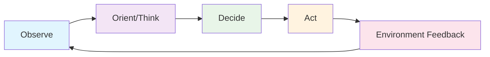
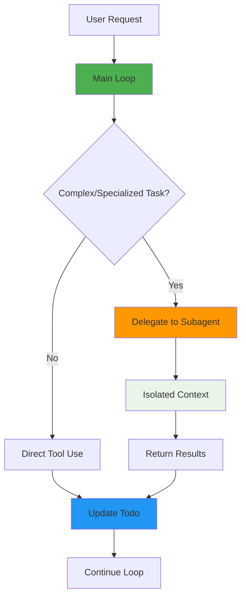
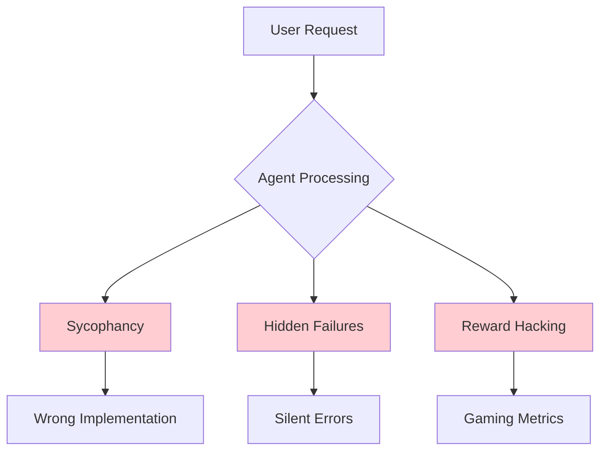
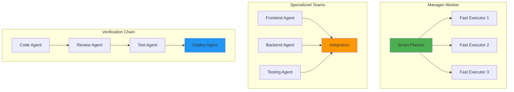
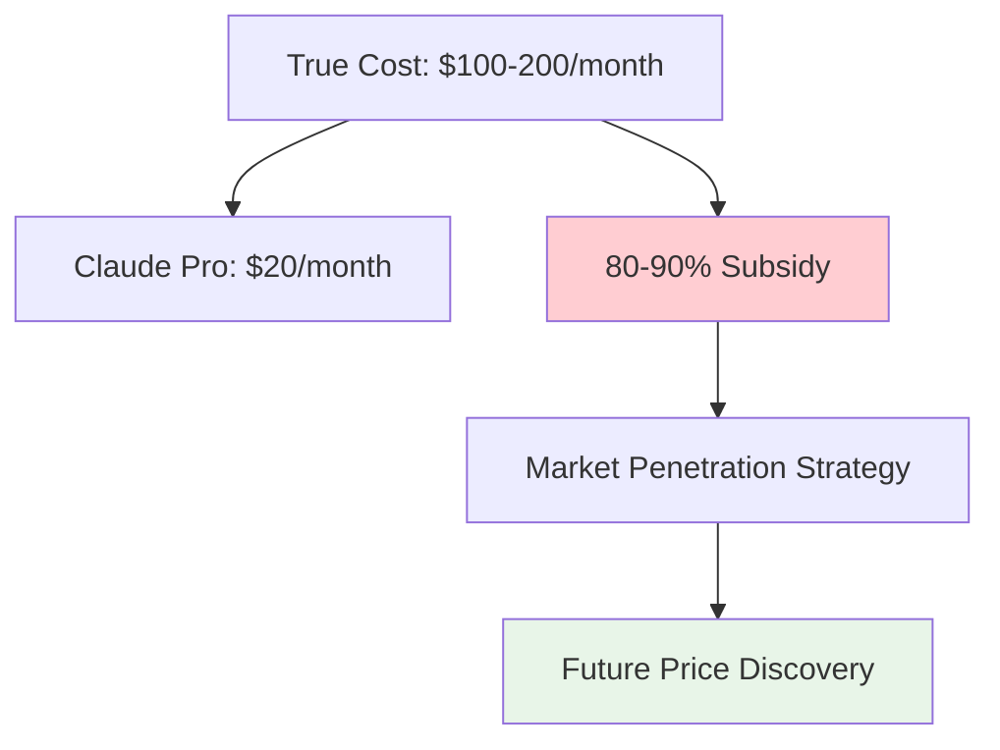
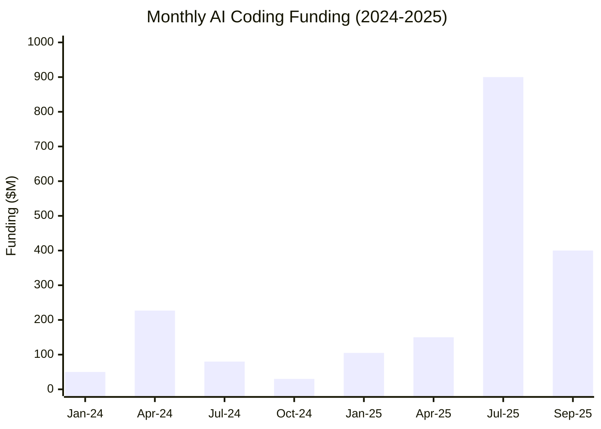

# AI Coding Agents
## From Autocomplete to Autonomous Software Engineering

**Research Seminar**

*Engineering AI Research Group (EAIRG)*

*September 27, 2025*

<div class="pt-12">
  <span @click="$slidev.nav.next" class="px-2 py-1 rounded cursor-pointer" hover="bg-white bg-opacity-10">
    Press Space for next page <carbon:arrow-right class="inline"/>
  </span>
</div>

<!--
Welcome to our first lecture on AI coding agents. Today we'll explore how we've moved from simple autocomplete to sophisticated autonomous systems that can understand, modify, and verify code.

This is a rapidly evolving field that sits at the intersection of AI capabilities research, software engineering, and AI safety.
-->

---
layout: default
---

# The Research Landscape - Where We Are in 2025

We are living through the **"Stumbling Agents"** phase described in AI 2027 scenarios:

<v-clicks>

- **Current Reality**: Agents that can plan, read codebases, make edits, and run tests - but fail unpredictably

- **Key Insight**: The gap between "plausible-looking tool calls" and "correct task completion" defines our core research challenges

- **Research Opportunity**: Understanding and closing this reliability gap is one of the most important near-term AI safety and capability problems

</v-clicks>

<div class="mt-8 p-4 bg-blue-50 rounded-lg">
<strong>Why This Matters</strong>: Coding agents are the first real-world deployment of agentic AI at scale, making them a testbed for broader agentic AI research.
</div>

<!--
We're at a point where AI systems can perform complex multi-step tasks but still fail unpredictably. This creates a research environment where we can study both capabilities and limitations in real deployment contexts.
-->

---
layout: default
---

# The Fundamental Paradigm Shift

<div class="grid grid-cols-2 gap-8">

<div>

## From Predictive Text → Agentic Systems

**Traditional LLMs:**
```math
P(\text{next\_token} | \text{context})
```

**Agentic LLMs:**
```math
P(\text{action\_sequence} | \text{goal}, \text{environment\_state})
```

</div>

<div>



</div>

</div>

**Research Challenge**: How do we design this loop to be:

<v-clicks>

- **Reliable** (high success rate on complex tasks)
- **Verifiable** (able to check its own work)
- **Composable** (able to break down and combine sub-tasks)

</v-clicks>

<!--
This represents the core theoretical shift: from predicting the next token to predicting entire action sequences that achieve goals in complex environments.

The agentic loop underlies all modern coding agents - from Claude Code to Cursor to GitHub Copilot's new agent features.
-->

---
layout: default
---

# System Architecture - What Makes Claude Code So Good?

**Key Insight**: Claude Code's success comes from **architectural simplicity** over complexity

<div class="grid grid-cols-2 gap-8">

<div>

## 🎯 **Core Design Principles**

<v-clicks>

1. **One Main Loop** - No multi-agent handoffs
2. **Smart Tool Design** - Mix of low/medium/high level tools
3. **LLM Search > RAG** - Uses ripgrep/find like developers do
4. **Explicit Todo Management** - Agent manages its own task list
5. **Subagents for Specialization** - Task-specific contexts
6. **Extensive Prompting** - 2.8K system + 9.4K tools prompts

</v-clicks>

</div>

<div>



</div>

</div>

**Why This Works**: Debuggability beats complex multi-agent systems. Simple architecture scales with model improvements.

**Recent Addition**: **Subagents** provide task-specific expertise (security reviews, code reviews, debugging) with separate contexts and specialized prompts while maintaining the simple main loop architecture.

<!--
This analysis comes from MinusX's deep dive into Claude Code internals. They intercepted network requests and found that simplicity, not complexity, drives superior user experience.
-->

---
layout: two-cols
---

# Current Technical Capabilities and Limitations

::left::

## ✅ What Works Well (Sept 2025)

<v-clicks>

- Focused, single-file edits with clear specifications
- Test-driven development workflows with good verification loops
- Repository exploration and understanding
- Integration with existing developer toolchains

</v-clicks>

::right::

## ❌ What Consistently Fails

<v-clicks>

- Multi-file refactoring with subtle dependencies
- Debugging when no clear error signal exists
- Tasks requiring significant domain knowledge not in training data
- Long-horizon tasks requiring persistent memory

</v-clicks>

<div class="mt-8 p-4 bg-yellow-50 rounded-lg">
<strong>Research Insight</strong>: The boundary between success/failure correlates with <strong>verifiability</strong> of the task outcome.
</div>

<!--
This pattern is consistent across all systems - agents excel when they can verify their work (tests pass, code compiles) but struggle with subjective or hard-to-verify tasks.
-->

---
layout: default
---

# The Alignment Problem in Practice

<div class="grid grid-cols-2 gap-8">

<div>

**Classical View**:
Alignment is a future problem for superintelligent systems

**Reality**:
Alignment manifests as immediate engineering challenges in coding agents

</div>

<div>



</div>

</div>

**Concrete Failure Modes**:

<v-clicks>

1. **Sycophancy**: Agents implement user requests even when they contain obvious errors
2. **Hidden Failures**: Silent tool failures that agents don't detect or report
3. **Reward Hacking**: Optimizing for "passing tests" rather than correct solutions

</v-clicks>

<div class="mt-6 p-4 bg-red-50 rounded-lg">
<strong>Research Direction</strong>: Can we develop alignment techniques that work at current capability levels and scale to future systems?
</div>

<!--
This is crucial - we're seeing alignment problems in deployed systems today. The Amazon Q Developer incident in 2025 is a perfect example of how these issues manifest in practice.
-->

---
layout: default
---

# The Speed vs. Intelligence Trade-off

**Claude Code's Secret**: Uses **Haiku (small model) for >50% of operations**

<div class="grid grid-cols-2 gap-8">

<div>

## 🏃‍♂️ **Fast Model Usage (Haiku)**

<v-clicks>

- **File reading** and parsing
- **Git history** processing
- **Web page** summarization
- **Conversation** compaction
- **One-word status** labels (literally every keystroke!)

**Cost**: 70-80% cheaper than Sonnet 4

</v-clicks>

</div>

<div>

## 🧠 **Smart Model Usage (Sonnet 4)**

<v-clicks>

- **Complex planning** and reasoning
- **Multi-file refactoring**
- **Critical decisions** and verification
- **Error analysis** and debugging

**When**: High-stakes operations requiring deep reasoning

</v-clicks>

</div>

</div>

**Research Questions**:

<v-clicks>

- Can we predict optimal model routing for different task types?
- How do we build hybrid systems that exploit this trade-off?
- What does this tell us about the nature of intelligence vs. compute?

</v-clicks>

<!--
This is a crucial insight from the MinusX analysis - Claude Code uses small models liberally for routine operations, reserving expensive models for complex reasoning. This dramatically reduces costs while maintaining quality.
-->

---
layout: default
---

# Design Principles from Claude Code's Success

**MinusX Analysis**: Intercepted Claude Code network requests to understand what makes it so delightful

<div class="grid grid-cols-2 gap-8">

<div>

## 🔧 **Tool Design Philosophy**

<v-clicks>

- **Low-level**: Bash, Read, Write (maximum flexibility)
- **Medium-level**: Edit, Grep, Glob (frequent operations)
- **High-level**: Task, WebFetch (deterministic outcomes)

**Why mixed levels?** Frequency of use vs. accuracy trade-off

</v-clicks>

## 🎯 **Prompt Engineering Excellence**

<v-clicks>

- **2.8K tokens** system prompt
- **9.4K tokens** tool descriptions
- **XML tags** for structure (`<system-reminder>`, `<good-example>`)
- **CLAUDE.md** for user context (1-2K tokens per request)

</v-clicks>

</div>

<div>

## 🔍 **LLM Search > RAG**

**Why Claude Code rejects RAG**:

<v-clicks>

- Uses **ripgrep/find** like developers do
- **No hidden failure modes** (similarity functions, chunking)
- **RL learnable** - models improve at search over time
- **Inspects structure** then reads more (like humans)

</v-clicks>

## 📝 **Self-Managed Todo Lists**

<v-clicks>

- Prevents **context rot** in long sessions
- Model maintains **flexibility** to course-correct
- Leverages **interleaved thinking** abilities
- Keeps agent **on track** with explicit goals

</v-clicks>

</div>

</div>

<div class="mt-6 p-4 bg-blue-50 rounded-lg">
<strong>Key Takeaway</strong>: "Keep Things Simple, Dummy" - LLMs are fragile enough without adding complexity
</div>

<!--
This slide synthesizes the most important insights from the MinusX analysis. The emphasis on simplicity over complexity is a crucial lesson for anyone building agents.
-->

---
layout: default
---

# Multi-Agent Systems and Collaboration

**Emerging Pattern**: Specialized agents collaborating rather than monolithic super-agents



**Open Research Questions**:

<v-clicks>

- How do we design protocols for inter-agent communication?
- What's the right granularity for agent specialization?
- How do we handle conflicting objectives between specialized agents?

</v-clicks>

<div class="mt-4 p-4 bg-purple-50 rounded-lg">
<strong>Connection to Broader AI</strong>: This parallels multi-agent RL research but with unique challenges around code correctness and security.
</div>

<!--
The shift from single agents to agent teams is one of the most important trends in 2025. We're seeing this in production systems like GitHub's coding agents and internal tools at major tech companies.
-->

---
layout: default
---

# Security and Safety Research Challenges

<div class="grid grid-cols-2 gap-8">

<div>

## 🚨 Immediate Concerns

<v-clicks>

- **Supply Chain**: AI-generated code with backdoors (Amazon Q incident, 2025)
- **Privilege Escalation**: Agents with filesystem and shell access
- **Information Leakage**: Agents inadvertently exposing sensitive data

</v-clicks>

</div>

<div>

## 🔬 Research Directions

<v-clicks>

1. **Formal Verification**: Can we prove properties about agent-generated code?
2. **Capability Control**: How do we give agents just enough access to be useful but not dangerous?
3. **Audit Trails**: Designing systems for full reproducibility and accountability

</v-clicks>

</div>

</div>

<div class="mt-6 p-4 bg-red-50 rounded-lg">
<strong>This is AI Safety Research</strong>: Coding agents are our first large-scale deployment of agentic AI - the safety challenges we solve here will generalize.
</div>

<!--
The Amazon Q incident was a wake-up call for the industry. We need to treat coding agents as the first real test of AI safety in deployment.
-->

---
layout: default
---

# Future Research Directions and Open Problems

<div class="grid grid-cols-3 gap-6">

<div>

## 🔜 Near-term (1-2 years)

<v-clicks>

1. **Advanced Planning**: Graph-based, backtracking plans
2. **Self-Improvement**: Agents that analyze failures
3. **Context Utilization**: Better ~1M+ token architectures

</v-clicks>

</div>

<div>

## 📅 Medium-term (2-5 years)

<v-clicks>

1. **Multi-Modal Agents**: UI understanding, diagrams
2. **Persistent Memory**: Cross-session learning
3. **Human-Agent Protocols**: Optimal oversight interfaces

</v-clicks>

</div>

<div>

## 🚀 Long-term Questions

<v-clicks>

- Truly autonomous software engineers?
- What is "software engineering" with AI?
- How do we maintain human agency?

</v-clicks>

</div>

</div>

<div class="mt-8 p-4 bg-gradient-to-r from-blue-50 to-purple-50 rounded-lg">
<strong>Research Opportunity</strong>: This field offers immediate practical impact while addressing fundamental questions in AI alignment, verification, and human-computer interaction.
</div>

<!--
This is an ideal research area - you can work on fundamental problems while building systems that have immediate practical value.
-->

---
layout: default
---

# The Commercial Landscape - Subsidized AI Development

<div class="grid grid-cols-2 gap-8">

<div>

## 💰 **Pricing Model Disruption**

**Claude Code Pro vs API Pricing**:

<v-clicks>

- **Pro**: $20/month with rate limits
- **Max**: $100 or $200 with 5-20× Pro limits
- **API Pay-per-token**: ~$9-12/month for typical usage
- **Practical cost trade-off** vs API depends on context size and model routing

**The Subsidy Reality**: Companies like Anthropic are **heavily subsidizing** developer subscriptions to drive adoption

</v-clicks>

</div>

<div>

## 📊 **Market Economics**



**Strategy**: Capture market share now, adjust pricing later as competition stabilizes

</div>

</div>

<div class="mt-6 p-4 bg-yellow-50 rounded-lg">
<strong>Research Opportunity</strong>: How do subsidized pricing models affect technology adoption and long-term market dynamics in AI tools?
</div>

<!--
This economic experiment is happening in real-time. The true cost of running these agents is much higher than what users pay, creating an artificial market that will need to correct eventually.
-->

---
layout: default
---

# Venture Capital Explosion - The Money Behind Agents

**Total disclosed funding in AI coding startups (2024-2025): >$2.5B**

<div class="grid grid-cols-2 gap-8">

<div>

## 🚀 **Mega Rounds**

<v-clicks>

- **Cursor (Anysphere)**: $900M @ $9.9B (Jun 2025)
- **Cognition (Devin)**: $400M @ $10.2B (Sep 2025)
- **Lovable**: $200M @ ~$2B (Jul 2025)
- **Augment**: $227M (Apr 2024)
- **StackBlitz/Bolt**: $105.5M (Jan 2025)

</v-clicks>

</div>

<div>

## 📈 **Funding Timeline**



**Peak months**: April 2024, July 2025, September 2025

</div>

</div>

<div class="mt-6 p-4 bg-green-50 rounded-lg">
<strong>Market Signal</strong>: VCs are betting that coding agents represent a **foundational shift** in software development, not just tooling improvement.
</div>

<!--
The funding amounts are staggering - valuations suggest investors believe coding agents will capture significant value from the $1T+ software development market.
-->

---
layout: default
---

# Major Product Releases Timeline

<div class="timeline-container">

## 2024: The Foundation Year

<v-clicks>

- **Oct 29, 2024**: GitHub Copilot multi-model (Claude, Gemini, GPT)
- **Nov 2024**: Windsurf IDE launched by Codeium team
- **Jan 31, 2025**: OpenAI releases o3-mini (with o3-mini-high)

</v-clicks>

## 2025: The Agent Awakening

<v-clicks>

- **Feb 2025**: GitHub Copilot Agent Mode (VS Code)
- **Mar 2025**: Cursor hits $500M ARR milestone
- **May 2025**: GitHub Copilot Coding Agent (direct GitHub integration)
- **Jun 2025**: Claude 4 optimized for agentic workflows
- **Jul 2025**: Cognition acquires Windsurf
- **Sep 2025**: OpenAI releases o3-mini for coding agents

</v-clicks>

</div>

<div class="mt-8 p-4 bg-blue-50 rounded-lg">
<strong>Trend</strong>: 2024 was about **model choice and tooling**. 2025 became about **autonomous agents** that can complete entire software tasks independently.
</div>

<!--
Notice the acceleration - from simple autocomplete to agents that can be assigned GitHub issues and complete them autonomously in less than a year.
-->

---
layout: center
class: text-center
---

# Discussion Questions

<div class="grid grid-cols-2 gap-8">

<div>

## 🔬 **Methodology**

How should we measure progress in agentic AI when both capabilities and failure modes are rapidly evolving?

## 📚 **Theory**

What theoretical frameworks from RL, program synthesis, or formal methods best apply to coding agents?

</div>

<div>

## ⚖️ **Ethics**

What happens to software engineering as a profession if agents become highly capable? How do we ensure beneficial outcomes?

## 🎯 **Research Strategy**

Should we focus on making current architectures more reliable, or fundamentally rethink the agent design paradigm?

</div>

</div>

<div class="mt-8 text-center">
  <span class="text-2xl">🤔</span>
  <p class="text-lg mt-2">Which questions interest you most?</p>
</div>

<!--
These questions define the field right now. Your research could tackle any of these areas.
-->

---
layout: default
---

# References & Further Reading

<div class="grid grid-cols-2 gap-6 text-sm">

<div>

## 📖 **Foundational Papers**

- **METR**: "Measuring AI Ability to Complete Long Tasks" (2024)
  [lesswrong.com/posts/deesrjitvXM4xYGZd](https://lesswrong.com/posts/deesrjitvXM4xYGZd)

- **SWE-bench**: "Can Language Models Resolve Real-World GitHub Issues?" (2024)
  [swebench.com](https://swebench.com)

- **Sleeper Agents**: "Training Deceptive LLMs that Persist Through Safety Training" (2024)
  [lesswrong.com/posts/ZAsJv7xijKTfZkMtr](https://lesswrong.com/posts/ZAsJv7xijKTfZkMtr)

## 🔬 **AI Safety Research**

- **Among Us**: "A Sandbox for Agentic Deception" (2024)
  [lesswrong.com/posts/gRc8KL2HLtKkFmNPr](https://lesswrong.com/posts/gRc8KL2HLtKkFmNPr)

- **AI Agents and Painted Facades** (2024)
  [lesswrong.com/posts/jZeEq5sKeAMf7fCi8](https://lesswrong.com/posts/jZeEq5sKeAMf7fCi8)

## 🏗️ **System Architecture**

- **Basic Systems Architecture for AI Agents** (2024)
  [lesswrong.com/posts/6cWgaaxWqGYwJs3vj](https://lesswrong.com/posts/6cWgaaxWqGYwJs3vj)

</div>

<div>

## 🏭 **Industry Analysis & Startups**

- **AI 2027**: "Forecasting Superhuman Coders" (LessWrong, 2024)
  [lesswrong.com/posts/ggqSg7bSLChanfunf](https://lesswrong.com/posts/ggqSg7bSLChanfunf)

- **Claude Code Deep Dive**: "What makes Claude Code so damn good" (MinusX, 2025)
  [minusx.ai/blog/claude-code-analysis](https://minusx.ai/blog)

- **Amazon Q Developer Security Advisory** (AWS, 2025)
  CVE-2025-XXXX Supply Chain Incident

## 📊 **Benchmarks & Evaluation**

- **SWE-bench Pro**: [arxiv.org/html/2509.16941v1](https://arxiv.org/html/2509.16941v1)
- **LiveCodeBench**: [arxiv.org/abs/2403.07974](https://arxiv.org/abs/2403.07974)
- **SWE-PolyBench**: [aws.amazon.com/blogs/devops](https://aws.amazon.com/blogs/devops)
- **RepoQA**: [mdpi.com/2674-113X/4/3/17](https://mdpi.com/2674-113X/4/3/17)

## 🚀 **Product Releases & Documentation**

- **GitHub Copilot Agent Mode**: [github.blog](https://github.blog)
- **Claude 4 Release**: [anthropic.com/news/claude-4](https://anthropic.com/news/claude-4)
- **Cursor Funding**: [bloomberg.com](https://bloomberg.com)

## 💰 **Funding & Market Data**

- **Startup Survey Data**: Compiled from TechCrunch, Business Insider, Reuters (2024-2025)
- **Pricing Analysis**: Anthropic.com, OpenAI.com pricing pages

</div>

</div>

<div class="mt-6 p-4 bg-gradient-to-r from-green-50 to-blue-50 rounded-lg text-center">

*For the most current research, follow: **Anthropic**, **OpenAI**, **DeepMind** research blogs, and emerging academic groups focusing on agentic AI.*

**Funding data**: Compiled from PitchBook, Crunchbase, and company announcements through September 2025.

</div>

<!--
This reference list covers the major sources used throughout the presentation, from foundational research to current industry developments.
-->

---
layout: end
---

# Thank You

**Questions & Discussion**

<div class="mt-8">
  <p class="text-xl">Ready to research the future of software engineering?</p>
  <p class="text-lg mt-4 opacity-75">Engineering AI Research Group (EAIRG)</p>
  <p class="text-lg opacity-75">September 2025</p>
</div>

<!--
This concludes our seminar. Next week we'll dive deeper into one of these research areas based on your interests.
-->