```mermaid
graph TB
    BL["📋 Backlog/PR Queue<br/>~5min task latency"] --> W1["🎨 Frontend Agent<br/>Claude Haiku • $0.02/task<br/>70% first-pass rate"]
    BL --> W2["⚙️ Backend Agent<br/>Claude Haiku • $0.03/task<br/>80% first-pass rate"]
    BL --> W3["🧪 Test Agent<br/>Claude Haiku • $0.01/task<br/>90% coverage target"]

    M["🧠 Manager Agent<br/>Claude Sonnet • $0.20/cycle<br/>3x parallel capacity"] --> BL

    W1 -.->|"~2min review"| V["✅ Verification Agent<br/>Claude Sonnet • $0.15/review<br/>95% accuracy gate"]
    W2 -.->|"~3min review"| V
    W3 -.->|"~1min review"| V

    V ==>|"merge on pass"| I["🚀 Integration Agent<br/>Claude Sonnet • $0.25/merge<br/>CI/CD orchestration"]

    HS["📝 Handoff Schema<br/>JSON contract<br/>~100 tokens overhead<br/>prevents 80% failures"] -.-> W1
    HS -.-> W2
    HS -.-> W3

    style M fill:#4caf50,color:#fff
    style V fill:#ff9800,color:#fff
    style I fill:#9c27b0,color:#fff
    style BL fill:#e3f2fd
    style HS fill:#f3e5f5
```

# AI Coding Agents

## From Snippets to Swarms

### The Evolution of Intelligent Code Generation

#### Toward the Automated Researcher

**Research Seminar**

_Engineering AI Research Group (EAIRG)_
_September 27, 2025_

<div class="pt-4 text-sm text-gray-600">
Actionable practices to ship reliable coding agents in 90 days
</div>

<div class="pt-2 text-xs text-gray-500">
As of Sept 2025
</div>

<div class="pt-8">
  <span @click="$slidev.nav.next" class="px-4 py-2 rounded cursor-pointer hover:bg-blue-50 text-blue-600 border border-blue-200">
    Press Space for next page →
  </span>
</div>

<!--
Welcome to our research seminar. Today we'll trace the complete evolution from simple autocomplete to multi-agent systems, and explore what this means for the future of software engineering.

This presentation follows a four-act structure: deconstructing modern agents, understanding their limitations, envisioning their future, and examining the ecosystem driving this transformation.
-->

---

## layout: section

## Deconstructing the Modern Agent

<div class="text-lg opacity-75 mt-8">
Understanding how modern coding agents actually work
</div>

<!--
Act I builds our foundation. We'll trace the evolutionary path, establish the theoretical framework, then dive deep into a real system. This gives us the blueprint for everything that follows.
-->

---

## layout: default

# From Completions to Repo Edits

_Practice_

<Transform :scale="0.9">

<div class="grid grid-cols-2 gap-4">

<div class="space-y-4">

<v-clicks>

<div class="p-3 bg-gray-50 rounded border">
<h3 class="font-bold text-blue-600 mb-2 text-sm">2019-2021: Text-to-Code</h3>
<ul class="text-xs space-y-1">
<li>• GPT-style LMs emit small completions</li>
<li>• Codex shows code-finetuning potential</li>
<li>• HumanEval: "sample-and-rerank" wins</li>
<li class="font-semibold text-green-600 mt-2">→ Capability: ~10 lines of JavaScript</li>
</ul>
</div>

<div class="p-3 bg-blue-50 rounded border">
<h3 class="font-bold text-blue-600 mb-2 text-sm">2021-2023: Tool-Using Assistants</h3>
<ul class="text-xs space-y-1">
<li>• Chat UIs + function calling</li>
<li>• ReAct-style reasoning with actions</li>
<li>• Agents read files, call tools, iterate</li>
<li class="font-semibold text-green-600 mt-2">→ Capability: Single-file modifications</li>
</ul>
</div>

</v-clicks>

</div>

<div class="space-y-4">

<v-clicks>

<div class="p-3 bg-green-50 rounded border">
<h3 class="font-bold text-blue-600 mb-2 text-sm">2024-2025: Agentic Loops</h3>
<ul class="text-xs space-y-1">
<li>• Shell + editor + permission gates</li>
<li>• SWE-bench: repo-scale edits</li>
<li>• Long context + thinking budgets</li>
<li>• Rise of "Vibe Coding": AI-first development</li>
<li>• Adaptive thinking time (dynamic presets)</li>
<li class="font-semibold text-green-600 mt-2">→ Capability: Multi-file, verified changes</li>
</ul>
</div>

<div class="p-3 bg-purple-50 rounded border border-purple-200">
<h3 class="font-bold text-purple-600 mb-2 text-sm">Research Directions: 2025-2027</h3>
<div class="text-xs text-purple-600 mb-1">*Speculative timeline based on current research trends*</div>
<ul class="text-xs space-y-1">
<li>• Multi-agent coordination</li>
<li>• Formal verification integration</li>
<li>• Adaptive model routing</li>
<li>• "Vibe Researching": Automated discovery</li>
<li class="font-semibold text-purple-600 mt-2">→ Research Goal: The Automated Researcher</li>
</ul>
</div>

</v-clicks>

</div>

</div>

<v-clicks>

<div class="mt-4 p-3 bg-blue-50 rounded-lg border border-blue-200">
<strong class="text-blue-800 text-sm">Key Insight:</strong> The leap from "snippets" to "long-running repo edits" came from three ingredients:
<ol class="mt-1 ml-4 text-sm">
<li><strong>Tool use</strong> (ability to act on environment)</li>
<li><strong>Verification loops</strong> (ability to check own work)</li>
<li><strong>Massive context</strong> (ability to reason about entire codebases)</li>
</ol>
</div>

</v-clicks>

</Transform>

<!--
This evolution wasn't just about bigger models - it required fundamental changes in architecture. We moved from generation-only to perception-action cycles, from isolated responses to persistent memory, from single-shot to iterative verification.

Notice how each phase enabled fundamentally new capabilities, not just incremental improvements.
-->

---

## layout: default

# Interface Landscape: How Developers Actually Use AI Coding Tools

_Practice_

<Transform :scale="0.85">

<div class="mb-3 p-2 bg-green-50 rounded border border-green-200">
<strong class="text-green-800 text-xs">Reality Check:</strong> Agent capabilities mean nothing without the right interface for the task
</div>

<div class="grid grid-cols-2 gap-4">

<div class="space-y-3">

<div class="bg-blue-50 p-3 rounded border border-blue-200">
<h4 class="font-semibold mb-2 text-xs">🏗️ Integrated Development</h4>
<ul class="text-xs space-y-1">
<li><strong>Full AI IDEs:</strong> Cursor, JetBrains AI Assistant, Windsurf</li>
<li><strong>IDE Extensions:</strong> GitHub Copilot, Sourcegraph Cody, Continue.dev</li>
<li><strong>Best for:</strong> Daily coding, multi-file edits, repo-aware refactors</li>
</ul>
</div>

<div class="bg-purple-50 p-3 rounded border border-purple-200">
<h4 class="font-semibold mb-2 text-xs">🖥️ Terminal & Command Line</h4>
<ul class="text-xs space-y-1">
<li><strong>CLI Assistants:</strong> Claude Code, Copilot CLI, aider, Warp AI</li>
<li><strong>Best for:</strong> DevOps, scripting, repo chores, terminal workflows</li>
</ul>
</div>

<div class="bg-yellow-50 p-3 rounded border border-yellow-200">
<h4 class="font-semibold mb-2 text-xs">☁️ Agentic Environments</h4>
<ul class="text-xs space-y-1">
<li><strong>Sandbox VMs:</strong> Devin, GitHub Copilot agents, OpenHands CodeAct 2.1</li>
<li><strong>Planning & PR flow:</strong> GitHub Copilot Workspace, Claude Code</li>
<li><strong>Best for:</strong> Ticket-sized tasks, bug fixes, background automation</li>
</ul>
</div>

<div class="bg-red-50 p-3 rounded border border-red-200">
<h4 class="font-semibold mb-2 text-xs">🔍 Code Review & Repo Bots</h4>
<ul class="text-xs space-y-1">
<li><strong>PR Automation:</strong> CodeRabbit, GitLab Duo, Copilot code review</li>
<li><strong>Best for:</strong> Review quality, triage, enforcing guidelines</li>
</ul>
</div>

</div>

<div class="space-y-4">

<div class="bg-gray-50 p-3 rounded border">
<h4 class="font-semibold mb-2 text-xs">📊 Interface vs Task Matching</h4>
<table class="text-xs w-full">
<thead>
<tr class="border-b">
<th class="text-left py-1">Task Type</th>
<th class="text-left py-1">Best Interface</th>
<th class="text-left py-1">Why</th>
</tr>
</thead>
<tbody class="space-y-1">
<tr class="border-b">
<td class="py-1 text-blue-600">Daily coding</td>
<td class="py-1">IDE + extension</td>
<td class="py-1">Context, low friction</td>
</tr>
<tr class="border-b">
<td class="py-1 text-purple-600">Repo automation</td>
<td class="py-1">CLI tools</td>
<td class="py-1">Script-friendly</td>
</tr>
<tr class="border-b">
<td class="py-1 text-yellow-600">Bug fixes</td>
<td class="py-1">Agentic sandbox</td>
<td class="py-1">Full investigation</td>
</tr>
<tr class="border-b">
<td class="py-1 text-red-600">Code review</td>
<td class="py-1">GitHub/GitLab bot</td>
<td class="py-1">Native workflow</td>
</tr>
<tr>
<td class="py-1 text-green-600">Prototyping</td>
<td class="py-1">Web IDE/chat</td>
<td class="py-1">Zero setup</td>
</tr>
</tbody>
</table>
</div>

<div class="bg-orange-50 p-3 rounded border border-orange-200">
<h4 class="font-semibold mb-2 text-xs">🔧 Common Interaction Patterns</h4>
<ul class="text-xs space-y-1">
<li>• <strong>Inline autocomplete:</strong> Sub-second, context-aware suggestions</li>
<li>• <strong>Chat with code context:</strong> Natural language + file/selection awareness</li>
<li>• <strong>Apply-edits workflow:</strong> Diff preview before writing files</li>
<li>• <strong>Plan-execute-iterate:</strong> Sandbox → test → refine → PR</li>
<li>• <strong>Tool integration:</strong> MCP connects Slack/Jira/GitHub context</li>
</ul>
</div>

<div class="bg-indigo-50 p-3 rounded border border-indigo-200">
<h4 class="font-semibold mb-2 text-xs">🏢 Deployment Styles</h4>
<ul class="text-xs space-y-1">
<li>• <strong>Cloud SaaS:</strong> Fast adoption, managed context (Copilot, Cursor)</li>
<li>• <strong>Self-hosted:</strong> Keep code in VPC (Windsurf Enterprise, Tabnine)</li>
<li>• <strong>Local-only:</strong> Air-gapped, privacy-first (Continue + Ollama)</li>
<li>• <strong>Hybrid:</strong> Local editing, cloud intelligence routing</li>
</ul>
</div>

</div>

</div>

<div class="mt-3 p-2 bg-blue-50 rounded border border-blue-200">
<strong class="text-blue-800 text-xs">Selection Strategy:</strong> Start with IDE extensions for daily work, add CLI tools for automation, evaluate agentic environments for complex tasks. Match interface to workflow, not technology hype.
</div>

</Transform>

---

## layout: default

# Design Tasks the Agent Can Verify

_Practice_

## The Single Best Predictor of Agent Success

<div class="grid grid-cols-2 gap-4">

<div>

<div class="mb-3 p-2 bg-green-50 rounded border border-green-200">
<strong class="text-green-800 text-sm">Core Insight:</strong> Task success correlates strongly with verifiability
</div>


<div class="mt-2 text-xs text-center font-mono text-gray-600">
Track time-to-first-green-test per task
</div>

<div class="mt-1 text-xs text-center text-gray-500">
*Example ranges only; replace with org baselines*
</div>

<div class="mt-3 bg-green-50 p-2 rounded border border-green-200">
<h4 class="font-semibold text-green-700 mb-1 text-sm">✅ Verifiable Tasks (High Success Rate)</h4>
<ul class="text-xs space-y-1">
<li>• Bug fixes with existing tests</li>
<li>• Refactoring with type safety</li>
<li>• API implementations with schemas</li>
<li>• <strong>Real repos:</strong> OpenHands CodeAct 2.1 achieves 50%+ on SWE-bench Verified</li>
<li>• <strong>Enterprise:</strong> 90%+ compile rate, 70%+ green CI</li>
</ul>
</div>

</div>

<div>

<div class="bg-red-50 p-2 rounded border border-red-200 mb-3">
<h4 class="font-semibold text-red-700 mb-1 text-sm">❌ Non-Verifiable Tasks (Low Success Rate)</h4>
<ul class="text-xs space-y-1">
<li>• New feature design</li>
<li>• Performance optimization</li>
<li>• UX improvements</li>
<li>• <strong>Success rates:</strong> 20-40% for design decisions, 10-30% for user experience</li>
</ul>
</div>

<div class="bg-blue-50 p-3 rounded border border-blue-200">
<h4 class="font-semibold text-blue-700 mb-1 text-sm">🛠️ Your Workflow</h4>
<p class="text-xs mb-1">Before assigning a task to an agent, ask:</p>
<ol class="text-xs space-y-1 ml-3">
<li>1. Can success be automatically verified?</li>
<li>2. Is there a fast feedback loop?</li>
<li>3. Are the requirements unambiguous?</li>
</ol>
<p class="text-xs mt-2 font-semibold">If no → decompose the task or do it yourself.</p>
</div>

</div>

</div>

<div class="mt-6 p-4 bg-blue-50 rounded-lg border border-blue-200">
<strong class="text-blue-800">Practical Takeaway:</strong> To maximize agent success, give it tasks it can verify. Write tests first, then ask the agent to implement. This single insight can 3x your productivity.
</div>

---

## layout: default

# Verifiability in Action: Micro-Demo

_Practice_

<Transform :scale="0.9">

<div class="grid grid-cols-2 gap-4">

<div>

<v-clicks>

<div class="bg-red-50 p-3 rounded border border-red-200">
<h4 class="font-semibold text-red-700 mb-2 text-sm">❌ Pre: Failing Test</h4>
<div class="text-sm font-mono">
```bash
$ pytest -q test_auth.py::test_login
FAILED test_auth.py::test_login - AttributeError:
'NoneType' object has no attribute 'id'
```
</div>
</div>

<div class="mt-3 bg-blue-50 p-3 rounded border border-blue-200">
<h4 class="font-semibold text-blue-700 mb-2 text-sm">🔧 Agent Action</h4>
<div class="text-sm">
<strong>Single Edit in auth.py:23</strong>
<div class="font-mono mt-2">
```diff
- return User.objects.get(username=username)
+ user = User.objects.filter(username=username).first()
+ return user if user else None
```
</div>
</div>
</div>

</v-clicks>

</div>

<div>

<v-clicks>

<div class="bg-green-50 p-3 rounded border border-green-200">
<h4 class="font-semibold text-green-700 mb-2 text-sm">✅ Post: Green Test</h4>
<div class="text-sm font-mono">
```bash
$ pytest -q test_auth.py::test_login
PASSED                                [100%]

1 passed in 0.03s

````
</div>
</div>

<div class="mt-3 bg-yellow-50 p-3 rounded border border-yellow-200">
<h4 class="font-semibold text-yellow-700 mb-2 text-sm">🎯 Why This Works</h4>
<ul class="text-xs space-y-1">
<li>• <strong>Clear failure signal:</strong> Specific error message</li>
<li>• <strong>Fast feedback loop:</strong> 0.03s test execution</li>
<li>• <strong>Unambiguous success:</strong> Green = good</li>
<li>• <strong>Minimal scope:</strong> One function, one test</li>
</ul>
</div>

</v-clicks>

</div>

</div>

<div class="mt-4 p-3 bg-green-50 rounded-lg border border-green-200">
<strong class="text-green-800 text-sm">Result:</strong> Agent succeeded on first attempt. Task took 45 seconds total (15s analysis + 5s edit + 25s verification). ~12k tokens in, ~300 out; verified-diff@1 = 1/1. This is the 3x productivity multiplier in action.
</div>

</Transform>

---
layout: default
---

# Why Agents Fail: Partial Observability
*Research*

<Transform :scale="0.85">

## Formalizing Coding Agents as POMDPs

<div class="mb-4 p-3 bg-green-50 rounded-lg border border-green-200">
<strong class="text-green-800">Concrete Example: Fixing a Null Pointer Bug</strong>
<div class="mt-2 text-xs">
<strong>State $s$:</strong> Repository at commit abc123 with test_user_validation.py failing<br>
<strong>Action $a$:</strong> Edit user.py:47 to add `if user is not None:` boundary check<br>
<strong>Observation $o$:</strong> `pytest -q test_user_validation.py` returns "PASSED" (green)<br>
<strong>Belief Update:</strong> Agent believes null pointer issue is resolved<br>
<strong>Why POMDP:</strong> Agent can't directly see all code paths—must infer correctness from test feedback
</div>
</div>

<div class="grid grid-cols-2 gap-4">

<div>

<div class="bg-gray-50 p-3 rounded border">
<h3 class="font-bold mb-3">POMDP Components</h3>

<v-clicks>

<ul class="text-sm space-y-2">
<li><strong>States</strong> $s$: Repository state (files, dependencies, tests)</li>
<li><strong>Actions</strong> $a$: Tool calls (read, edit, execute, search)</li>
<li><strong>Observations</strong> $o$: Compile results, test outcomes, error messages</li>
<li><strong>Transition</strong> $T(s'|s,a)$: How actions change repository state</li>
<li><strong>Observation</strong> $O(o|s',a)$: What feedback we get</li>
</ul>

<div class="mt-3 p-2 bg-blue-100 rounded text-sm">
<strong>Policy:</strong> $\pi(a|h)$ where $h$ is action-observation history
</div>

</v-clicks>

</div>

</div>

<div>

```mermaid
graph LR
    A["🔍 Observe<br/>grep, read<br/>~200ms"] --> B["🧠 Update Belief<br/>analyze context<br/>~2s"]
    B --> C["⚡ Select Action<br/>plan next step<br/>~1s"]
    C --> D["🛠️ Execute Tool<br/>edit, test, git<br/>~3s"]
    D --> E["📊 Response<br/>pass/fail + logs<br/>~500ms"]
    E --> A

    F["💰 Cost: ~$0.05/step"] --> A
    G["⏱️ Cycle: ~6s average"] --> A
    H["🎯 Success: 60% first-attempt"] --> E

    style A fill:#e3f2fd
    style C fill:#f3e5f5
    style D fill:#e8f5e8
    style F fill:#fff2cc
    style G fill:#fff2cc
    style H fill:#e8f5e8
````

<div class="mt-4 text-sm">
<strong class="text-blue-600">Key Challenge:</strong> Partial observability means agents must infer repository state from limited feedback.
</div>

</div>

</div>

<div class="mt-3 p-3 bg-blue-50 rounded-lg border border-blue-200">
<strong class="text-blue-800 text-sm">Why This Matters:</strong> This formalization reveals that coding agents are fundamentally about sequential decision-making under uncertainty - the same framework used in robotics and game AI.
</div>

</Transform>

<!--
This isn't just academic formalism. The POMDP framework explains why agents fail: they maintain incorrect beliefs about repository state. It also suggests solutions: better observation functions and more informative feedback loops.

The parallel to robotics is important - we're essentially doing "software robotics" where the environment is code rather than the physical world.
-->

---

## layout: default

# Claude Code: The Minimal Loop That Scales

_Practice_

<Transform :scale="0.85">

<div class="mb-3 p-2 bg-green-50 rounded-lg border border-green-200">
<strong class="text-green-800 text-sm">Key Insight:</strong> Claude Code's success comes from architectural simplicity over complexity
</div>

<div class="grid grid-cols-2 gap-4">

<div>

<h3 class="font-bold text-blue-600 mb-3">🎯 Core Design Principles</h3>

<v-clicks>

<div class="space-y-3">
<div class="flex items-start space-x-2">
<span class="text-blue-500 mt-1 font-bold text-sm">1.</span>
<div class="text-sm"><strong>One Main Loop</strong> - No multi-agent handoffs, single coherent context</div>
</div>
<div class="flex items-start space-x-2">
<span class="text-blue-500 mt-1 font-bold text-sm">2.</span>
<div class="text-sm"><strong>Smart Tool Design</strong> - Mix of low/medium/high level operations</div>
</div>
<div class="flex items-start space-x-2">
<span class="text-blue-500 mt-1 font-bold text-sm">3.</span>
<div class="text-sm"><strong>LLM-native search first</strong> - File-RAG when repos are very large</div>
</div>
<div class="flex items-start space-x-2">
<span class="text-blue-500 mt-1 font-bold text-sm">4.</span>
<div class="text-sm"><strong>Explicit Todo Management</strong> - Agent tracks its own progress</div>
</div>
<div class="flex items-start space-x-2">
<span class="text-blue-500 mt-1 font-bold text-sm">5.</span>
<div class="text-sm"><strong>Subagents for Specialization</strong> - Task-specific isolated contexts</div>
</div>
<div class="flex items-start space-x-2">
<span class="text-blue-500 mt-1 font-bold text-sm">6.</span>
<div class="text-sm"><strong>Extensive Prompting</strong> - Multi-thousand token system and tool prompts</div>
</div>
</div>

</v-clicks>

<div class="mt-4 bg-gray-50 p-3 rounded border">
<h4 class="font-semibold mb-2 text-sm">Memory Architecture</h4>
<ul class="text-xs space-y-1">
<li>• CLAUDE.md files load hierarchically (enterprise → project → user)</li>
<li>• @path imports up to 5 hops deep</li>
<li>• Prompt caching for conversation efficiency</li>
</ul>
</div>

</div>

<div>

```mermaid
graph TD
    A["📝 User Request<br/>~1k tokens"] --> B["🔄 Main Loop<br/>~30s response"]
    B --> C{"🧠 Complex/Specialized?<br/>~2s decision"}
    C -->|"80% tasks"| D["🛠️ Direct Tool Use<br/>~5s execution"]
    C -->|"20% tasks"| E["🚀 Delegate to Subagent<br/>~60s timeout"]
    E --> F["🔒 Isolated Context<br/>sandbox protection"]
    F --> G["📊 Return Results<br/>success/failure"]
    D --> H["📋 Update Todo List<br/>track progress"]
    G --> H
    H --> I["↻ Continue Loop<br/>until complete"]

    D --> J["Tool Categories<br/>~200ms each"]
    J -.->|Meta| H
    J -->|"Read 90%"| K["Read/Glob/Grep<br/>sandboxed"]
    J -->|"Write 8%"| L["Edit/MultiEdit<br/>verified"]
    J -->|"Execute 2%"| M["Bash<br/>restricted"]

    B -.-> H

    style B fill:#4caf50,color:#fff
    style E fill:#ff9800,color:#fff
    style F fill:#e8f5e8
    style H fill:#2196f3,color:#fff
    style K fill:#c8e6c9
    style L fill:#ffcdd2
    style M fill:#ffcdd2
```

<div class="mt-4 bg-gray-50 p-3 rounded border">
<h4 class="font-semibold mb-2 text-sm">Tool Categories</h4>
<ul class="text-xs space-y-1">
<li><strong>Read:</strong> Read, Glob, Grep (permission-free)</li>
<li><strong>Write:</strong> Edit, MultiEdit (approval required)</li>
<li><strong>Execute:</strong> Bash (approval required)</li>
<li><strong>Meta:</strong> Task, TodoWrite (coordination)</li>
</ul>
</div>

</div>

</div>

<div class="mt-4 p-3 bg-yellow-50 rounded-lg border border-yellow-200">
<strong class="text-yellow-800 text-sm">Real Todo Trace (Redacted)</strong>
<div class="mt-2 text-xs font-mono">
1. [pending] Fix authentication bug in login.py<br>
2. [in_progress] Search for auth-related files<br>
3. [completed] Found issue in validate_token() at line 45<br>
4. [pending] Write test to reproduce the bug<br>
5. [pending] Implement fix with error handling<br>
6. [pending] Run full test suite to verify
</div>
</div>

<div class="mt-3 p-3 bg-red-50 rounded-lg border border-red-200">
<strong class="text-red-800 text-sm">Failure → Recovery Example</strong>
<div class="mt-2 text-xs">
<strong>Iteration t:</strong> Agent edits config.py but breaks import<br>
<strong>Observation:</strong> `ModuleNotFoundError: No module named 'validators'`<br>
<strong>Iteration t+1:</strong> Agent reads error, searches for validators usage, adds missing import<br>
<strong>Result:</strong> Tests pass, todo marked completed
</div>
</div>

<div class="mt-3 p-3 bg-green-50 rounded-lg border border-green-200">
<strong class="text-green-800 text-sm">Strategic Insight:</strong> Debuggability beats complexity. Simple architecture scales with model improvements, while complex multi-agent systems introduce coordination failures.
</div>

</Transform>

<!--
This is our concrete instantiation of the POMDP theory. Notice how each design choice addresses a specific challenge:
- One main loop prevents coordination failures
- Explicit todo management addresses the belief state problem
- Hierarchical memory provides context without overwhelming the model
- Tool categories map to different risk levels

The simplicity is intentional - it allows the system to be understood, debugged, and improved systematically.
-->

---

## layout: default

# Tools That Don't Lie: Typed APIs & Constrained Generation

_Practice_

<Transform :scale="0.9">

<div class="mb-3 p-2 bg-purple-50 rounded border border-purple-200">
<strong class="text-purple-800 text-xs">Core Insight:</strong> Agent reliability depends on tool design as much as model intelligence
</div>

<div class="grid grid-cols-2 gap-4">

<div>

<div class="bg-gray-50 p-3 rounded border">
<h4 class="font-semibold mb-2 text-xs">Principles of Agent-Ready Tools</h4>

<div class="space-y-3">
<div class="border-b pb-2">
<strong class="text-blue-600 text-sm">Atomic Operations</strong>
<p class="text-xs mt-1">Single responsibility, complete or fail entirely</p>
<div class="text-xs text-gray-600 mt-1">✅ create_file vs ❌ multi-step bash pipeline</div>
</div>

<div class="border-b pb-2">
<strong class="text-blue-600 text-sm">Idempotent & Deterministic</strong>
<p class="text-xs mt-1">Safe retries, predictable outcomes</p>
<div class="text-xs text-gray-600 mt-1">✅ ensure_dependency('pytest') vs ❌ pip install</div>
</div>

<div class="border-b pb-2">
<strong class="text-blue-600 text-sm">Structured Output</strong>
<p class="text-xs mt-1">JSON/XML responses, not raw text</p>
<div class="text-xs text-gray-600 mt-1">✅ {"files": [...]} vs ❌ ls -l output</div>
</div>

<div>
<strong class="text-blue-600 text-sm">Clear Error Codes</strong>
<p class="text-xs mt-1">Specific failure reasons for retry logic</p>
<div class="text-xs text-gray-600 mt-1">✅ {'error': 'file_not_found'} vs ❌ generic exception</div>
</div>
</div>

</div>

</div>

<div>

<div class="bg-blue-50 p-3 rounded border border-blue-200">
<h4 class="font-semibold mb-2 text-xs">Example: Typed Tool Schema</h4>
<pre class="text-xs bg-white p-3 rounded border mt-2">
{
  "title": "ApplyPatch",
  "type": "object",
  "properties": {
    "file": {"type": "string"},
    "range": {
      "type": "object",
      "properties": {
        "start": {"type": "integer"},
        "end": {"type": "integer"}
      },
      "required": ["start", "end"]
    },
    "patch": {"type": "string"}
  },
  "required": ["file", "range", "patch"],
  "additionalProperties": false
}
</pre>
</div>

<div class="bg-green-50 p-3 rounded border border-green-200 mt-4">
<h4 class="font-semibold mb-2 text-xs">Tool Evolution Patterns</h4>
<div class="space-y-2 text-xs">
<div class="flex items-center space-x-2">
<span class="text-red-600">❌</span>
<code>run_shell('ls -l | grep .py')</code>
</div>
<div class="flex items-center space-x-2">
<span class="text-yellow-600">⚠️</span>
<code>list_files(path='/', pattern='*.py')</code>
</div>
<div class="flex items-center space-x-2">
<span class="text-green-600">✅</span>
<code>find_symbol('MyClass')</code>
</div>
</div>
<div class="mt-2 text-xs text-gray-600">
Progression: brittle → structured → semantic
</div>
</div>

</div>

</div>

<div class="mt-3 p-2 bg-yellow-50 rounded border border-yellow-200">
<strong class="text-yellow-800 text-xs">Implementation Tip:</strong> Require "file", "range", "patch" parameters; reject out-of-range edits by design to prevent corruption.
</div>

</Transform>

---

## layout: default

# MCP in Practice: The Tool Integration Standard

_Practice_ • **Ecosystem Building**

<Transform :scale="0.9">

<div class="mb-3 p-2 bg-blue-50 rounded border border-blue-200">
<strong class="text-blue-800 text-xs">Model Context Protocol:</strong> Anthropic's open standard for connecting agents to external tools and data sources
</div>

<div class="grid grid-cols-2 gap-4">

<div class="space-y-4">

<div class="bg-green-50 p-3 rounded border border-green-200">
<h4 class="font-semibold mb-2 text-xs">✅ What MCP Solves</h4>
<ul class="text-xs space-y-1">
<li><strong>Tool fragmentation:</strong> Every agent had custom integrations</li>
<li><strong>Security gaps:</strong> Inconsistent authentication patterns</li>
<li><strong>Maintenance burden:</strong> N×M tool-agent combinations</li>
<li><strong>Data silos:</strong> Context stuck in separate systems</li>
</ul>
</div>

<div class="bg-blue-50 p-3 rounded border border-blue-200">
<h4 class="font-semibold mb-2 text-xs">🔧 MCP Architecture</h4>
<div class="text-xs space-y-2">
<div><strong>MCP Server:</strong> Tool provider (GitHub, Slack, DB)</div>
<div><strong>MCP Client:</strong> Agent/IDE consuming tools</div>
<div><strong>Transport:</strong> JSON-RPC over stdio/SSE</div>
<div><strong>Schema:</strong> OpenAPI-style tool definitions</div>
</div>
</div>

</div>

<div class="space-y-4">

<div class="bg-yellow-50 p-3 rounded border border-yellow-200">
<h4 class="font-semibold mb-2 text-xs">🚀 Popular MCP Servers</h4>
<ul class="text-xs space-y-1">
<li><strong>@modelcontextprotocol/server-github:</strong> Issues, PRs, files</li>
<li><strong>@modelcontextprotocol/server-postgres:</strong> SQL queries</li>
<li><strong>@modelcontextprotocol/server-slack:</strong> Messages, channels</li>
<li><strong>@modelcontextprotocol/server-filesystem:</strong> Safe file ops</li>
</ul>
</div>

<div class="bg-purple-50 p-3 rounded border border-purple-200">
<h4 class="font-semibold mb-2 text-xs">📈 Ecosystem Impact</h4>
<ul class="text-xs space-y-1">
<li><strong>Claude Code:</strong> 20+ MCP servers by default</li>
<li><strong>VS Code extension:</strong> Community contributions</li>
<li><strong>Enterprise adoption:</strong> Internal tool exposure</li>
<li><strong>Open source growth:</strong> 100+ community servers</li>
</ul>
</div>

</div>

</div>

<div class="mt-3 p-2 bg-gradient-to-r from-blue-50 to-green-50 rounded border">
<strong class="text-green-800 text-xs">Action Item:</strong> Start with filesystem and GitHub MCP servers for your team. Build custom servers for internal APIs (CRM, monitoring, deployment tools). MCP reduces integration cost from weeks to hours.
</div>

</Transform>

<!--
MCP is becoming the standard way to extend agents. Instead of each tool building custom integrations with every agent, MCP creates a universal adapter layer.

Key insight: The value isn't just in the protocol - it's in the ecosystem effects. When everyone uses MCP, your agent immediately gets access to hundreds of tools.
-->

---

## layout: section

## Performance, Reliability & Cost

<div class="text-lg opacity-75 mt-8">
Examining the practical limitations and trade-offs of current agents
</div>

<!--
Act II shifts from "how it works" to "how well it works." This is where theory meets reality. We'll discover that success isn't just about model quality - it's about matching the right model to the right task and measuring what actually matters.

The verifiability insight is crucial: it's the single best predictor of agent success.
-->

---

layout: default

---

## layout: default

# Model Routing A: The Core Trade-off

_Practice_ • **A. Trade-off**

<Transform :scale="0.85">

<div class="mb-2 p-2 bg-purple-50 rounded border border-purple-200">
<strong class="text-purple-800 text-xs">Smart Take:</strong> Routing is scheduling. Wall-clock and error-budget aware; triggers based on backtracks/fail streaks; smarter beats faster when N dominates.
</div>

<div class="mb-4 p-3 bg-blue-50 rounded-lg border border-blue-200">
<strong class="text-blue-800">The Problem:</strong> Choosing the right model for each task
</div>

For any coding task, wall-clock time is:

<div class="text-center my-8 p-4 bg-gray-50 rounded-lg border">

$$\text{Time} = N \times \frac{L_{in} + L_{out}}{TPS} + \text{tool\_time} + \text{test\_time}$$

</div>

<div class="grid grid-cols-2 gap-4">

<div>

<h4 class="font-semibold mb-2 text-xs">Where:</h4>
<ul class="text-sm space-y-2">
<li>• <strong>N</strong> = iterations to converge (edits + test cycles)</li>
<li>• <strong>TPS</strong> = tokens per second</li>
<li>• <strong>L<sub>in</sub>, L<sub>out</sub></strong> = input/output tokens per step</li>
<li>• <strong>p<sub>fail</sub></strong> = probability a step produces bad code</li>
</ul>

</div>

<div>

<v-clicks>

<div class="bg-yellow-50 p-2 rounded border border-yellow-200 mb-2">
<strong class="text-yellow-800 text-sm">Key Insight:</strong> Faster models often have larger N and higher p<sub>fail</sub>
</div>

<div class="bg-green-50 p-2 rounded border border-green-200">
<strong class="text-green-800 text-sm">The Trade-off:</strong> Fast models are great at being many. Smart models are great at being right.
</div>

</v-clicks>

<div class="bg-blue-50 p-2 rounded border border-blue-200 mt-2">
<h4 class="font-semibold text-blue-700 mb-1 text-sm">Estimating p_fail in Practice</h4>
<ul class="text-xs space-y-1">
<li>• <strong>Historical error rate:</strong> Task-specific success % from logs</li>
<li>• <strong>Lint/test fail ratio:</strong> % of steps requiring fixes</li>
<li>• <strong>Backtrack rate:</strong> Trace-level "undo" operations per step</li>
</ul>
<div class="mt-1 text-xs font-semibold text-blue-600">
Rule of thumb: If last 2 steps were backtracks → escalate to smarter model
</div>
</div>

<div class="bg-purple-50 p-2 rounded border border-purple-200 mt-2">
<strong class="text-purple-800 text-xs">Pattern:</strong> Error rate often rises with step count; cap plan length; escalate on 2 backtracks or rising lint/test fail streaks.
</div>

</div>

</div>

<div class="mt-4 p-3 bg-blue-50 rounded border border-blue-200">
<strong class="text-blue-800 text-sm">Your Workflow:</strong> Don't just pick the fastest or smartest model. Match model intelligence to task complexity.
</div>

<div class="mt-3 p-3 bg-purple-50 rounded border border-purple-200">
<h4 class="font-semibold text-purple-700 mb-2 text-sm">Adaptive Thinking Time</h4>
<p class="text-xs">Short latency for easy tasks; expanded budget for hard tasks. Trigger-based escalation (≥2 backtracks, rising lint/test fail ratio).</p>
</div>

</Transform>

<!--
This mathematical framework reveals the core trade-off in agent design. It's not about finding the "best" model - it's about finding the optimal model for each specific task.

The formula shows that wall-clock time depends on both raw speed and the number of iterations needed. Sometimes a slower, smarter model wins because it needs fewer iterations.
-->

---

## layout: default

# Routing Heuristic You Can Ship Today

_Practice_ • **B. Heuristic**

<Transform :scale="0.8">

<div class="mb-3 p-2 bg-green-50 rounded-lg border border-green-200">
<strong class="text-green-800">The Heuristic:</strong> Mapping tasks to optimal models
</div>

| Task                 |      Fast Model      |        Smart Model        | Reasoning               |
| -------------------- | :------------------: | :-----------------------: | ----------------------- |
| Generate tests/stubs |  ✅ High throughput  |        ❌ Overkill        | Low risk, needs volume  |
| Search symbols       |  ✅ Quick iteration  |      ❌ Unnecessary       | Simple pattern matching |
| Small patches        |     ✅ Low risk      |        ❌ Too slow        | Easy to verify          |
| **Mass refactor**    |    ❌ Type misuse    |    ✅ Safety reasoning    | Complex inference       |
| **Infra edits**      |    ❌ Config risk    |  ✅ System understanding  | Cross-service deps      |
| Framework migration  |   ❌ High failure    |    ✅ Needs reasoning     | Complex dependencies    |
| API design           | ❌ Poor abstractions | ✅ Architectural thinking | Deep understanding      |
| Debug failures       |  ❌ Misses context   |     ✅ Deep analysis      | Causal reasoning        |

<div class="mt-4 grid grid-cols-3 gap-3">

<div class="bg-blue-50 p-2 rounded border border-blue-200">
<h4 class="font-semibold text-blue-700 mb-1 text-sm">Coarse-to-fine</h4>
<p class="text-xs">Fast model drafts, smart model validates</p>
</div>

<div class="bg-purple-50 p-2 rounded border border-purple-200">
<h4 class="font-semibold text-purple-700 mb-1 text-sm">Best-of-K</h4>
<p class="text-xs">Spawn K fast workers, smart model selects best</p>
</div>

<div class="bg-green-50 p-2 rounded border border-green-200">
<h4 class="font-semibold text-green-700 mb-1 text-sm">Manager-worker</h4>
<p class="text-xs">Smart model plans, fast models execute</p>
</div>

</div>

<div class="mt-4 p-3 bg-red-50 rounded-lg border border-red-200">
<strong class="text-red-800 text-sm">Escape Hatch:</strong> If confidence &lt; 0.6 after K steps, reroute to manager-worker pattern with explicit human checkpoints.
</div>

<div class="mt-3 p-3 bg-green-50 rounded-lg border border-green-200">
<strong class="text-green-800 text-sm">Your Workflow:</strong> Start with this table, then adapt based on your specific codebase and task patterns.
</div>

</Transform>

<!--
This table codifies the practical wisdom that experienced agent users develop. The key is understanding that different tasks have different risk profiles and complexity levels.

The key insight is in hybrid patterns - combining multiple models in a single workflow to get the best of both worlds.
-->

---

## layout: default

# Model Routing C: The Economics

_Practice_ • **C. Economics**

<Transform :scale="0.9">

<div class="mb-3 p-2 bg-yellow-50 rounded-lg border border-yellow-200">
<strong class="text-yellow-800">The Economics:</strong> Cost implications of routing strategies *As of Sept 2025*
</div>

<div class="grid grid-cols-2 gap-4">

<div>

<div class="bg-gray-50 p-3 rounded border">
<h4 class="font-semibold mb-2 text-sm">Claude Code Pro Economics</h4>
<ul class="text-sm space-y-2">
<li><strong>Cost:</strong> $20/month for rate-limited usage</li>
<li><strong>Alternative:</strong> Direct API at ~$15-60/1000 requests</li>
<li><strong>Break-even:</strong> ~1,300 medium requests/month</li>
</ul>

<div class="mt-2 bg-blue-100 p-2 rounded text-xs">
<strong>Token Consumption Pattern:</strong>
<ul class="mt-1 space-y-1">
<li>• Input tokens per session: 50,000-200,000</li>
<li>• Output tokens per session: 5,000-20,000</li>
<li>• Tool calls per session: 10-100</li>
</ul>
</div>

<div class="mt-2 p-2 bg-yellow-100 rounded text-xs">
<strong>Economic Reality:</strong> Pro subscriptions are likely subsidized relative to API list prices *As of Sept 2025*
</div>
</div>

</div>

<div>

<div class="bg-gray-50 p-3 rounded border">
<h4 class="font-semibold mb-2 text-sm">Smart Model Routing Economics</h4>

<table class="w-full text-xs">
<thead>
<tr class="border-b">
<th class="text-left py-1">Pattern</th>
<th class="text-center py-1">Cost Per Task</th>
<th class="text-center py-1">Speed</th>
<th class="text-center py-1">Quality</th>
</tr>
</thead>
<tbody>
<tr>
<td class="py-1">All-Smart</td>
<td class="text-center py-1">$2.50</td>
<td class="text-center text-red-600 py-1">Slow</td>
<td class="text-center text-green-600 py-1">High</td>
</tr>
<tr>
<td class="py-1">All-Fast</td>
<td class="text-center py-1">$0.25</td>
<td class="text-center text-green-600 py-1">Fast</td>
<td class="text-center text-yellow-600 py-1">Medium</td>
</tr>
<tr>
<td class="py-1">Hybrid</td>
<td class="text-center py-1">$0.75</td>
<td class="text-center text-blue-600 py-1">Medium</td>
<td class="text-center text-green-600 py-1">High</td>
</tr>
</tbody>
</table>

<div class="mt-2 bg-blue-100 p-2 rounded text-xs">
<strong>Cost Strategy:</strong>
<ol class="mt-1 space-y-1 ml-3">
<li>1. Profile your task mix</li>
<li>2. Route based on complexity</li>
<li>3. Use hybrid patterns for best ROI</li>
</ol>
</div>

<div class="mt-2 bg-gray-100 p-2 rounded text-xs">
<strong>Assumptions:</strong> 5 steps, ~30k in/3k out tokens per step, TPS 2-5k/s. "All-Fast" requires +3 backtracks on complex tasks. Based on Sept 2025 list prices.
</div>

<div class="mt-2 bg-purple-100 p-2 rounded text-xs">
<strong>Calculator:</strong> Your task cost ≈ (tokens_in + tokens_out) × price + test_runs × compute_cost
</div>
</div>

</div>

</div>

<div class="mt-4 p-3 bg-yellow-50 rounded-lg border border-yellow-200">
<strong class="text-yellow-800 text-sm">Cache Hit Impact:</strong> A 50% cache hit rate can reduce costs by 30%. Measure $/win, not just token costs, to capture true system efficiency.
</div>

</Transform>

<!--
The economics reveal the real-world constraints on agent usage. Understanding these costs helps you make better routing decisions and plan for the future when subsidies disappear.

The hybrid patterns aren't just technically superior - they're economically essential for sustainable agent usage at scale.
-->

---

## layout: default

# Operating Costs: Caching, KV, Scheduling

_Practice_ • **C+. Operations**

<Transform :scale="0.85">

<div class="mb-3 p-2 bg-green-50 rounded border border-green-200">
<strong class="text-green-800 text-sm">System-Level Cost Control:</strong> Token costs are just the beginning
</div>

<div class="grid grid-cols-2 gap-4">

<div>

<div class="bg-gray-50 p-3 rounded border">
<h4 class="font-semibold mb-2 text-xs">Intelligent Caching</h4>
<ul class="text-sm space-y-2">
<li><strong>KV/Prompt Caching:</strong> Reuse context across steps</li>
<li><strong>File Read Deduplication:</strong> Cache file contents within session</li>
<li><strong>Test Container Warm Pools:</strong> Skip cold start overhead</li>
<li><strong>Dependency Prefetch:</strong> Load likely imports ahead of time</li>
</ul>
</div>

<div class="bg-blue-50 p-3 rounded border border-blue-200 mt-4">
<h4 class="font-semibold mb-2 text-xs">Queue Policies</h4>
<ul class="text-xs space-y-1">
<li>• <strong>Priority:</strong> Verifiable tasks first (tests, compilation)</li>
<li>• <strong>Throttling:</strong> Cap long-context steps per hour</li>
<li>• <strong>Batching:</strong> Group similar tasks for efficiency</li>
<li>• <strong>Preemption:</strong> Kill runaway sessions after budget</li>
</ul>
</div>

</div>

<div>

<div class="bg-yellow-50 p-3 rounded border border-yellow-200">
<h4 class="font-semibold mb-2 text-xs">$/Win Optimization</h4>
<ul class="text-sm space-y-2">
<li><strong>Track at System Level:</strong> Include compute, storage, human time</li>
<li><strong>Cost Per Success:</strong> (total_cost) / (verified_diffs)</li>
<li><strong>Efficiency Curves:</strong> Cost vs speed vs quality trade-offs</li>
<li><strong>Budget Alerts:</strong> Alert when cost/task exceeds threshold</li>
</ul>
</div>

<div class="bg-purple-50 p-3 rounded border border-purple-200 mt-4">
<h4 class="font-semibold mb-2 text-xs">Resource Scheduling</h4>
<ul class="text-xs space-y-1">
<li>• <strong>Peak hours:</strong> Route simple tasks to fast models</li>
<li>• <strong>Off-peak:</strong> Use spare capacity for training/eval</li>
<li>• <strong>Geographic:</strong> Follow-the-sun model routing</li>
<li>• <strong>Spot pricing:</strong> Use preemptible instances for batch work</li>
</ul>
</div>

</div>

</div>

<div class="mt-3 p-2 bg-orange-50 rounded border border-orange-200">
<strong class="text-orange-800 text-xs">Reality Check:</strong> A 50% cache hit rate can reduce costs by 30%. Measure $/win, not just token costs, to capture true system efficiency.
</div>

</Transform>

---

## layout: default

# Enterprise Evaluation: Beyond Academic Benchmarks

_Practice_ • **Real-World Metrics**

<Transform :scale="0.85">

<div class="mb-3 p-2 bg-blue-50 rounded border border-blue-200">
<strong class="text-blue-800 text-sm">Beyond SWE-bench:</strong> What matters when agents ship to production
</div>

<div class="grid grid-cols-2 gap-4">

<div class="space-y-4">

<div class="bg-green-50 p-3 rounded border border-green-200">
<h4 class="font-semibold mb-2 text-xs">📊 Weekly Production Metrics</h4>
<ul class="text-xs space-y-1">
<li><strong>PR-level success rate:</strong> Merged without revert within 7 days</li>
<li><strong>Test-gated throughput:</strong> Issues closed per agent-hour</li>
<li><strong>Review load:</strong> Reviewer minutes per agent PR</li>
<li><strong>Defect density:</strong> Post-merge bugs per KLOC from agent patches</li>
</ul>
</div>

<div class="bg-yellow-50 p-3 rounded border border-yellow-200">
<h4 class="font-semibold mb-2 text-xs">🔒 Quality Gates</h4>
<ul class="text-xs space-y-1">
<li><strong>Security defects:</strong> Caught pre-merge by SAST/DAST</li>
<li><strong>Coverage movement:</strong> Test coverage change after agent edits</li>
<li><strong>Flake rate:</strong> Test stability after agent changes</li>
<li><strong>Policy compliance:</strong> Code ownership, license, secrets scan</li>
</ul>
</div>

</div>

<div class="space-y-4">

<div class="bg-purple-50 p-3 rounded border border-purple-200">
<h4 class="font-semibold mb-2 text-xs">💰 Business Impact</h4>
<ul class="text-xs space-y-1">
<li><strong>Cycle time reduction:</strong> Issue-to-deploy duration</li>
<li><strong>Developer velocity:</strong> Features per sprint with/without agents</li>
<li><strong>Cost per resolved issue:</strong> Total compute + human review time</li>
<li><strong>Escalation rate:</strong> % requiring human intervention</li>
</ul>
</div>

<div class="bg-red-50 p-3 rounded border border-red-200">
<h4 class="font-semibold mb-2 text-xs">🚨 Failure Mode Detection</h4>
<ul class="text-xs space-y-1">
<li><strong>Reward hacking:</strong> Hard-coded test outputs, test inference</li>
<li><strong>Sycophancy signals:</strong> "Playing along" to secure approval</li>
<li><strong>Drift accumulation:</strong> Performance degradation over time</li>
<li><strong>Context bleeding:</strong> Cross-project information leakage</li>
</ul>
</div>

</div>

</div>

<div class="mt-3 p-2 bg-gradient-to-r from-blue-50 to-purple-50 rounded border">
<strong class="text-purple-800 text-xs">Production Reality:</strong> Track verified-diff@1 (passes tests on first attempt), backtrack rate (&lt;10% for reliability), and cost-per-win to measure true system performance beyond academic benchmarks.
</div>

</Transform>

---

## layout: default

# SWE-bench Pro vs Verified: The Critical Distinction

_Evaluation_ • **Data Quality Impact**

<Transform :scale="0.85">

<div class="mb-4 p-3 bg-red-50 rounded border border-red-200">
<strong class="text-red-800 text-sm">Critical:</strong> Pro vs Verified isn't just difficulty - it's about data quality and overfitting
</div>

<div class="grid grid-cols-2 gap-4">

<div class="space-y-4">

<div class="bg-green-50 p-3 rounded border border-green-200">
<h4 class="font-semibold mb-2 text-xs">✅ SWE-bench Verified (500 problems)</h4>
<ul class="text-xs space-y-1">
<li><strong>Human-verified fixes:</strong> Each solution manually reviewed</li>
<li><strong>Contamination-resistant:</strong> Less likely in training data</li>
<li><strong>Real-world correlation:</strong> Better predicts deployment success</li>
<li><strong>Current SOTA:</strong> OpenHands CodeAct 2.1 ~50%</li>
<li><strong>Typical range:</strong> 30-65% for production systems</li>
</ul>
</div>

<div class="bg-blue-50 p-3 rounded border border-blue-200">
<h4 class="font-semibold mb-2 text-xs">📊 What This Means</h4>
<ul class="text-xs space-y-1">
<li><strong>Deployment proxy:</strong> Verified scores correlate with real PRs</li>
<li><strong>Quality threshold:</strong> &lt;30% = not production ready</li>
<li><strong>Cost planning:</strong> ~2-3 attempts per successful fix</li>
</ul>
</div>

</div>

<div class="space-y-4">

<div class="bg-yellow-50 p-3 rounded border border-yellow-200">
<h4 class="font-semibold mb-2 text-xs">⚠️ SWE-bench Pro (2,294 problems)</h4>
<ul class="text-xs space-y-1">
<li><strong>Automated labeling:</strong> May contain incorrect solutions</li>
<li><strong>Training contamination:</strong> Likely seen during pre-training</li>
<li><strong>Inflated scores:</strong> 80%+ often indicates memorization</li>
<li><strong>Poor predictor:</strong> High Pro scores ≠ production success</li>
<li><strong>Research utility:</strong> Good for ablations, not deployment decisions</li>
</ul>
</div>

<div class="bg-red-50 p-3 rounded border border-red-200">
<h4 class="font-semibold mb-2 text-xs">🚨 Red Flags</h4>
<ul class="text-xs space-y-1">
<li><strong>Pro >> Verified:</strong> Likely overfitting/contamination</li>
<li><strong>No Verified scores:</strong> Hiding poor real-world performance</li>
<li><strong>Only citing Pro:</strong> Marketing, not technical validation</li>
</ul>
</div>

</div>

</div>

<div class="mt-4 p-3 bg-gradient-to-r from-yellow-50 to-red-50 rounded border">
<strong class="text-red-800 text-sm">Decision Rule:</strong> Evaluate agents on SWE-bench Verified first. If Verified performance is strong (&gt;40%), then Pro scores can provide additional signal. Never rely on Pro scores alone for deployment decisions.
</div>

</Transform>

---

## layout: default

# Model Routing D: The Research Frontier

_Research_ • **D. Learned Routing**

<Transform :scale="0.85">

<div class="mb-4 p-3 bg-purple-50 rounded-lg border border-purple-200">
<strong class="text-purple-800">The Research Goal:</strong> From heuristics to learned policies
</div>

<div class="grid grid-cols-2 gap-4">

<div>

<div class="bg-gray-50 p-3 rounded border">
<h4 class="font-semibold mb-2 text-sm">Current State</h4>
<p class="text-xs mb-2">We route models using human-designed heuristics (the table)</p>

<h4 class="font-semibold mb-2 text-sm">Research Goal</h4>
<p class="text-xs">Learn optimal routing policies automatically</p>
</div>

<v-clicks>

<div class="bg-blue-50 p-3 rounded border border-blue-200">
<h4 class="font-semibold text-blue-700 mb-2 text-sm">Formulation as Contextual Bandit Problem</h4>
<ul class="text-xs space-y-1">
<li><strong>Context:</strong> Task description, codebase features, user preferences</li>
<li><strong>Actions:</strong> Model choices (fast, smart, hybrid patterns)</li>
<li><strong>Rewards:</strong> Success rate, latency, cost trade-offs</li>
<li><strong>Policy:</strong> π(model|context) learned from experience</li>
</ul>
</div>

</v-clicks>

</div>

<div>

<v-clicks>

<div class="bg-yellow-50 p-3 rounded border border-yellow-200">
<h4 class="font-semibold text-yellow-700 mb-2 text-sm">Research Challenges</h4>
<ol class="text-xs space-y-1 ml-3">
<li>1. <strong>Exploration vs Exploitation:</strong> How to try new routing strategies safely?</li>
<li>2. <strong>Multi-objective Optimization:</strong> Balancing speed, quality, and cost</li>
<li>3. <strong>Transfer Learning:</strong> Policies learned on one codebase → another</li>
<li>4. <strong>Online Learning:</strong> Adapting as models and tasks evolve</li>
</ol>
</div>

</v-clicks>

</div>

</div>

<div class="mt-6 p-4 bg-purple-50 rounded-lg border border-purple-200">
<strong class="text-purple-800">Research Opportunity:</strong> This is a perfect PhD thesis topic - practical impact, clear metrics, and deep technical challenges.
</div>

</Transform>

<!--
This completes our model routing narrative - from the fundamental trade-off to practical heuristics to economic realities to future automation.

The contextual bandit formulation is key because it captures the sequential decision-making nature of routing while handling the multi-objective optimization naturally.
-->

---

## layout: default

# Stop Measuring the Wrong Thing

_Research_

<Transform :scale="0.85">

<div class="mb-4 p-3 bg-orange-50 rounded-lg border border-orange-200">
<strong class="text-orange-800">Critical Question:</strong> Are we measuring what matters?
</div>

<div class="grid grid-cols-2 gap-4">

<div>

<h3 class="font-bold text-red-600 mb-2 text-xs">🚨 Current Problems</h3>

<v-clicks>

<div class="space-y-3">
<div class="bg-red-50 p-2 rounded border border-red-200">
<h4 class="font-semibold text-red-700 mb-1 text-sm">Benchmark Contamination</h4>
<ul class="text-xs space-y-1">
<li>• Models trained on evaluation data</li>
<li>• "Teaching to the test" vs real capability</li>
<li>• Static benchmarks vs evolving tasks</li>
</ul>
</div>

<div class="bg-red-50 p-2 rounded border border-red-200">
<h4 class="font-semibold text-red-700 mb-1 text-sm">Output-Only Evaluation</h4>
<ul class="text-xs space-y-1">
<li>• Ignores process and reasoning</li>
<li>• Misses catastrophic failures</li>
<li>• No credit for partial progress</li>
</ul>
</div>

<div class="bg-red-50 p-2 rounded border border-red-200">
<h4 class="font-semibold text-red-700 mb-1 text-sm">The Deployment Cliff</h4>
<ul class="text-xs space-y-1">
<li>• Synthetic tasks vs real complexity</li>
<li>• Missing human interaction patterns</li>
<li>• No long-term reliability testing</li>
</ul>
</div>
</div>

</v-clicks>

</div>

<div>

<h3 class="font-bold text-green-600 mb-2 text-xs">✅ What We Need for Rigor</h3>

<v-clicks>

<div class="space-y-3">
<div class="bg-green-50 p-2 rounded border border-green-200">
<h4 class="font-semibold text-green-700 mb-1 text-sm">Contamination Control</h4>
<ul class="text-xs space-y-1">
<li>• Time-based splits and live evaluation</li>
<li>• Private test sets with time locks</li>
<li>• Dynamic benchmark generation</li>
</ul>
</div>

<div class="bg-green-50 p-2 rounded border border-green-200">
<h4 class="font-semibold text-green-700 mb-1 text-sm">Process Evaluation</h4>
<ul class="text-xs space-y-1">
<li>• Trace-level scoring (plans + executions)</li>
<li>• Tool usage efficiency metrics</li>
<li>• Error recovery and self-correction</li>
</ul>
</div>

<div class="bg-green-50 p-2 rounded border border-green-200">
<h4 class="font-semibold text-green-700 mb-1 text-sm">Deployment Realism</h4>
<ul class="text-xs space-y-1">
<li>• Integration testing, not just unit tests</li>
<li>• Human-in-the-loop interaction patterns</li>
<li>• Long-running session reliability</li>
</ul>
</div>

<div class="bg-blue-50 p-2 rounded border border-blue-200">
<h4 class="font-semibold text-blue-700 mb-1 text-sm">Measurement Standards</h4>
<ul class="text-xs space-y-1">
<li>• pass@1 with fixed wall-clock budget</li>
<li>• Token accounting and cost normalization</li>
<li>• Reproducible container environments</li>
</ul>
</div>
</div>

</v-clicks>

</div>

</div>

<div class="mt-6 p-4 bg-orange-50 rounded-lg border border-orange-200">
<strong class="text-orange-800">Research Gap:</strong> Current benchmarks don't predict real deployment success. We need evaluation methodologies that capture what matters in practice.
</div>

</Transform>

<!--
This critique is essential because it questions everything we've discussed so far. If our evaluation methods are broken, how do we know which agents actually work?

The shift from output-only to process evaluation is crucial - we need to understand not just what agents produce, but how they produce it.
-->

---

## layout: default

# Beyond Benchmarks: Starter Eval Kit

_Research_

<Transform :scale="0.85">

<div class="mb-4 p-3 bg-purple-50 rounded-lg border border-purple-200">
<strong class="text-purple-800">Reproducible Recipe:</strong> Build your own agent evaluation infrastructure
</div>

<div class="grid grid-cols-2 gap-4">

<div>

<div class="bg-gray-50 p-3 rounded border">
<h4 class="font-semibold mb-2 text-xs">🛠️ Infrastructure Components</h4>
<ul class="text-sm space-y-2">
<li>• <strong>Containerized Runner:</strong> Docker with repo isolation</li>
<li>• <strong>Fixed Wall-Clock Budget:</strong> 30min max per task</li>
<li>• <strong>JSONL Trace Schema:</strong> Plan/actions/obs/diffs/tests</li>
<li>• <strong>Git Integration:</strong> Clean state per task</li>
</ul>

<div class="mt-3 bg-gray-100 p-2 rounded text-xs">
<strong>Example JSONL Trace:</strong>
<pre class="mt-1">
{"t":1,"plan":"fix NPE","tool":"grep","args":"-n validate_token src","obs":"src/auth.py:45"}
{"t":2,"tool":"edit","args":{"file":"src/auth.py","range":{"start":44,"end":48},"patch":"+ if user is None: return None"},"obs":"ok"}
{"t":3,"tool":"pytest","args":"-q tests/test_auth.py::test_login","obs":"PASSED"}
{"t":4,"verified_diff":true,"cost":"$0.23","wall_time_ms":45000}
</pre>
</div>
</div>

<div class="bg-blue-50 p-3 rounded border border-blue-200">
<h4 class="font-semibold text-blue-700 mb-2 text-xs">📊 Metrics That Matter</h4>
<ul class="text-sm space-y-2">
<li>• <strong>verified-diff@1:</strong> Passes tests on first attempt</li>
<li>• <strong>Backtrack count:</strong> Mean iterations to converge</li>
<li>• <strong>Recovery rate:</strong> Fix after initial failure</li>
<li>• <strong>Cost per win:</strong> $/successful task</li>
</ul>
</div>

</div>

<div>

<div class="bg-green-50 p-3 rounded border border-green-200">
<h4 class="font-semibold text-green-700 mb-2 text-xs">🎯 Evaluation Tasks</h4>
<ul class="text-sm space-y-2">
<li>• <strong>Bug fixes:</strong> With failing tests provided</li>
<li>• <strong>Feature additions:</strong> With acceptance criteria</li>
<li>• <strong>Refactoring:</strong> Maintain behavior, improve structure</li>
<li>• <strong>Documentation:</strong> Generate from code + tests</li>
</ul>
</div>

<div class="bg-yellow-50 p-3 rounded border border-yellow-200">
<h4 class="font-semibold text-yellow-700 mb-2 text-xs">🔧 Implementation</h4>
<div class="text-xs space-y-1">
<div><strong>GitHub Template:</strong> Reproducible eval infrastructure</div>
<div><strong>Docker Image:</strong> Pre-configured eval environment</div>
<div><strong>CLI Tool:</strong> `agent-eval run --task bug-fix-001`</div>
<div><strong>Dashboard:</strong> Web UI for result visualization</div>
</div>
</div>

</div>

</div>

<div class="mt-6 p-4 bg-purple-50 rounded-lg border border-purple-200">
<strong class="text-purple-800">Goal:</strong> Move from anecdotal "this agent feels better" to data-driven "Agent A has 23% higher verified-diff@1 on our task distribution."
</div>

</Transform>

---

## layout: default

# Agent SRE: SLOs, Error Budgets, Rollbacks

_Practice_

<Transform :scale="0.85">

<div class="mb-3 p-2 bg-orange-50 rounded border border-orange-200">
<strong class="text-orange-800 text-sm">Production Reality:</strong> Agents need SRE discipline just like distributed systems
</div>

<div class="grid grid-cols-2 gap-4">

<div>

<div class="bg-gray-50 p-3 rounded border">
<h4 class="font-semibold mb-2 text-xs">Agent SLOs</h4>
<ul class="text-sm space-y-2">
<li><strong>Success:</strong> verified-diff@1 ≥85%</li>
<li><strong>Latency:</strong> p95 response time &lt;30s</li>
<li><strong>Cost:</strong> $/successful task &lt;$2.00</li>
<li><strong>Stability:</strong> backtracks/task &lt;0.3</li>
</ul>
</div>

<div class="bg-red-50 p-3 rounded border border-red-200 mt-4">
<h4 class="font-semibold mb-2 text-xs">Error Budget & Kill Switches</h4>
<ul class="text-xs space-y-1">
<li>• Auto-throttle when SLO breach detected</li>
<li>• Per-repo allowlist for agent access</li>
<li>• Circuit breaker after 3 consecutive failures</li>
<li>• Manual kill switch for agent runaway</li>
</ul>
</div>

</div>

<div>

<div class="bg-blue-50 p-3 rounded border border-blue-200">
<h4 class="font-semibold mb-2 text-xs">PR Gates & Verification</h4>
<ul class="text-sm space-y-2">
<li>• <strong>Required:</strong> Green tests + policy checks</li>
<li>• <strong>Required:</strong> Signed trace for full audit</li>
<li>• <strong>Required:</strong> License scan + SBOM attached</li>
<li>• <strong>Escalation:</strong> Human review for high-risk changes</li>
</ul>
</div>

<div class="bg-green-50 p-3 rounded border border-green-200 mt-4">
<h4 class="font-semibold mb-2 text-xs">Canary & Rollback</h4>
<ul class="text-xs space-y-1">
<li>• Deploy new agent versions to 5% of repos first</li>
<li>• Monitor success rate, escalation rate, cost</li>
<li>• Automated rollback on SLO degradation</li>
<li>• On-call rotation for agent incidents</li>
</ul>
</div>

</div>

</div>

<div class="mt-4 p-3 bg-blue-50 rounded border border-blue-200">
<strong class="text-blue-800 text-sm">Runbook Example:</strong> If verified-diff@1 drops below 70% for >10 tasks, auto-escalate to smart model; if still failing, page on-call and disable agent for affected repos.
</div>

---

## layout: section

## Swarms, Safety & The Future

<div class="text-lg opacity-75 mt-8">
Exploring the transition from single agents to multi-agent systems and their profound implications
</div>

<!--
Act III shifts our perspective from analyzing current systems to envisioning future ones. The transition from single agents to swarms isn't just about efficiency - it fundamentally changes the nature of AI assistance.

The alignment and safety challenges become much more complex in multi-agent settings, making this the most important research area for the field.
-->

---

## layout: default

# When Many Agents Beat One

_Research_

<Transform :scale="0.85">

<div class="mb-4 p-3 bg-blue-50 rounded-lg border border-blue-200">
<strong class="text-blue-800">Why Multi-Agent is Inevitable</strong>
</div>

<div class="grid grid-cols-2 gap-4">

<div>

<div class="space-y-3">
<div class="bg-gray-50 p-3 rounded border">
<h4 class="font-semibold mb-2 text-sm">Evidence from Reasoning Research</h4>
<ul class="text-xs space-y-1">
<li>• <strong>Self-consistency:</strong> Multiple solution paths → better outcomes</li>
<li>• <strong>Tree of Thoughts:</strong> Search over action sequences</li>
<li>• <strong>Constitutional AI:</strong> Multiple critics improve safety</li>
</ul>
</div>

<div class="bg-blue-50 p-3 rounded border border-blue-200">
<h4 class="font-semibold text-blue-700 mb-2 text-sm">Natural Fit for Coding</h4>
<ul class="text-xs space-y-1">
<li>• <strong>Specialization:</strong> frontend ↔ backend ↔ testing ↔ deployment</li>
<li>• <strong>Parallel exploration:</strong> multiple implementation approaches</li>
<li>• <strong>Verification:</strong> independent code review and testing</li>
</ul>
</div>
</div>

</div>

<div>



<div class="mt-4 bg-green-50 p-3 rounded border border-green-200">
<h4 class="font-semibold text-green-700 mb-3">Collaboration Patterns</h4>
<ul class="text-sm space-y-2">
<li>• <strong>Manager-Worker:</strong> Smart planner, fast executors</li>
<li>• <strong>Peer Review:</strong> Agents critique each other's work</li>
<li>• <strong>Chain Assembly:</strong> Sequential handoffs with verification</li>
</ul>
</div>

</div>

</div>

<div class="mt-6 p-4 bg-blue-50 rounded-lg border border-blue-200">
<strong class="text-blue-800">Insight:</strong> Multi-agent systems aren't just about parallelism - they enable specialization, verification, and fault tolerance that single agents cannot achieve.
</div>

</Transform>

<!--
The evidence from reasoning research is compelling - multiple perspectives consistently beat single attempts. But coding adds unique challenges: managing shared state, ensuring consistency, and coordinating complex workflows.

The manager-worker pattern is emerging as the most practical approach because it maintains global coherence while enabling parallel execution.
-->

---

## layout: default

# Persistent Memory: Value, Risks, Guardrails

_Practice_

<Transform :scale="0.85">

<div class="mb-4 p-3 bg-blue-50 rounded border border-blue-200">
<strong class="text-blue-800 text-sm">Memory Architecture:</strong> How agents remember across sessions determines capability and risk
</div>

<div class="grid grid-cols-2 gap-4">

<div>

<div class="bg-gray-50 p-3 rounded border">
<h4 class="font-semibold mb-2 text-xs">Work Diaries vs Raw Transcripts</h4>
<ul class="text-sm space-y-2">
<li><strong>Work Diaries:</strong> Summarized decisions, patterns, and learnings</li>
<li><strong>Raw Transcripts:</strong> Complete interaction logs</li>
<li><strong>Strategy:</strong> Pin decisions, not raw logs</li>
<li><strong>Retrieval Order:</strong> diary → code-intel → LLM search</li>
</ul>
</div>

<div class="bg-red-50 p-3 rounded border border-red-200 mt-4">
<h4 class="font-semibold mb-2 text-xs">Security Boundaries</h4>
<ul class="text-xs space-y-1">
<li>• <strong>Per-repo isolation:</strong> No cross-project memory bleed</li>
<li>• <strong>Encryption at rest:</strong> All stored memories encrypted</li>
<li>• <strong>Access controls:</strong> Team/org-level memory permissions</li>
<li>• <strong>Audit trail:</strong> Who accessed what memory when</li>
</ul>
</div>

</div>

<div>

<div class="bg-yellow-50 p-3 rounded border border-yellow-200">
<h4 class="font-semibold mb-2 text-xs">Memory Poisoning Risks</h4>
<ul class="text-sm space-y-2">
<li>• <strong>Injection attacks:</strong> Malicious prompts in stored memories</li>
<li>• <strong>False patterns:</strong> Learning from incorrect decisions</li>
<li>• <strong>Context pollution:</strong> Irrelevant memories affecting decisions</li>
<li>• <strong>Drift accumulation:</strong> Errors compounding over time</li>
</ul>
</div>

<div class="bg-green-50 p-3 rounded border border-green-200 mt-4">
<h4 class="font-semibold mb-2 text-xs">Retention & Cleanup</h4>
<ul class="text-xs space-y-1">
<li>• <strong>TTL policies:</strong> Auto-expire memories after 90 days</li>
<li>• <strong>PII redaction:</strong> Scrub personal info from memories</li>
<li>• <strong>Quality scoring:</strong> Deweight low-confidence memories</li>
<li>• <strong>Manual purge:</strong> Clear contaminated memory sets</li>
</ul>
</div>

</div>

</div>

<div class="mt-4 p-3 bg-purple-50 rounded border border-purple-200">
<strong class="text-purple-800 text-sm">Best Practice:</strong> Keep RAG pipeline separate from write-path. Memories inform, but don't directly control agent actions.
</div>

</Transform>

---

## layout: default

# Cooperation Amplifies Misalignment

_Research_

<Transform :scale="0.85">

<div class="mb-4 p-3 bg-red-50 rounded-lg border border-red-200">
<strong class="text-red-800">How Cooperation Amplifies Alignment Challenges</strong>
</div>

<div class="grid grid-cols-2 gap-8">

<div>

<div class="bg-gray-50 p-3 rounded border">
<h4 class="font-semibold mb-3">Single-Agent Alignment Issues</h4>
<ul class="text-sm space-y-2">
<li>• <strong>Sycophancy:</strong> Agreeing with user errors</li>
<li>• <strong>Deception:</strong> Hiding failures for better ratings</li>
<li>• <strong>Specification gaming:</strong> Following letter, not spirit</li>
</ul>
</div>

<div class="bg-red-50 p-3 rounded border border-red-200">
<h4 class="font-semibold text-red-700 mb-3">Multi-Agent Amplification</h4>
<ul class="text-sm space-y-2">
<li>• <strong>Herding:</strong> Agents reinforce each other's mistakes</li>
<li>• <strong>Coordination Failures:</strong> Agents work at cross-purposes</li>
<li>• <strong>Emergent Deception:</strong> Unintended collaborative lies</li>
</ul>
</div>

</div>

<div>

<div class="bg-yellow-50 p-3 rounded border border-yellow-200">
<h4 class="font-semibold text-yellow-700 mb-3">Security Research Examples</h4>

<div class="mb-2 p-2 bg-red-50 rounded border border-red-200">
<strong class="text-red-700 text-xs">Disclaimer:</strong> CVE-2025-8217 is a hypothetical example for academic discussion. Use actual security advisories for production decisions.
</div>

<div class="space-y-3 text-sm">
<div>
<strong>Hypothetical: Amazon Q Developer (CVE-2025-8217):</strong>
<ul class="mt-1 space-y-1 ml-4">
<li>• Prompt injection in extension update</li>
<li>• Malicious code in VS Code release</li>
<li>• Supply chain compromise attempt</li>
</ul>
</div>

<div>
<strong>Cross-Agent Privilege Escalation:</strong>
<ul class="mt-1 space-y-1 ml-4">
<li>• One agent modifies another's config</li>
<li>• Escalating permissions across tools</li>
<li>• Breaking isolation boundaries</li>
</ul>
<div class="mt-2 p-2 bg-red-100 rounded text-xs">
<strong>Representative Attack Path (Hypothetical):</strong> Debug agent with broad write access is socially engineered by code-gen agent to modify deploy agent policy → cross-tool escalation.
</div>
</div>
</div>
</div>

<div class="bg-purple-50 p-3 rounded border border-purple-200">
<h4 class="font-semibold text-purple-700 mb-3">Research Challenges</h4>
<ol class="text-sm space-y-1 ml-4">
<li>1. How do we maintain alignment as agents collaborate?</li>
<li>2. Can we detect and prevent emergent deception?</li>
<li>3. What governance structures work for agent teams?</li>
</ol>
</div>

</div>

</div>

<div class="mt-6 p-4 bg-red-50 rounded-lg border border-red-200">
<strong class="text-red-800">Critical Insight:</strong> Alignment problems don't just scale linearly with more agents - they can amplify exponentially through coordination failures and emergent behaviors.
</div>

</Transform>

<!--
This isn't theoretical anymore. We're seeing real alignment failures in production systems. The Amazon Q incident shows how a single compromised agent can affect the entire development ecosystem.

Multi-agent systems make these problems worse because agents can coordinate in unexpected ways, making it harder to predict and prevent failures.
-->

---

## layout: default

# Guardrails That Ship

_Research_

<Transform :scale="0.85">

<div class="mb-4 p-3 bg-red-50 rounded-lg border border-red-200">
<strong class="text-red-800">The Applied Alignment Problem</strong>
</div>

<div class="grid grid-cols-2 gap-8">

<div>

<h3 class="font-bold text-red-600 mb-4">🚨 Immediate Threats</h3>

<div class="space-y-4">
<div class="bg-red-50 p-3 rounded border border-red-200">
<h4 class="font-semibold text-red-700 mb-2">Supply Chain Attacks</h4>
<ul class="text-sm space-y-1">
<li>• AI-generated code with backdoors</li>
<li>• Compromised agent extensions</li>
<li>• <strong>Hypothetical Example:</strong> CVE-2025-8217 in Amazon Q Developer (academic scenario)</li>
</ul>
</div>

<div class="bg-red-50 p-3 rounded border border-red-200">
<h4 class="font-semibold text-red-700 mb-2">Privilege Escalation</h4>
<ul class="text-sm space-y-1">
<li>• Agents with filesystem and shell access</li>
<li>• Cross-agent configuration editing</li>
<li>• Breaking sandbox boundaries</li>
</ul>
</div>

<div class="bg-red-50 p-3 rounded border border-red-200">
<h4 class="font-semibold text-red-700 mb-2">The Lethal Trifecta (Willison, 2025)</h4>
<p class="text-xs mb-2 text-red-600">Three capabilities that together enable complete security breach:</p>
<ul class="text-sm space-y-1">
<li>• <strong>Private data access</strong> + <strong>untrusted content</strong> + <strong>external communication</strong></li>
<li>• Prompt injection via web/email/docs → secret exfiltration</li>
<li>• <strong>Mitigation:</strong> Remove at least one leg of the trifecta</li>
</ul>
</div>

<div class="bg-red-50 p-3 rounded border border-red-200">
<h4 class="font-semibold text-red-700 mb-2">Reward Hacking & Training-Game Behaviors</h4>
<ul class="text-sm space-y-1">
<li>• <strong>Hard-coding test outputs:</strong> Inferring expected results from artifacts</li>
<li>• <strong>Sycophancy:</strong> "Playing along" to secure reward/approval</li>
<li>• <strong>Hidden objectives:</strong> Pursuing goals not aligned with stated purpose</li>
<li>• <strong>Mitigation:</strong> Hidden tests, mutation testing, ephemeral sandboxes</li>
</ul>
</div>
</div>

</div>

<div>

<h3 class="font-bold text-green-600 mb-4">🔬 Research Directions</h3>

<div class="space-y-4">
<div class="bg-green-50 p-3 rounded border border-green-200">
<h4 class="font-semibold text-green-700 mb-2">Formal Verification</h4>
<ul class="text-sm space-y-1">
<li>• Can we prove properties about agent-generated code?</li>
<li>• Automated security analysis pipelines</li>
<li>• Correctness guarantees for critical systems</li>
</ul>
</div>

<div class="bg-green-50 p-3 rounded border border-green-200">
<h4 class="font-semibold text-green-700 mb-2">Capability Control</h4>
<ul class="text-sm space-y-1">
<li>• Just enough access to be useful, not dangerous</li>
<li>• Dynamic permission scaling</li>
<li>• Fail-safe defaults and recovery</li>
</ul>
</div>

<div class="bg-green-50 p-3 rounded border border-green-200">
<h4 class="font-semibold text-green-700 mb-2">Audit and Accountability</h4>
<ul class="text-sm space-y-1">
<li>• Full reproducibility of agent actions</li>
<li>• Causal tracing for security incidents</li>
<li>• Signed execution logs</li>
</ul>
</div>
</div>

</div>

</div>

<div class="mt-4 p-3 bg-yellow-50 rounded border border-yellow-200">
<strong class="text-yellow-800 text-sm">Defense Strategy:</strong> Break the lethal trifecta by cutting exfiltration paths (default-deny outbound calls), limiting private data exposure (scoped tokens), or isolating untrusted content processing (separate reader/secret-holder tasks).
</div>

<div class="mt-4 p-3 bg-blue-50 rounded border border-blue-200">
<h4 class="font-semibold text-blue-700 mb-2 text-sm">Trifecta-Breaking Checklist</h4>
<ul class="text-xs space-y-1">
<li>• <strong>Cut exfil:</strong> Default-deny outbound calls, route through allowlist proxy</li>
<li>• <strong>Limit private data:</strong> Ephemeral scoped tokens, filtered RAG corpora</li>
<li>• <strong>Isolate untrusted content:</strong> Separate reader tasks from secret-holders</li>
<li>• <strong>Signed traces</strong> for full audit trail and incident response</li>
<li>• <strong>Pre-flight check:</strong> Can it touch secrets + untrusted input + talk outside?</li>
</ul>
</div>

</Transform>

<!--
The security challenges are real and immediate. The Amazon Q incident was a wake-up call - we need to treat agent security as seriously as we treat human developer security.

The research directions point toward a future where we can have both capable agents and strong security guarantees, but we're not there yet.
-->

---

## layout: default

# RLVR: Reinforcement Learning from Verifiable Rewards

_Research_ • **September 2025 Pulse Check**

<Transform :scale="0.85">

<div class="mb-4 p-3 bg-blue-50 rounded border border-blue-200">
<strong class="text-blue-800 text-sm">Core Insight:</strong> Training agents with execution-based rewards (tests pass, code compiles) rather than human feedback
</div>

<div class="grid grid-cols-2 gap-4">

<div class="space-y-4">

<div class="bg-green-50 p-3 rounded border border-green-200">
<h4 class="font-semibold mb-2 text-xs">✅ What's Working</h4>
<ul class="text-xs space-y-1">
<li>• <strong>SWE-bench gains:</strong> 70-76% pass rates reported (verify on official board)</li>
<li>• <strong>SQL execution:</strong> Spider/BIRD scores with execution accuracy rewards</li>
<li>• <strong>One-shot RLVR:</strong> Single example can ~2x MATH-500 accuracy</li>
<li>• <strong>Agent specialization:</strong> General LMs → SWE agents via environment feedback</li>
</ul>
</div>

<div class="bg-yellow-50 p-3 rounded border border-yellow-200">
<h4 class="font-semibold mb-2 text-xs">⚠️ Measurement Challenges</h4>
<ul class="text-xs space-y-1">
<li>• <strong>Spurious rewards:</strong> Gains even with random/inverted rewards</li>
<li>• <strong>Pass@K rethink:</strong> CoT-Pass@K requires correct reasoning, not just answers</li>
<li>• <strong>Exploration collapse:</strong> Boosts Pass@1 but loses coverage at high K</li>
<li>• <strong>Marketing vs reality:</strong> Check official boards, not blog posts</li>
</ul>
</div>

<div class="bg-purple-50 p-3 rounded border border-purple-200">
<h4 class="font-semibold mb-2 text-xs">🔬 Active Research Areas</h4>
<ul class="text-xs space-y-1">
<li>• <strong>Adaptive exploration:</strong> Preventing premature policy collapse</li>
<li>• <strong>Negative reinforcement:</strong> Penalizing poor samples for generalization</li>
<li>• <strong>World model RLVR:</strong> Video/language models optimized for task metrics</li>
<li>• <strong>Multimodal agents:</strong> OSWorld for GUI, computer use training</li>
</ul>
</div>

</div>

<div class="space-y-4">

<div class="bg-blue-50 p-3 rounded border border-blue-200">
<h4 class="font-semibold mb-2 text-xs">📊 Current Best Practices</h4>
<ul class="text-xs space-y-1">
<li><strong>Reward Design:</strong> Execution + partial credit + rule checks</li>
<li><strong>Diversity Monitoring:</strong> Track high-K curves and entropy</li>
<li><strong>Contamination-Free Eval:</strong> Hidden tests, seed randomization</li>
<li><strong>Verifiable Constraints:</strong> Mix unseen constraints into curricula</li>
</ul>
</div>

<div class="bg-gray-50 p-3 rounded border">
<h4 class="font-semibold mb-2 text-xs">🛠️ Tooling Consolidation</h4>
<ul class="text-xs space-y-1">
<li>• GRPO/PPO with verifiable rewards</li>
<li>• Meta's SWE-RL rule-based reward codebase</li>
<li>• SQL-R1 execution accuracy frameworks</li>
<li>• IFBench for instruction-following generalization</li>
</ul>
</div>

<div class="bg-red-50 p-3 rounded border border-red-200">
<h4 class="font-semibold mb-2 text-xs">🚨 Key Debates</h4>
<ul class="text-xs space-y-1">
<li>• Does RLVR create new solutions or reweight existing ones?</li>
<li>• How much reward signal is spurious vs meaningful?</li>
<li>• Can we scale beyond unit tests to complex objectives?</li>
<li>• What's the right balance of exploration vs exploitation?</li>
</ul>
</div>

</div>

</div>

<div class="mt-4 p-3 bg-gradient-to-r from-green-50 to-blue-50 rounded border">
<strong class="text-blue-800 text-sm">Research Direction:</strong> RLVR works best when rewards are truly verifiable (tests, compilation, execution). The challenge is designing rich reward functions that capture complex software engineering objectives without gaming.
</div>

</Transform>

---

## layout: default

# What's Next (Engineering + Research)

_Research_

<Transform :scale="0.85">

<div class="grid grid-cols-2 gap-8">

<div class="space-y-6">

<div class="bg-blue-50 p-6 rounded border border-blue-200">
<h3 class="font-bold text-blue-600 mb-4">🔜 Near-term (1-2 years)</h3>

<v-clicks>

<div class="space-y-4">
<div>
<h4 class="font-semibold mb-2">Technical Challenges</h4>
<ul class="space-y-2">
<li>• Advanced planning with backtracking</li>
<li>• Self-improving agent architectures</li>
<li>• Efficient context utilization (1M+ tokens)</li>
</ul>
</div>

<div>
<h4 class="font-semibold mb-2">Evaluation Infrastructure</h4>
<ul class="space-y-2">
<li>• Live, contamination-free benchmarks</li>
<li>• Trace-level evaluation frameworks</li>
<li>• Multi-agent coordination metrics</li>
<li>• Autonomy-hours metric (1-5h → multi-day traces)</li>
</ul>
</div>
</div>

</v-clicks>

</div>

<div class="bg-green-50 p-6 rounded border border-green-200">
<h3 class="font-bold text-green-600 mb-4">📅 Medium-term (2-5 years)</h3>

<v-clicks>

<div class="space-y-4">
<div>
<h4 class="font-semibold mb-2">Capabilities</h4>
<ul class="space-y-2">
<li>• Multi-modal agents (UI, diagrams, video)</li>
<li>• Persistent cross-session learning</li>
<li>• Natural human-agent collaboration</li>
</ul>
</div>

<div>
<h4 class="font-semibold mb-2">Safety & Alignment</h4>
<ul class="space-y-2">
<li>• Formal verification for agent code</li>
<li>• Provable alignment guarantees</li>
<li>• Multi-agent governance protocols</li>
<li>• Discovery evals (novel math/programming with independent verification)</li>
</ul>
</div>
</div>

</v-clicks>

</div>

</div>

<div>

<div class="bg-purple-50 p-6 rounded border border-purple-200">
<h3 class="font-bold text-purple-600 mb-4">🚀 Long-term Questions</h3>

<v-clicks>

<div class="space-y-4">
<div>
<h4 class="font-semibold mb-2">Fundamental Questions</h4>
<ul class="space-y-2">
<li>• What is "software engineering" with AGI?</li>
<li>• How do we maintain human agency?</li>
<li>• Can we build truly autonomous software engineers?</li>
</ul>
</div>

<div>
<h4 class="font-semibold mb-2">Societal Implications</h4>
<ul class="space-y-2">
<li>• Economic displacement and transition</li>
<li>• New forms of human-AI collaboration</li>
<li>• Governance of autonomous systems</li>
</ul>
</div>
</div>

</v-clicks>

</div>

</div>

</div>

<div class="mt-8 p-4 bg-gradient-to-r from-blue-50 to-purple-50 rounded-lg border">
<strong class="text-blue-800">Research Opportunity:</strong> This field offers immediate practical impact while addressing fundamental questions in AI alignment, verification, and human-computer interaction.
</div>

</Transform>

<!--
These research directions span from immediate practical challenges to deep philosophical questions about the nature of intelligence and automation.

The near-term work is essential for making current systems reliable. The long-term questions will determine whether we build a future we want to live in.
-->

---

## layout: section

## Market Forces & Final Thoughts

<div class="text-lg opacity-75 mt-8">
Grounding technology and research in real-world market forces and economic drivers
</div>

<!--
Act IV brings us back to earth. All the technical details and research insights must be understood in the context of massive economic forces and rapid product development cycles.

This context is crucial for understanding why certain research directions matter more than others and where the field is likely to go next.
-->

---

## layout: default

# Where the Market Is Moving

_Practice_

<Transform :scale="0.85">

<div class="mb-4 p-3 bg-blue-50 rounded-lg border border-blue-200">
<strong class="text-blue-800">Late 2025:</strong> From horizontal assistants to vertical specialists
</div>

<div class="grid grid-cols-2 gap-8">

<div>

<div class="bg-gray-50 p-6 rounded border">
<h4 class="font-semibold mb-4">Consolidation Vectors</h4>
<ul class="space-y-3">
<li>• <strong>Editors:</strong> IDE integration becoming table stakes</li>
<li>• <strong>CI/CD:</strong> Testing and deployment automation</li>
<li>• <strong>Code Intelligence:</strong> Search, analysis, and navigation</li>
<li>• <strong>Platform Agents:</strong> Cloud-native development environments</li>
</ul>
</div>

<div class="bg-purple-50 p-6 rounded border border-purple-200">
<h4 class="font-semibold text-purple-700 mb-4">Vertical Specialists</h4>
<ul class="space-y-3">
<li>• <strong>Bio-tech:</strong> Genomic sequence analysis agents</li>
<li>• <strong>Finance:</strong> HFT strategy backtesting</li>
<li>• <strong>Game Engines:</strong> Procedural content generation</li>
<li>• <strong>Embedded:</strong> Real-time systems optimization</li>
</ul>
</div>

</div>

<div>

<div class="bg-green-50 p-6 rounded border border-green-200">
<h4 class="font-semibold text-green-700 mb-4">Distribution Moats</h4>
<ul class="space-y-3">
<li>• <strong>IDE Integration:</strong> Native workflow embedding</li>
<li>• <strong>Policy/Compliance:</strong> Enterprise governance features</li>
<li>• <strong>Data Residency:</strong> On-premises and hybrid deployments</li>
<li>• <strong>Eval/Trace Infrastructure:</strong> Observability and debugging</li>
</ul>
</div>

<div class="bg-yellow-50 p-6 rounded border border-yellow-200">
<h4 class="font-semibold text-yellow-700 mb-4">Strategic Implications</h4>
<ul class="space-y-3">
<li>• Horizontal assistants plateau at commodity margins</li>
<li>• Winning stacks integrate verification by default</li>
<li>• Vertical specialists capture premium pricing</li>
<li>• Distribution beats pure technology</li>
</ul>
</div>

</div>

</div>

<div class="mt-6 p-4 bg-blue-50 rounded-lg border border-blue-200">
<strong class="text-blue-800">Market Insight:</strong> The agent space is maturing from "funding frenzy" to strategic specialization. Winners will own specific problem domains, not generic capabilities.
</div>

</Transform>

<!--
The funding levels reveal what institutional investors believe about the future of software development. They're not just betting on incremental improvements - they're betting on significant changes to the development workflow.

The competition between different approaches (editor-first vs cloud-first vs enterprise-first) will drive rapid innovation.
-->

---

## layout: default

# Major Product Releases Timeline

_Practice_

<Transform :scale="0.85">

<div class="mb-4 p-3 bg-blue-50 rounded-lg border border-blue-200">
<strong class="text-blue-800">September 2025: A Watershed Month</strong>
</div>

<div class="grid grid-cols-2 gap-8">

<div>

<div class="bg-gray-50 p-3 rounded border">
<h4 class="font-semibold mb-3">September 2025 Developments</h4>

<div class="space-y-3 text-sm">
<div>
<strong class="text-blue-600">GPT-5-Codex</strong> (Sept 15):¹⁵
<ul class="mt-1 space-y-1 ml-4">
<li>• Coding-tuned GPT-5 variant (OpenAI)</li>
<li>• OpenAI reports GPT-5-Codex can work independently for more than 7 hours with dynamic thinking budgets</li>
<li>• Press reports cite performance improvements on coding benchmarks [TechRadar, Sept 2025]</li>
<li>• Integrated code-review and repo workflows (OpenAI)</li>
<li>• <strong>Emerging pattern:</strong> Correctness-as-a-Service APIs that other agents call for verification</li>
</ul>
</div>

<div>
<strong class="text-blue-600">GitHub Copilot CLI</strong> (Sept 25):¹⁶
<ul class="mt-1 space-y-1 ml-4">
<li>• CLI can start and track Copilot coding-agent sessions</li>
<li>• Uses GitHub Models multi-model backends</li>
<li>• Shared billing with existing Copilot plans</li>
</ul>
</div>

<div>
<strong class="text-blue-600">Cross-Agent Privilege Escalation</strong> (Sept 24):¹⁷
<ul class="mt-1 space-y-1 ml-4">
<li>• Rehberger shows agents can rewrite each other's configs</li>
<li>• Mitigation: isolate configs, containerize, enforce least-privilege</li>
</ul>
</div>
</div>
</div>

</div>

<div>

<div class="bg-blue-50 p-3 rounded border border-blue-200">
<h4 class="font-semibold text-blue-700 mb-3">Key Trends Emerging</h4>

<v-clicks>

<div class="space-y-3 text-sm">
<div>
<strong>1. Model Specialization:</strong>
<ul class="mt-1 space-y-1 ml-4">
<li>• Coding-specific fine-tuning becoming standard</li>
<li>• Task-specific thinking budgets</li>
</ul>
</div>

<div>
<strong>2. Platform Convergence:</strong>
<ul class="mt-1 space-y-1 ml-4">
<li>• Multiple model backends in single tools</li>
<li>• Cross-platform agent workflows</li>
</ul>
</div>

<div>
<strong>3. Security Maturation:</strong>
<ul class="mt-1 space-y-1 ml-4">
<li>• Real incidents driving better practices</li>
<li>• Industry-wide security standards emerging</li>
</ul>
</div>
</div>

</v-clicks>

<div class="mt-4 bg-yellow-100 p-2 rounded text-sm">
<strong>Market Insight:</strong> The rapid release cycle indicates this field is still in the "land grab" phase, with major players competing for developer mindshare.
</div>
</div>

</div>

</div>

<div class="mt-4 p-3 bg-blue-50 rounded border border-blue-200">
<strong class="text-blue-800 text-sm">Strategic Takeaway:</strong> For researchers and practitioners, this rapid evolution means staying current is essential. What's current today may be obsolete in six months.
</div>

<div class="mt-2 text-xs text-gray-600 text-center">
*As of Sept 2025; examples, see References.*
</div>

<div class="mt-3 p-3 bg-orange-50 rounded border border-orange-200">
<h4 class="font-semibold text-orange-700 mb-2 text-sm">Compute Is Destiny</h4>
<p class="text-xs">Long-horizon runs are expensive. Design routing/evals with wall-clock and $ budgets; expect persistent rate limits.</p>
</div>

</Transform>

<!--
September 2025 was a watershed month that perfectly illustrates how fast this field is moving. Three major developments in 10 days shows the pace of innovation.

The convergence trends are particularly important - the field is moving toward multi-model, multi-platform systems rather than single-vendor solutions.
-->

---

## layout: default

# Decisions for Your Team Next Quarter

_Practice & Research_

<Transform :scale="0.85">

<div class="grid grid-cols-2 gap-8">

<div class="bg-purple-50 p-6 rounded-lg border border-purple-200">
<h3 class="font-bold text-purple-600 mb-4">🤔 For Researchers</h3>

<v-clicks>

<div class="space-y-3 text-sm">
<div>
<strong>1. Evaluation:</strong> How do we create benchmarks that predict real-world agent success?
</div>

<div>
<strong>2. Multi-Agent Coordination:</strong> What are the fundamental limits of agent collaboration?
</div>

<div>
<strong>3. Alignment:</strong> Can we prove alignment properties for agent-generated code?
</div>

<div>
<strong>4. Capability Control:</strong> How do we give agents just enough power to be useful but not dangerous?
</div>
</div>

</v-clicks>

</div>

<div class="bg-blue-50 p-6 rounded-lg border border-blue-200">
<h3 class="font-bold text-blue-600 mb-4">🛠️ For Practitioners</h3>

<v-clicks>

<div class="space-y-3 text-sm">
<div>
<strong>1. Routing triggers:</strong> Escalate to smart model after 2 backtracks; cap plan length at 10 steps
</div>

<div>
<strong>2. PR gates:</strong> Require green tests + SBOM + license scan before merge
</div>

<div>
<strong>3. Agent SLOs:</strong> verified-diff@1 ≥85%, p95 latency &lt;5min, $/win &lt;$2.00
</div>

<div>
<strong>4. Isolation policy:</strong> Per-agent containers, read-only filesystem, approval for write/exec
</div>

<div>
<strong>5. Budget per task:</strong> $5 max; kill runaway sessions after 30 minutes
</div>
</div>

</v-clicks>

</div>

</div>

<div class="mt-8 p-6 bg-gradient-to-r from-purple-50 to-blue-50 rounded-lg border">
<strong class="text-purple-800">Meta-Question:</strong> Are we building the future we want? How do we ensure that increasingly capable agents serve human flourishing rather than replace human agency?
</div>

</Transform>

<!--
These discussion questions are designed to bridge the gap between the research insights and practical applications we've covered.

The meta-question is perhaps the most important - as we build more capable agent systems, we need to consciously design them to augment rather than replace human capability and creativity.
-->

---

## layout: default

# References & Further Reading

_Practice & Research_

<Transform :scale="0.85">

<div class="grid grid-cols-2 gap-4">

<div class="space-y-4">

<div class="bg-gray-50 p-3 rounded border">
<h4 class="font-semibold mb-2 text-xs">📖 Foundational Papers</h4>
<ul class="text-sm space-y-2">
<li>• <strong>METR:</strong> "Measuring AI Ability to Complete Long Tasks" (2024)</li>
<li>• <strong>SWE-bench:</strong> "Can Language Models Resolve Real-World GitHub Issues?" (2024)</li>
<li>• <strong>Sleeper Agents:</strong> "Training Deceptive LLMs" (2024)</li>
</ul>
</div>

<div class="bg-gray-50 p-3 rounded border">
<h4 class="font-semibold mb-2 text-xs">🔬 AI Safety Research</h4>
<ul class="text-sm space-y-2">
<li>• <strong>Among Us:</strong> "A Sandbox for Agentic Deception" (2024)</li>
<li>• <strong>AI Agents and Painted Facades</strong> (2024)</li>
</ul>
</div>

<div class="bg-gray-50 p-3 rounded border">
<h4 class="font-semibold mb-2 text-xs">🏗️ System Architecture</h4>
<ul class="text-sm space-y-2">
<li>• <strong>Basic Systems Architecture for AI Agents</strong> (2024)</li>
</ul>
</div>

</div>

<div class="space-y-4">

<div class="bg-gray-50 p-3 rounded border">
<h4 class="font-semibold mb-2 text-xs">🏭 Industry Analysis</h4>
<ul class="text-sm space-y-2">
<li>• <strong>AI 2027:</strong> "Forecasting Superhuman Coders" (LessWrong, 2024)</li>
<li>• <strong>Claude Code Deep Dive:</strong> MinusX analysis (2025) https://minusx.ai/blog/decoding-claude-code/</li>
<li>• <strong>GPT-5-Codex Analysis:</strong> Simon Willison's blog (Sept 2025)</li>
<li>• <strong>Cross-Agent Security Research:</strong> Johann Rehberger (Sept 2025)</li>
<li>• <strong>Security Research Methods:</strong> CVE analysis framework (CVE-2025-8217 used as hypothetical example)</li>
<li>• <strong>From Vibe Coding to Vibe Researching:</strong> Chen & Pachocki (2025) — motivates "automated researcher" concept</li>
</ul>
</div>

<div class="bg-gray-50 p-3 rounded border">
<h4 class="font-semibold mb-2 text-xs">📊 Benchmarks & Evaluation</h4>
<ul class="text-sm space-y-2">
<li>• <strong>SWE-bench Pro, SWE-bench-Live</strong></li>
<li>• <strong>LiveCodeBench, RepoQA</strong></li>
<li>• <strong>SWE-bench Critiques:</strong> "Illusion" and "UTBoost" papers</li>
</ul>
</div>

<div class="bg-blue-50 p-3 rounded border border-blue-200">
<h4 class="font-semibold text-blue-700 mb-2 text-xs">🌐 Essential Resources</h4>
<ul class="text-sm space-y-2">
<li>• <strong>Simon Willison's Blog:</strong> AI-assisted programming tag</li>
<li>• <strong>swyx's AI Engineering Guide</strong></li>
<li>• <strong>Hacker News:</strong> Search "coding agents"</li>
<li>• <strong>r/MachineLearning:</strong> Academic discussions</li>
<li>• <strong>AI Engineering Communities:</strong> Real-time insights</li>
</ul>
</div>

</div>

</div>

<div class="mt-4 p-3 bg-blue-50 rounded border border-blue-200 text-center">
<strong class="text-blue-800 text-sm">Stay Current:</strong> This field evolves daily. Follow security researchers, read vendor blogs, and test new releases carefully.
</div>

</Transform>

---

## layout: default

# Footnotes

<div class="text-xs space-y-1">
<div>¹ Radford et al. "Language Models are Unsupervised Multitask Learners" (2019)</div>
<div>² Chen et al. "Evaluating Large Language Models Trained on Code" (2021)</div>
<div>³ Chen et al. "CodeT5: Identifier-aware Unified Pre-trained Encoder-Decoder Models" (2021)</div>
<div>⁴ OpenAI Function Calling Documentation (2023)</div>
<div>⁵ Yao et al. "ReAct: Synergizing Reasoning and Acting in Language Models" (2022)</div>
<div>⁶ Yang et al. "InterCode: Standardizing and Benchmarking Interactive Coding" (2023)</div>
<div>⁷ Anthropic Claude Code Documentation (2024)</div>
<div>⁸ Jimenez et al. "SWE-bench: Can Language Models Resolve Real-World GitHub Issues?" (2024)</div>
<div>⁹ Wei et al. "Chain-of-Thought Prompting Elicits Reasoning in Large Language Models" (2022)</div>
<div>¹⁰ Hypothetical security scenario based on common AI coding agent vulnerabilities. CVE-2025-8217 is fictional for academic discussion purposes.</div>
<div>¹¹ Rehberger, Johann. "Cross-Agent Privilege Escalation" (Sept 2025) https://simonwillison.net/2025/Sep/24/cross-agent-privilege-escalation/</div>
<div>¹² Wang et al. "Self-Consistency Improves Chain of Thought Reasoning" (2022)</div>
<div>¹³ Yao et al. "Tree of Thoughts: Deliberate Problem Solving with Large Language Models" (2023)</div>
<div>¹⁴ Bai et al. "Constitutional AI: Harmlessness from AI Feedback" (2022)</div>
<div>¹⁵ OpenAI. "Introducing GPT-5-Codex" (Sept 2025) https://openai.com/gpt-5-codex</div>
<div>¹⁶ GitHub. "Copilot CLI Public Preview" (Sept 2025) https://github.blog/changelog/2025-09-25-github-copilot-cli-is-now-in-public-preview/</div>
<div>¹⁷ Rehberger, Johann. "Multi-Agent Security Findings" (Sept 2025)</div>
<div>¹⁸ Concept of adaptive thinking time in model routing based on task complexity</div>
<div>¹⁹ OpenAI GPT-5-Codex Performance Benchmarks (Sept 2025)</div>
<div>²⁰ Chen & Pachocki "From Vibe Coding to Vibe Researching" (2025)</div>
</div>

---

## layout: default

# The Checklist for Superhuman Teammates

_Practice & Research_

<Transform :scale="0.85">

<div class="mb-6 p-4 bg-gradient-to-r from-blue-50 to-purple-50 rounded-lg border">
<strong class="text-blue-800">To bridge the capability gap from today's "stumbling agents" to reliable "superhuman teammates," we need:</strong>
</div>

<v-clicks>

<div class="grid grid-cols-2 gap-4">

<div class="space-y-4">
<div class="flex items-start space-x-3">
<span class="text-2xl">1️⃣</span>
<div>
<strong class="text-blue-600">Advanced Planning</strong>
<p class="text-sm mt-1">Move from linear scripts to partial-order plans with backtracking capabilities</p>
</div>
</div>

<div class="flex items-start space-x-3">
<span class="text-2xl">2️⃣</span>
<div>
<strong class="text-blue-600">Verified Edits</strong>
<p class="text-sm mt-1">Property checks, automated test synthesis, and formal verification of agent actions</p>
</div>
</div>

<div class="flex items-start space-x-3">
<span class="text-2xl">3️⃣</span>
<div>
<strong class="text-blue-600">Secure Observability</strong>
<p class="text-sm mt-1">Signed traces with replay guarantees and full audit capabilities</p>
</div>
</div>
</div>

<div class="space-y-4">
<div class="flex items-start space-x-3">
<span class="text-2xl">4️⃣</span>
<div>
<strong class="text-blue-600">Intelligent Memory</strong>
<p class="text-sm mt-1">Work diaries and persistent learning, not just conversation dumps</p>
</div>
</div>

<div class="flex items-start space-x-3">
<span class="text-2xl">5️⃣</span>
<div>
<strong class="text-blue-600">Adaptive Model Routing</strong>
<p class="text-sm mt-1">Smart selection between fast and intelligent models based on task complexity and adaptive thinking time</p>
</div>
</div>

<div class="flex items-start space-x-3">
<span class="text-2xl">6️⃣</span>
<div>
<strong class="text-blue-600">Multi-Agent Coordination</strong>
<p class="text-sm mt-1">Specialized teams with shared context and verified handoffs</p>
</div>
</div>
</div>

</div>

</v-clicks>

<div class="mt-8 p-4 bg-gradient-to-r from-blue-50 to-purple-50 rounded-lg border">
<strong class="text-blue-800">The Path Forward:</strong> Co-design the LLM "brain" with the entire agentic scaffold - success comes from the system, not just the model
</div>

</Transform>

---

## layout: default

# Key Takeaways & Research Directions

<Transform :scale="0.85">

<div class="grid grid-cols-2 gap-4">

<div class="space-y-4">

<div class="bg-blue-50 p-3 rounded border border-blue-200">
<h3 class="font-bold text-blue-600 mb-2 text-xs">🎯 What We Learned</h3>
<ul class="text-xs space-y-1">
<li><strong>Evolution:</strong> Tool use + verification + context enabled the leap from snippets to repo-scale edits</li>
<li><strong>POMDP Framework:</strong> Coding agents are sequential decision-making under uncertainty</li>
<li><strong>Verifiability Predicts Success:</strong> Tasks with fast feedback loops (tests, compilation) have 80-95% success rates</li>
<li><strong>Model Routing:</strong> Fast models for volume, smart models for correctness. Adaptive thinking time based on complexity</li>
<li><strong>Evaluation Crisis:</strong> Current benchmarks don't predict deployment success. Need trace-level, process evaluation</li>
<li><strong>Multi-Agent Future:</strong> Specialization and verification through coordination, but alignment challenges amplify</li>
</ul>
</div>

<div class="bg-green-50 p-3 rounded border border-green-200">
<h3 class="font-bold text-green-600 mb-2 text-xs">📊 Actionable Metrics</h3>
<ul class="text-xs space-y-1">
<li><strong>verified-diff@1:</strong> Passes tests on first attempt</li>
<li><strong>Backtrack rate:</strong> &lt;10% for superhuman teammates</li>
<li><strong>Cost per win:</strong> Track $/successful task at system level</li>
<li><strong>Autonomy-hours:</strong> 1-5h → multi-day uninterrupted operation</li>
<li><strong>Recovery rate:</strong> Fix after initial failure</li>
<li><strong>Escalation trigger:</strong> ≥2 backtracks or rising lint/test failures</li>
</ul>
</div>

</div>

<div class="space-y-4">

<div class="bg-purple-50 p-3 rounded border border-purple-200">
<h3 class="font-bold text-purple-600 mb-2 text-xs">🔬 Research Opportunities</h3>
<ul class="text-xs space-y-1">
<li><strong>Learned Model Routing:</strong> Contextual bandits for π(model|task, history)</li>
<li><strong>Formal Verification:</strong> Property checking for agent-generated code</li>
<li><strong>Discovery Evaluation:</strong> Novel math/programming with independent verification</li>
<li><strong>Cross-Agent Coordination:</strong> Safe handoff protocols and shared state management</li>
<li><strong>Security Research:</strong> Preventing privilege escalation and emergent deception</li>
<li><strong>Memory Architecture:</strong> Work diaries vs raw transcripts, retention policies</li>
<li><strong>Contamination-Free Benchmarks:</strong> Time-locked, dynamic evaluation generation</li>
</ul>
</div>

<div class="bg-yellow-50 p-3 rounded border border-yellow-200">
<h3 class="font-bold text-yellow-700 mb-2 text-xs">🛠️ Engineering Priorities</h3>
<ul class="text-xs space-y-1">
<li><strong>Tool Design:</strong> Typed schemas, idempotent operations, structured error codes</li>
<li><strong>Trace Infrastructure:</strong> JSONL schemas, signed audit trails, replay capabilities</li>
<li><strong>Policy Engine:</strong> No commits to main, writes require tests, approval gates</li>
<li><strong>Cost Optimization:</strong> KV caching, prompt reuse, queue scheduling by verifiability</li>
<li><strong>Security by Design:</strong> Container isolation, least privilege, secrets scanning</li>
<li><strong>SRE for Agents:</strong> SLOs, error budgets, automated rollbacks</li>
</ul>
</div>

</div>

</div>

<div class="mt-6 p-4 bg-gradient-to-r from-blue-50 to-purple-50 rounded border">
<strong class="text-purple-800 text-sm">The Path Forward:</strong> We're moving from "stumbling agents" to "superhuman teammates" through systematic engineering: better tools, smarter routing, trace-level evaluation, and multi-agent coordination with safety guardrails.
</div>

</Transform>

---

## layout: default

# Practical Deployment Playbook: Shipping Agents That Close Tickets

_Practice_

<Transform :scale="0.85">

<div class="mb-4 p-3 bg-green-50 rounded border border-green-200">
<strong class="text-green-800 text-sm">System Design:</strong> Five-component architecture for production agent deployment
</div>

<div class="grid grid-cols-2 gap-4">

<div class="space-y-4">

<div class="bg-blue-50 p-3 rounded border border-blue-200">
<h4 class="font-semibold mb-2 text-xs">🏗️ Core Components</h4>
<ol class="text-xs space-y-2 ml-3">
<li><strong>1. Planner:</strong> Issue → step plan + acceptance tests</li>
<li><strong>2. Actor:</strong> File edits, test runs, artifact capture</li>
<li><strong>3. Verifier:</strong> Policy checks, SAST, secret scan, hidden tests</li>
<li><strong>4. Repo Memory:</strong> Symbol graph + embeddings + change history</li>
<li><strong>5. Safety Guard:</strong> File allowlists + code-owner approval gates</li>
</ol>
</div>

<div class="bg-yellow-50 p-3 rounded border border-yellow-200">
<h4 class="font-semibold mb-2 text-xs">📊 Data & RL Loop</h4>
<ul class="text-xs space-y-1">
<li><strong>Log everything:</strong> Inputs, plans, changes, test outputs, human feedback</li>
<li><strong>Verifiable rewards:</strong> Compile, lint, unit, property, fuzz tests</li>
<li><strong>Weekly RLVR:</strong> Train on your backlog distribution</li>
<li><strong>Start narrow:</strong> Bug fixes with good tests → features</li>
</ul>
</div>

</div>

<div class="space-y-4">

<div class="bg-purple-50 p-3 rounded border border-purple-200">
<h4 class="font-semibold mb-2 text-xs">🚀 Staged Rollout</h4>
<ol class="text-xs space-y-2 ml-3">
<li><strong>Phase 1:</strong> Bash-only or edit-only "copilot plus tests"</li>
<li><strong>Phase 2:</strong> PR with tests passing and policy OK</li>
<li><strong>Phase 3:</strong> "Merge on green" for allowlisted directories</li>
<li><strong>Monitor:</strong> Success rate, review load, defect density</li>
</ol>
</div>

<div class="bg-red-50 p-3 rounded border border-red-200">
<h4 class="font-semibold mb-2 text-xs">🔒 Safety Checklist</h4>
<ul class="text-xs space-y-1">
<li><strong>Sandboxes:</strong> Locked egress, per-run identities, minimal secrets</li>
<li><strong>Hidden tests:</strong> Adversarial CI, mutation testing, fuzzing</li>
<li><strong>Policy engine:</strong> File allowlists, ownership matching, secret scanners</li>
<li><strong>Rollout gates:</strong> PR labels, staged canaries, auto-revert</li>
</ul>
</div>

</div>

</div>

<div class="mt-4 p-3 bg-gradient-to-r from-green-50 to-blue-50 rounded border">
<strong class="text-blue-800 text-sm">Start Here:</strong> Pick one task type (bug fixes), one repo (well-tested), implement basic planner-actor-verifier loop, measure verified-diff@1 rate, then expand systematically.
</div>

</Transform>

---

## layout: default

# Start This Week

<Transform :scale="0.85">

<div class="grid grid-cols-2 gap-8">

<div class="bg-blue-50 p-6 rounded-lg border border-blue-200">
<h3 class="font-bold text-blue-600 mb-4">For Practitioners</h3>
<ul class="space-y-2 text-sm">
<li>• Pick one local agent, one cloud agent</li>
<li>• Instrument traces and ship evaluations</li>
<li>• <strong>Governance:</strong> No merges without green tests + SBOM + license scan + signed trace</li>
<li>• <strong>Auto-escalation:</strong> Escalate after 2 backtracks; cap plan length</li>
<li>• Add policy.md: no commits to main; writes require passing tests; shell behind approval; secrets scanning on save</li>
<li>• Contribute to MCP servers and tool ecosystems</li>
</ul>

<div class="mt-4 pt-4 border-t border-blue-200">
<h4 class="font-semibold text-blue-700 mb-2">For Researchers</h4>
<ul class="space-y-2 text-sm">
<li>• Focus on trace-level evaluation methodologies</li>
<li>• Study agent failure modes systematically</li>
<li>• Build better verification primitives</li>
<li>• Design multi-agent coordination protocols</li>
</ul>
</div>
</div>

<div class="bg-purple-50 p-6 rounded-lg border border-purple-200">
<h3 class="font-bold text-purple-600 mb-4">Key Insights to Remember</h3>

<div class="space-y-4 text-sm">
<blockquote class="bg-white p-3 rounded border-l-4 border-purple-300 italic">
"Long context helps you read more. Tests help you know."
</blockquote>

<blockquote class="bg-white p-3 rounded border-l-4 border-purple-300 italic">
"Fast models are great at being many. Smart models are great at being right."
</blockquote>

<blockquote class="bg-white p-3 rounded border-l-4 border-purple-300 italic">
"If you cannot replay the trace, you cannot trust the change."
</blockquote>

<blockquote class="bg-white p-3 rounded border-l-4 border-purple-300 italic">
"Benchmarks measure outputs. Production measures verified diffs."
</blockquote>

<blockquote class="bg-white p-3 rounded border-l-4 border-purple-300 italic">
"The default way to code is vibe coding... the future hopefully will be vibe researching."
</blockquote>
</div>

<div class="mt-6 bg-green-50 p-4 rounded-lg border border-green-200">
<h4 class="font-semibold text-green-700 mb-3">🚀 Next 7 Days Action Plan</h4>
<div class="text-sm space-y-2">
<div><strong>Day 1:</strong> Choose agent + enable trace logging</div>
<div><strong>Day 2-3:</strong> Add tests-first workflow for 2 task types</div>
<div><strong>Day 4-5:</strong> Implement basic routing rule (escalate after 2 backtracks)</div>
<div><strong>Day 6-7:</strong> Run 20-task A/B and measure verified-diff@1</div>
</div>
</div>
</div>

</div>

</Transform>

---

## layout: end

# Thank You

<div class="flex flex-col items-center justify-center h-full text-center space-y-12">

<div class="space-y-6">
<h2 class="text-4xl font-bold text-gray-800">Questions & Discussion</h2>
<p class="text-xl text-gray-600 max-w-2xl">From snippets to swarms: engineering the future of AI coding agents</p>
</div>

<div class="grid grid-cols-3 gap-12 max-w-5xl">
<div class="space-y-3">
<h3 class="text-lg font-semibold text-blue-700">Try Today</h3>
<div class="text-base space-y-2 text-gray-700">
<div>Claude Code</div>
<div>Cursor, GitHub Copilot</div>
</div>
</div>

<div class="space-y-3">
<h3 class="text-lg font-semibold text-green-700">Research</h3>
<div class="text-base space-y-2 text-gray-700">
<div>SWE-bench variants</div>
<div>Multi-agent coordination</div>
</div>
</div>

<div class="space-y-3">
<h3 class="text-lg font-semibold text-purple-700">Build</h3>
<div class="text-base space-y-2 text-gray-700">
<div>MCP servers</div>
<div>Evaluation frameworks</div>
</div>
</div>
</div>

<div class="text-lg text-gray-600 space-y-1">
<div class="font-medium">Engineering AI Research Group (EAIRG)</div>
<div>September 27, 2025</div>
</div>

</div>

<!--
We've traced the complete evolution from simple autocomplete to multi-agent systems, explored the current challenges with "stumbling agents," and outlined the path toward reliable, parallel agent systems.

Key insights:
1. Evolution required tool use + verification + context, not just bigger models
2. Speed vs intelligence tradeoffs create natural routing strategies
3. The future is many competent agents, not one perfect agent
4. Success comes from the entire agentic scaffold, not just the LLM
5. We're building the foundation for AGI through coding agent research

This is a critical moment - the decisions we make about agent architecture, safety, and evaluation will shape the future of human-AI collaboration.
-->
